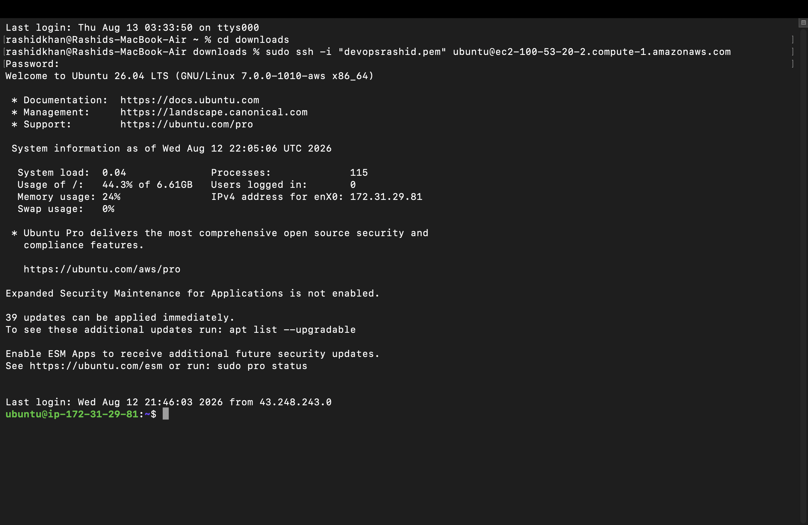
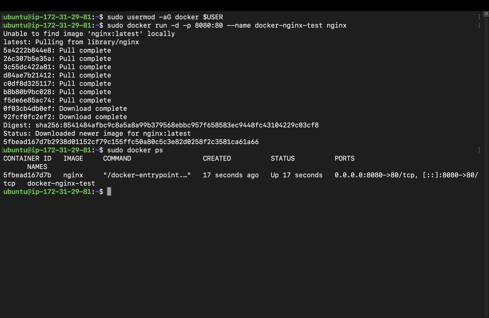
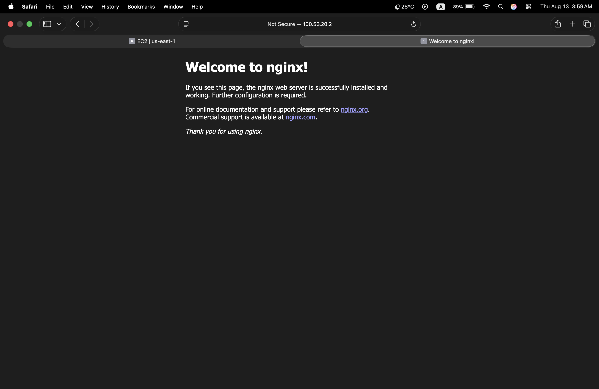

# Day 08 – Cloud Server Setup: Docker, Nginx & Web Deployment

## Overview
Today's task focused on launching an AWS EC2 instance, establishing remote SSH communication, installing Nginx and Docker, configuring AWS Security Groups for HTTP Port 80 and Custom TCP Port 8080 access, and extracting access logs for audit.

---

## Step-by-Step Execution & Screenshots

### 1. Cloud Instance Access & System Setup
Establish secure remote connection using SSH:
```bash
chmod 400 devopsrashid.pem
ssh -i devopsrashid.pem ubuntu@<YOUR_EC2_PUBLIC_IP>
```


Update system package indexes:
```bash
sudo apt update && sudo apt upgrade -y
```

### 2. Nginx & Docker Setup
Install Nginx web server:
```bash
sudo apt install nginx -y
sudo systemctl status nginx
```

Install Docker engine and run an isolated Nginx container on port 8080:
```bash
sudo apt install docker.io -y
sudo systemctl enable --now docker
sudo usermod -aG docker $USER
sudo docker run -d -p 8080:80 --name docker-nginx-test nginx
```

Verify active container status:
```bash
sudo docker ps
```


### 3. Inbound Web Verification
Configured AWS Security Group inbound rules for HTTP (Port 80). Verified web accessibility via browser:


### 4. Log Extraction & Local SCP Transfer
Export active access logs and transfer to local machine for audit:
```bash
sudo tail -n 50 /var/log/nginx/access.log > ~/nginx-logs.txt
scp -i ~/Downloads/devopsrashid.pem ubuntu@<YOUR_EC2_PUBLIC_IP>:~/nginx-logs.txt ~/Downloads/
```

## Challenges Faced & Solutions
**Challenge:** Nginx installed and running successfully, but the web page was timing out on the browser using EC2 
Public IP

**Root Cause:** AWS Security Group inbound firewall rules only permitted SSH traffic on Port 22 by default.

**Solution:** Navigated to AWS EC2 Security Groups -> Inbound Rules, added HTTP (Port 80) and Custom TCP (Port 8080)
from 0.0.0.0/0.

## What I Learned
**Cloud Provisioning:** Creating, managing, and connecting to AWS EC2 instances securely via SSH.

**Network Security:** Configuring Security Groups to allow specific inbound web traffic.

**Application Deployment:** Running web servers via native Linux services as well as isolated Docker containers.

**Log Auditing:** Isolating log entries from /var/log/nginx/access.log and pulling them locally using scp.


