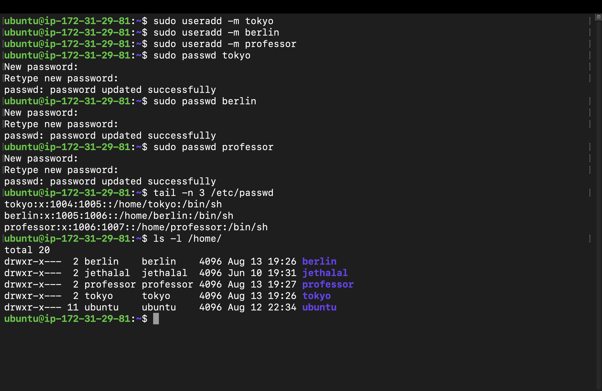
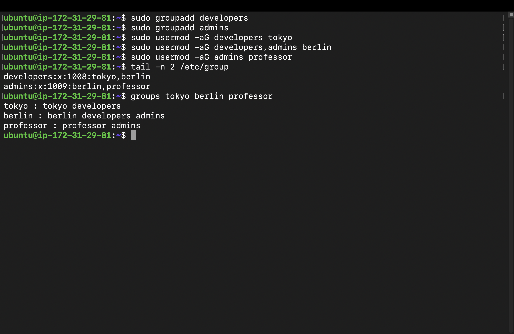
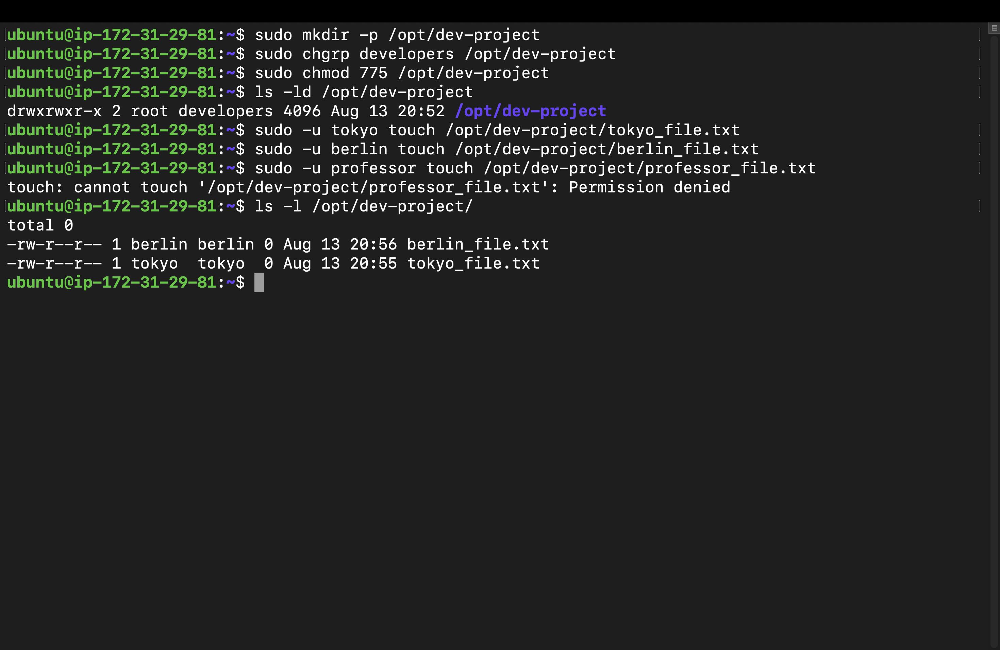
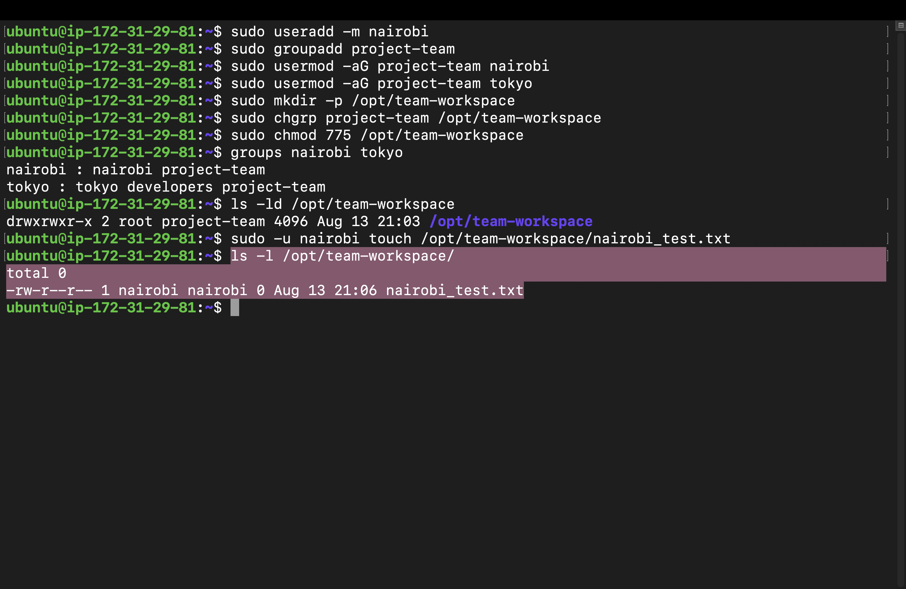

# Day 09 Challenge

## Users & Groups Created
- Users: tokyo, berlin, professor, nairobi
- Groups: developers, admins, project-team

## Group Assignments
- tokyo -> developers, project-team
- berlin -> developers, admins
- professor -> admins
- nairobi -> project-team

## Directories Created
- `/opt/dev-project` (Owner: root, Group: developers, Permissions: 775)
- `/opt/team-workspace` (Owner: root, Group: project-team, Permissions: 775)

## Commands Used & Execution Proof

### Task 1: Create Users
```bash
sudo useradd -m tokyo
sudo useradd -m berlin
sudo useradd -m professor
sudo passwd tokyo
sudo passwd berlin
sudo passwd professor
tail -n 3 /etc/passwd
ls -l /home/
```


### Task 2 & 3: Create Groups and Assign Users
```bash
sudo groupadd developers
sudo groupadd admins
sudo usermod -aG developers tokyo
sudo usermod -aG developers,admins berlin
sudo usermod -aG admins professor
tail -n 2 /etc/group
groups tokyo berlin professor
```


### Task 4: Shared Directory
```bash
sudo mkdir -p /opt/dev-project
sudo chgrp developers /opt/dev-project
sudo chmod 775 /opt/dev-project
sudo -u tokyo touch /opt/dev-project/tokyo_file.txt
sudo -u berlin touch /opt/dev-project/berlin_file.txt
ls -ld /opt/dev-project
ls -l /opt/dev-project/
```


### Task 5: Team Workspace
```bash
sudo useradd -m nairobi
sudo groupadd project-team
sudo usermod -aG project-team nairobi
sudo usermod -aG project-team tokyo
sudo mkdir -p /opt/team-workspace
sudo chgrp project-team /opt/team-workspace
sudo chmod 775 /opt/team-workspace
sudo -u nairobi touch /opt/team-workspace/nairobi_test.txt
ls -ld /opt/team-workspace
ls -l /opt/team-workspace/
```



## What I Learned

**The `-aG` Flag:** Always use `-aG` with `usermod` to append a user to a group. Using just `-G` removes the user from
  thier existing secondary groups.

**Shared Directory Permissions:** Using `chmod 775` along with `chgrp` is the standard way to allow a specific group
  to collaboratively read, write, and execute files within a shared directory.

**Cross-User Privilege Testing:** Using `sudo -u <username> <command>` is an incredibly efficient way to simulate and
  verify another user's permissions without needing their password.


