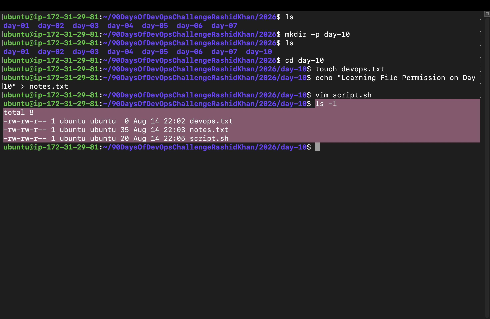
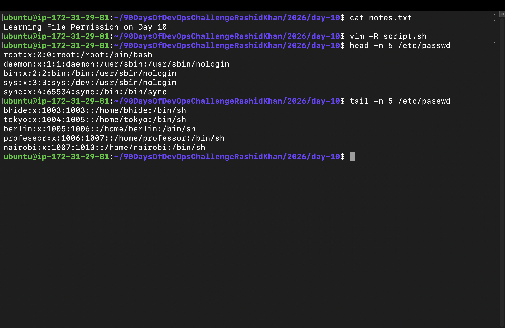
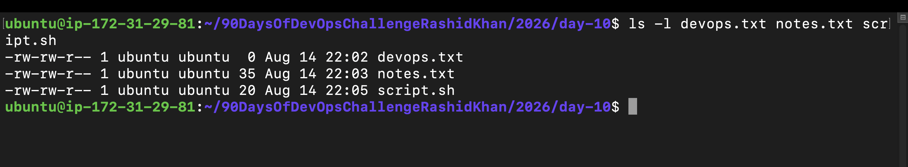
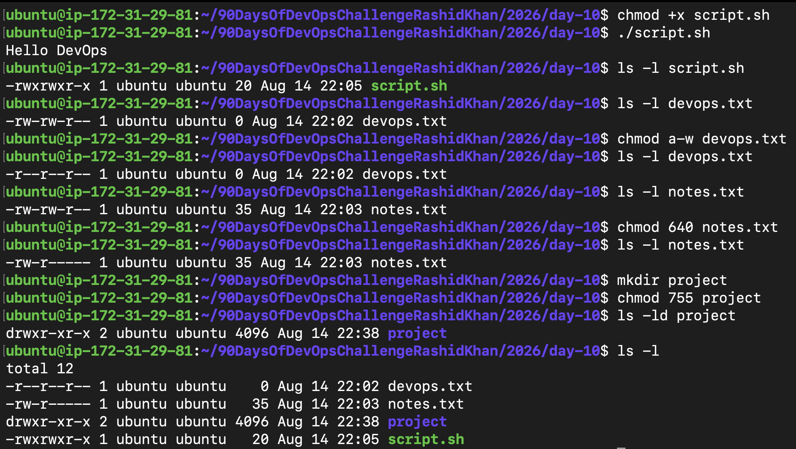
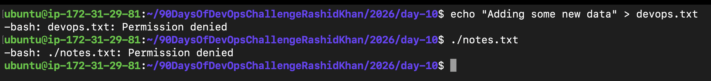

# Day 10 Challenge

## Files Created
- `devops.txt` (Empty file created using `touch`)
- `notes.txt` (File with content created using `echo`)
- `script.sh` (Bash script created using `vim`)
- `project/` (Directory created using `mkdir`)




## Permission Changes

**Initial Permissions Analysis:**
- Default files were created with `rw-rw-r--` (Read/Write for Owner & Group, Read for Others).


**Modifications Made:**
- **`script.sh`:** Before `-rw-rw-r--` | After `-rwxrwxr-x` (Made executable)
- **`devops.txt`:** Before `-rw-rw-r--` | After `-r--r--r--` (Made read-only for all)
- **`notes.txt`:** Before `-rw-rw-r--` | After `-rw-r-----` (Set to 640 numeric)
- **`project/`:** Set directly to `drwxr-xr-x` (Set to 755 numeric)



## Commands Used
```bash
# Creating files
mkdir day-10
touch devops.txt
echo "Learning File Permissions on Day 10" > notes.txt
vim script.sh

# Reading files
cat notes.txt
vim -R script.sh
head -n 5 /etc/passwd
tail -n 5 /etc/passwd

# Modifying permissions
chmod +x script.sh
chmod a-w devops.txt
chmod 640 notes.txt
mkdir project
chmod 755 project
```

## What I Learned
1. **The 4-2-1 Numeric Rule:** Permissions are simple math! Read is 4, Write is 2, and Execute is 1. Combining them (like 6 for rw, or 7 for rwx) gives you exact control over access.
2. **Execution is Explicit:** Linux does not allow any file to run as a script automatically. You must explicitly grant execute (`+x`) permissions, which is a massive security advantage.
3. **Intentional Errors are Guides:** Trying to write to a read-only file or executing a non-executable file triggers `Permission denied`. Understanding these errors helps in debugging server incidents faster.


