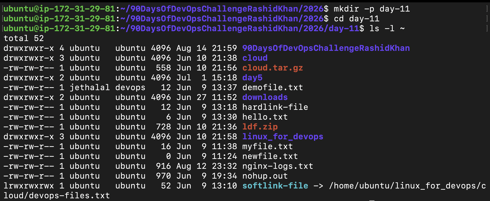
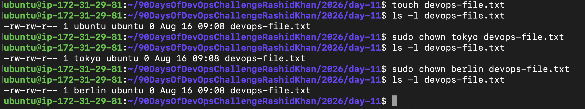
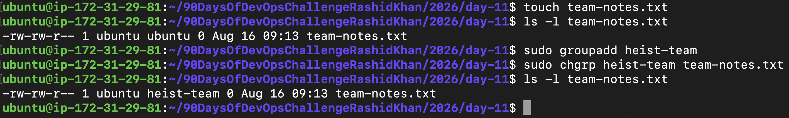
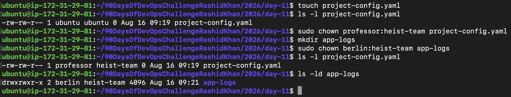
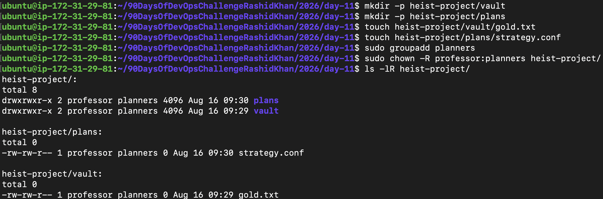
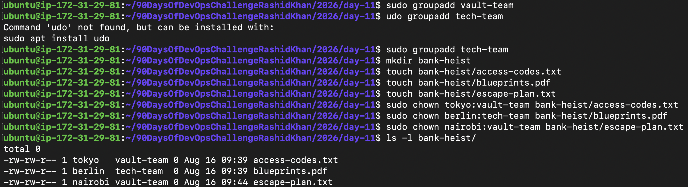

# Day 11 Challenge: File Ownership (chown & chgrp)

This file contains the practical documentation for Day 11 of the #90DaysOfDevOps challenge. Today, I mastered Linux File Ownership using a "Bank Heist" theme to understand Role-Based Access Control (RBAC).

---

## Users & Groups Created
- **Users:** `tokyo`, `berlin`, `nairobi`, `professor`
- **Groups:** `heist-team`, `planners`, `vault-team`, `tech-team`

## Files & Directories Created
- `devops-file.txt`
- `team-notes.txt`
- `project-config.yaml`
- `app-logs/` (directory)
- `heist-project/` (directory with subfolders `vault/` and `plans/`, files `gold.txt` and `strategy.conf`)
- `bank-heist/` (directory with files `access-codes.txt`, `blueprints.pdf`, `escape-plan.txt`)

## Ownership Changes
- `devops-file.txt`: ubuntu:ubuntu → tokyo:ubuntu → berlin:ubuntu
- `team-notes.txt`: ubuntu:ubuntu → ubuntu:heist-team
- `project-config.yaml`: ubuntu:ubuntu → professor:heist-team
- `app-logs/`: ubuntu:ubuntu → berlin:heist-team
- `heist-project/` (and its contents): ubuntu:ubuntu → professor:planners
- `bank-heist/access-codes.txt`: root:root → tokyo:vault-team
- `bank-heist/blueprints.pdf`: root:root → berlin:tech-team
- `bank-heist/escape-plan.txt`: root:root → nairobi:vault-team

Example:
- devops-file.txt: user:user → tokyo:heist-team

## Commands Used
- `ls -l` : Check detailed permissions and ownership of files.
- `ls -lR` : Check ownership recursively for a directory.
- `sudo chown <user> <file>` : Change the owner of a file.
- `sudo chgrp <group> <file>` : Change the group of a file.
- `sudo chown <user>:<group> <file>` : Change both owner and group in one command.
- `sudo chown -R <user>:<group> <directory>` : Change ownership recursively for a folder and everything inside it.

---

## Steps Executed

## Step 1: Understanding Ownership
Identified the difference between an owner and a group in Linux using the `ls -l` command. 
*   **Owner:** The specific user who has primary control over the file.
*   **Group:** A collection of users who share specific access permissions to the file.

---
️
## Step 2: Basic `chown` Operations
Created users `tokyo` and `berlin`. Changed the ownership of `devops-file.txt` from the default user to `tokyo`, and then transferred it to `berlin`.

---

## Step 3: Basic `chgrp` Operations
Created a new group called `heist-team`. Assigned the `team-notes.txt` file to this specific group so multiple team members can access it safely.

---

## Step 4: Combined Owner & Group Change
Learned the time-saving colon (`:`) shortcut. Changed both the owner and the group of `project-config.yaml` and the `app-logs` directory in a single command (`chown owner:group`).

---

## Step 5: Recursive Ownership (`-R`)
Created a complex project directory (`heist-project/`). Instead of changing file ownership one by one, used the `-R` (Recursive) flag to change the owner to `professor` and group to `planners` for all internal folders and files simultaneously.

---

## Step 6: The Final Bank Heist Practice Challenge
Set up a real-world RBAC (Role-Based Access Control) microservices scenario. Created a `bank-heist` directory and restricted access to different files based on specific roles:
*   `access-codes.txt` → Owner: tokyo, Group: vault-team
*   `blueprints.pdf` → Owner: berlin, Group: tech-team
*   `escape-plan.txt` → Owner: nairobi, Group: vault-team

---

## What I Learned (Key Takeaways)
1. **The Sudo Barrier:** You cannot give away file ownership to another user without `sudo` privileges. This is a brilliant built-in security constraint in Linux.
2. **The `:` Shortcut:** `sudo chown user:group file.txt` is the most efficient way to configure ownership.
3. **Real-world Application:** Proper ownership (`chown -R`) is the backbone of deploying web servers (like Nginx), managing CI/CD pipeline artifacts, and configuring shared team workspaces.
