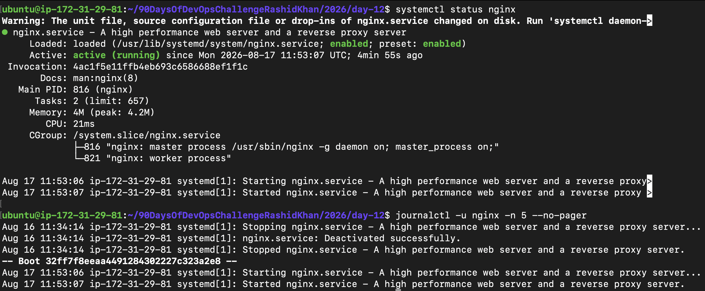
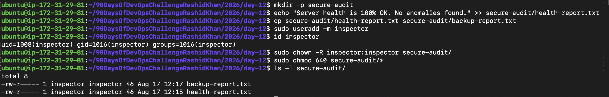

# Day 12: Breather & Revision (Days 01–11)

## Section 1: Consolidation & Review Notes

### Mindset & Plan Review
*   **Goal Check:** The Day 01 goals are absolutely on track. Moving from basic commands to production-level scenarios (like RBAC & Cloud Deployment) has built strong confidence.
*   **Tweaks:** I need to focus slightly more on "Muscle Memory". Going forward, I will try to type commands faster without looking at my cheat sheets.

###️ Processes & Services Observation
*   I re-ran process and log diagnostics for `nginx` to check its health and recent logs. 
*   **Commands Executed:**
    ```bash
    sudo systemctl status nginx
    sudo journalctl -u nginx -n 50 --no-pager
    ```
*   **Observation:** `systemctl status` gives an instant health snapshot (active/running), but `journalctl -u <service> --no-pager` is the real lifesaver for seeing *why* a service failed in the backend logs without getting trapped in the terminal pager.
  


### File Skills, User & Group Sanity (RBAC)
*   Practiced a continuous flow: Created a workspace, appended data, took a safe backup, created a test auditor, and locked down access securely.
*   **Commands Executed:**
    ```bash
    mkdir secure-audit
    echo "Server health is 100% OK. No anomalies found." >> secure-audit/health-report.txt
    cp secure-audit/health-report.txt secure-audit/backup-report.txt
    sudo useradd -m inspector
    id inspector
    sudo chown -R inspector:inspector secure-audit/
    sudo chmod 640 secure-audit/*
    ls -l secure-audit/
    ```
*   **Verification:** Verified via `id` and `ls -l`. Zero-Trust architecture successfully simulated at the file level. The copy command (`cp`) ensured we had a `.txt` backup before changing permissions.



### Cheat Sheet Refresh: Top 5 Incident-Response Commands
If a server crashes at 2 AM, these are the first 5 commands I am reaching for:
1.  `systemctl status <service>` (Is it dead or alive?)
2.  `journalctl -xeu <service>` (Why did it die?)
3.  `ps -aux | grep <process>` (Is a rogue process eating resources?)
4.  `ls -lah` (Are permissions or file sizes messed up?)
5.  `history | grep <keyword>` (What did the last engineer run before it broke?)

---

## Section 2: Mini Self-Check

**Q1. Which 3 commands save you the most time right now, and why?**
1.  `grep`: Saves hours of reading by filtering exact errors from thousands of lines of logs.
2.  `history`: Prevents me from retyping complex, long commands I figured out yesterday.
3.  `ls -lah`: Gives me hidden files, human-readable sizes, and exact permission blocks in one go.

**Q2. How do you check if a service is healthy? List the exact 2–3 commands you’d run first.**
1.  `sudo systemctl status <service_name>` (To check active/failed state).
2.  `sudo journalctl -u <service_name> -n 50 --no-pager` (To read the last 50 error logs of that specific service).

**Q3. How do you safely change ownership and permissions without breaking access? Give one example command.**
*   **Safety Rule:** Never run `chmod 777`. Always target a specific directory and use recursive flags carefully.
*   **Example:** `sudo chown -R inspector:inspector /secure-audit/` (Changes owner and group safely for a folder and its contents). Followed by `sudo chmod 640 /secure-audit/*` (Owner reads/writes, group reads, others get nothing).

**Q4. What will you focus on improving in the next 3 days?**
*   Automating these basic file and user operations using basic Bash scripting, and diving deeper into networking concepts to connect the dots between server files and web traffic.
