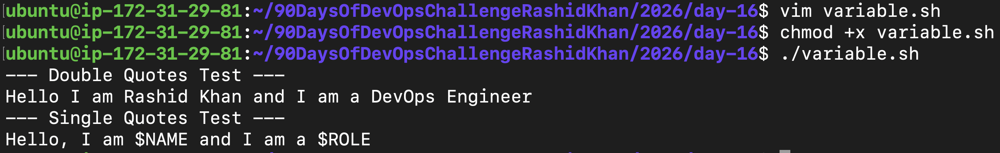
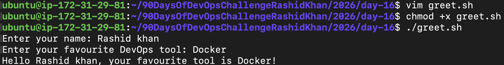
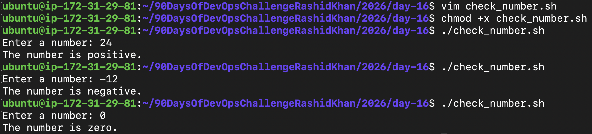
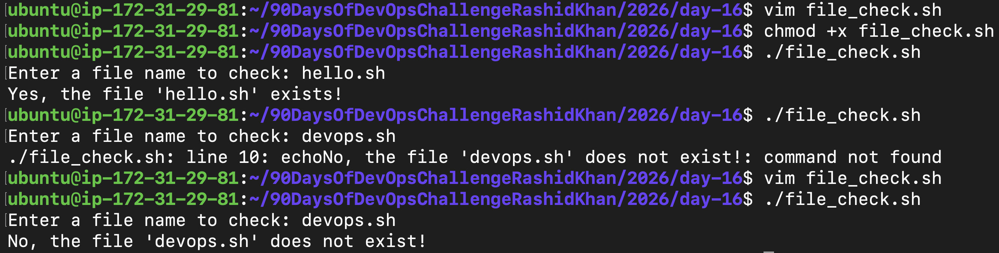
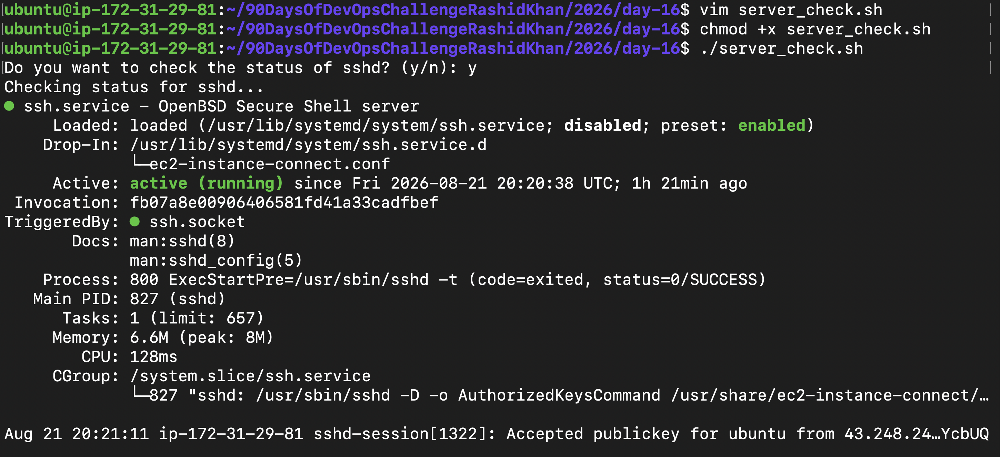

# Day 16 - Shell Scripting Basics

## Objective
Today, I started my journey into Shell Scripting. The goal was to understand the fundamentals like shebangs, variables, user inputs, and conditional logic to automate daily Linux tasks. Below is the documentation of the scripts I wrote and my observations.

---

## Task 1: Your First Script

**Code (hello.sh):**
```bash
#!/bin/bash
echo "Hello, DevOps!"
```

**Observation:**
 
I created the script and used chmod +x hello.sh to give it execution rights, then ran it using ./hello.sh. 


**What happens if you remove the shebang line (#!/bin/bash)?**

If I remove the shebang, the script will execute using my current default shell. While it might still run, this is a bad practice. The shebang explicitly tells the operating system which interpreter to use (Bash), ensuring the script behaves consistently regardless of who runs it or what their default shell is.

---

## Task 2: Variables

**Code (variables.sh):**
```bash
#!/bin/bash
NAME="Rashid"
ROLE="DevOps Engineer"

echo "--- Double Quotes Test ---"
echo "Hello, I am $NAME and I am a $ROLE"

echo "--- Single Quotes Test ---"
echo 'Hello, I am $NAME and I am a $ROLE'
```

**Observation:**

I learned that Bash is very strict about spaces during variable assignment; NAME="Rashid" works, but NAME = "Rashid" throws an error. I also observed the difference between quotes: double quotes evaluate the variables and print their actual values, whereas single quotes treat the variable names as literal strings.



---

## Task 3: User Input with read

**Code (greet.sh):**
```bash
#!/bin/bash
read -p "Enter your name: " name
read -p "Enter your favourite DevOps tool: " tool

echo "Hello $name, your favourite tool is $tool!"
```

**Observation:**

Using the read -p command allowed me to make the script interactive. Instead of hardcoding values, the script paused, prompted me for input, stored my response into a variable, and printed it dynamically.



---

## Task 4: If-Else Conditions

### Script 1: check_number.sh
**Code:**
```bash
#!/bin/bash
read -p "Enter a number: " num

if [ $num -gt 0 ]; then
    echo "The number is positive."
elif [ $num -lt 0 ]; then
    echo "The number is negative."
else
    echo "The number is zero."
fi
```



### Script 2: file_check.sh
**Code:**
```bash
#!/bin/bash
read -p "Enter a filename to check: " filename

if [ -f $filename ]; then
    echo "Yes, the file '$filename' exists!"
else
    echo "No, the file '$filename' does not exist."
fi
```



**Observation:**

I learned how to use square brackets [ ] for conditional checks and understood that spaces inside the brackets are mandatory in Bash. I used -gt (greater than) and -lt (less than) for integer comparisons, and the -f flag to verify if a specific file exists on the filesystem.

---

## Task 5: Combine It All (Real-world Scenario)

**Code (server_check.sh):**
```bash
#!/bin/bash
SERVICE="sshd"

read -p "Do you want to check the status of $SERVICE? (y/n): " choice

if [ "$choice" == "y" ]; then
    echo "Checking status for $SERVICE..."
    systemctl status $SERVICE --no-pager
elif [ "$choice" == "n" ]; then
    echo "Skipped."
else
    echo "Invalid input. Please enter 'y' or 'n'."
fi
```

**Observation:**

I combined variables, user input, and if-else logic to create a functional server status checking script. By adding --no-pager to the systemctl status command, I ensured the output prints directly to the terminal without freezing the screen in an interactive pager mode.



---

## What I Learned (3 Key Points)
1. **Automation starts with basic logic:** Writing repetitive terminal commands into a single .sh file saves time and reduces manual typing errors.
2. **Quotes matter in Bash:** Double quotes resolve variable values, while single quotes read everything as raw text. Knowing when to use which is crucial for debugging.
3. **Execution requires explicit permission:** By default, Linux prevents new files from running to ensure security. Using chmod +x is mandatory before executing any custom script.
