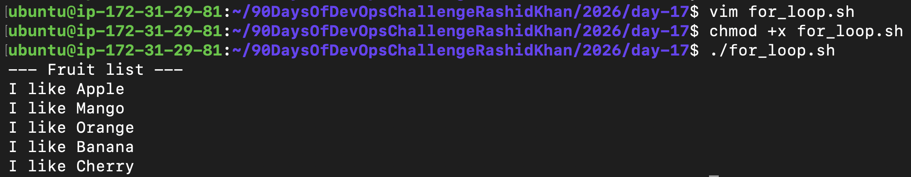
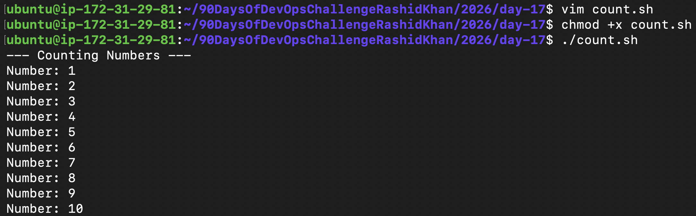
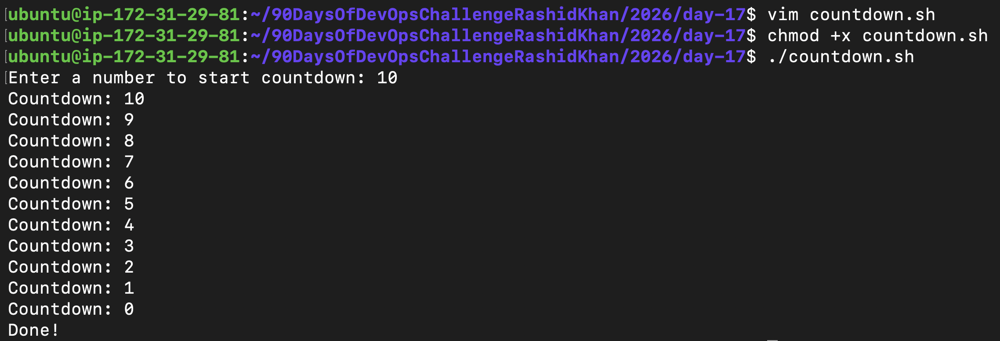
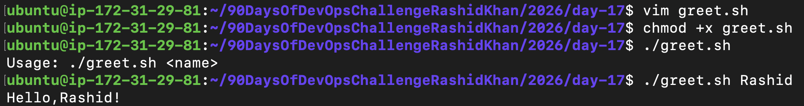
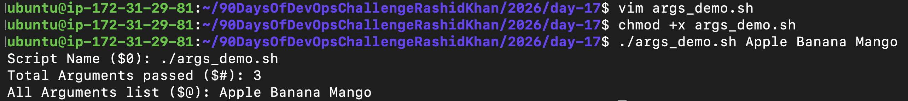
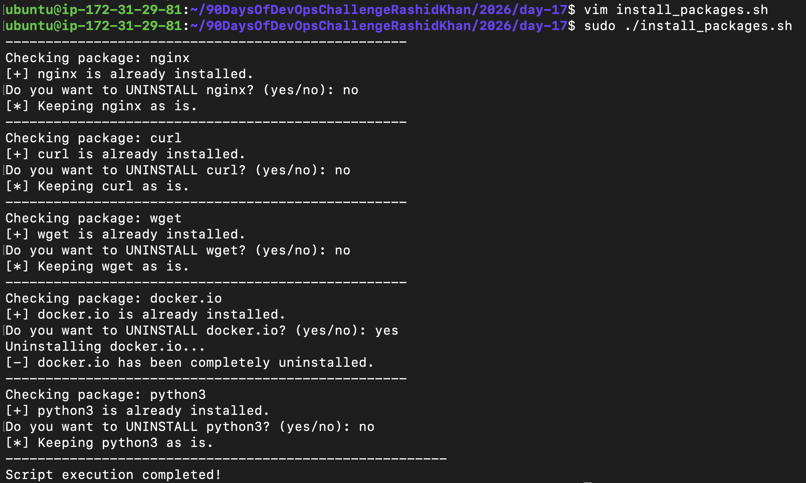
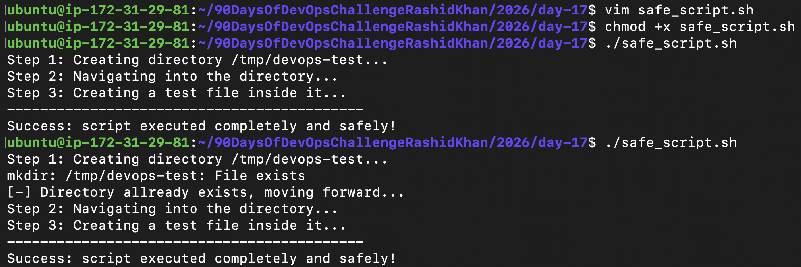

# Day 17 - Shell Scripting: Loops, Arguments & Error Handling

This repository contains scripts covering dynamic iteration, command-line argument passing, package management, and safe execution practices in Bash.

---

## Task 1: For Loop

### 1. Iterating through a list (for_loop.sh)
```bash
#!/bin/bash
# Looping through a list of 5 fruits

echo "--- Fruit List ---"
for fruit in Apple Mango Orange Banana Cherry; do
    echo "I like $fruit"
done
```

**Output Proof:**


### 2. Iterating through numbers using C-style loop (count.sh)
```bash
#!/bin/bash
# Counting numbers from 1 to 10 using C-style for loop

echo "--- Counting Numbers ---"
for (( i=1; i<=10; i++ )); do
    echo "Number: $i"
done
```

**Output Proof:**


---

## Task 2: While Loop

### Reverse Countdown Timer (countdown.sh)
```bash
#!/bin/bash
# Countdown timer using while loop

read -p "Enter a number to start countdown: " num

while [ $num -ge 0 ]; do
    echo "Countdown: $num"
    num=$((num - 1))
    sleep 1
done

echo "Done!"
```

**Output Proof:**


---

## Task 3: Command-Line Arguments

### 1. Handling Positional Parameters (greet.sh)
```bash
#!/bin/bash
# Script to demonstrate positional parameter ($1)

if [ -z "$1" ]; then
    echo "Usage: ./greet.sh <name>"
else
    echo "Hello, $1!"
fi
```

**Output Proof:**


### 2. Handling Special Variables (args_demo.sh)
```bash
#!/bin/bash
# Script to demonstrate special variables ($0, $#, $@)

echo "Script Name (\$0): $0"
echo "Total Arguments passed (\$#): $#"
echo "All Arguments list (\$@): $@"
```

**Output Proof:**


---

## Task 4: Install Packages via Script (With Custom Uninstall Logic)

### The Master Installer (install_packages.sh)
This script checks for required packages, installs them automatically if missing, and includes a custom logic block to optionally uninstall them based on user input. It also includes a root privilege check.

```bash
#!/bin/bash
# Master Script to Install/Uninstall Packages

# 1. ROOT CHECK
if [ "$EUID" -ne 0 ]; then
    echo "Error: Please run this script as root (use: sudo ./install_packages.sh)"
    exit 1
fi

PACKAGES="nginx curl wget docker.io python3"

# 2. LOOP THROUGH EACH PACKAGE
for pkg in $PACKAGES; do
    echo "----------------------------------------"
    echo "Checking package: $pkg"

    PACKAGE_READY=false

    # 3. CHECK IF INSTALLED
    if dpkg -s "$pkg" &> /dev/null; then
        echo "[+] $pkg is already installed."
        PACKAGE_READY=true
    else
        echo "[-] $pkg is missing. Installing now..."
        if apt-get install -y "$pkg" &> /dev/null; then
            echo "[+] $pkg installed successfully."
            PACKAGE_READY=true
        else
            echo "[!] Failed to install $pkg."
        fi
    fi

    # 4. CUSTOM UNINSTALL LOGIC
    if [ "$PACKAGE_READY" = true ]; then
        read -p "Do you want to UNINSTALL $pkg? (yes/no): " choice
        if [ "$choice" == "yes" ]; then
            echo "Uninstalling $pkg..."
            apt-get remove -y "$pkg" &> /dev/null
            echo "[-] $pkg has been completely uninstalled."
        else
            echo "[*] Keeping $pkg as is."
        fi
    fi
done

echo "----------------------------------------"
echo "Script execution completed!"
```

**Output Proof:**


---

## Task 5: Error Handling

### Safe Execution with set -e (safe_script.sh)
```bash
#!/bin/bash
# Script to demonstrate error handling with set -e and ||

set -e

echo "Step 1: Creating directory /tmp/devops-test..."
mkdir /tmp/devops-test || echo "[-] Directory already exists, moving forward..."

echo "Step 2: Navigating into the directory..."
cd /tmp/devops-test

echo "Step 3: Creating a test file inside it..."
touch testfile.txt

echo "-------------------------------------------"
echo "Success: script executed completely and safely!"
```

**Output Proof:**


---

## Key Learnings
1. **Dynamic Execution with Arguments:** Using `$1`, `$@`, and `$#` eliminates the need to hardcode values or rely entirely on read prompts, making scripts highly reusable for CI/CD pipelines.
2. **Robust Error Handling:** Implementing `set -e` prevents a script from cascading failures. Using the Logical OR `||` acts as a crucial safety net to handle expected non-fatal errors (like creating a directory that already exists).
3. **Advanced Flow Control:** Combining for loops with package managers (like apt-get or dpkg) allows for rapid scaling of infrastructure setup. Adding automated root checks ($EUID) prevents permission-based runtime crashes.
