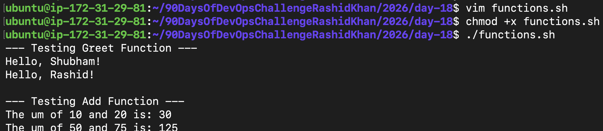
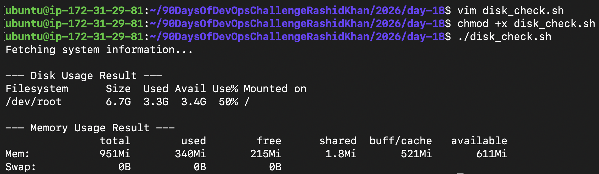
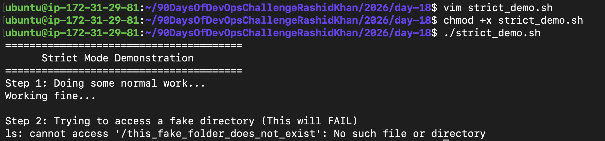
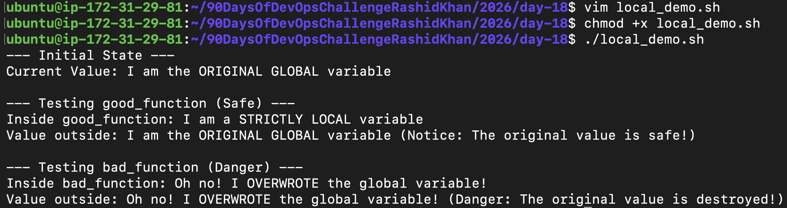
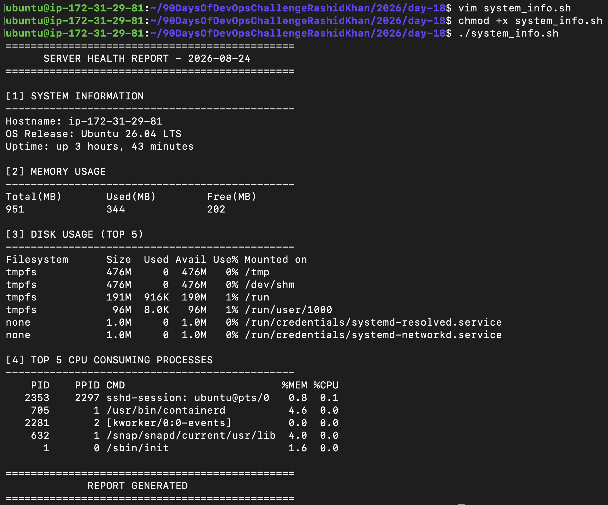
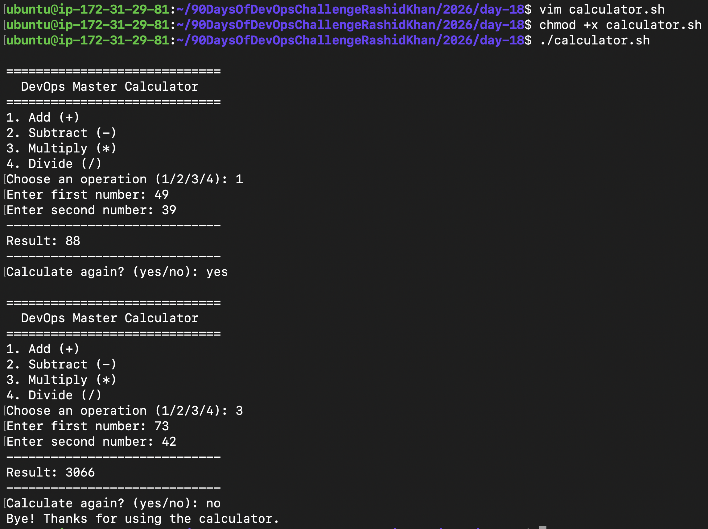

# Day 18: Shell Scripting - Functions & Intermediate Concepts

## Objective
To write cleaner, reusable, and production-ready scripts by mastering bash functions, understanding variable scopes (local vs global), and enforcing strict execution modes to prevent catastrophic failures.

---

## Task 1: Basic Functions
**Goal:** Create a script with functions that accept arguments.

**Code:**
```bash
#!/bin/bash

greet() {
    echo "Hello, $1!"
}

add() {
    local sum=$(( $1 + $2 ))
    echo "The sum of $1 and $2 is: $sum"
}

echo "--- Testing Greet Function ---"
greet "Shubham"
greet "Rashid"

echo -e "\n--- Testing Add Function ---"
add 10 20
add 50 75
```

**Output Proof:**


---

## Task 2: Functions with Return Values
**Goal:** Use command substitution to capture the output of functions into variables.

**Code:**
```bash
#!/bin/bash

check_disk() {
    df -h /
}

check_memory() {
    free -h
}

echo "Fetching system information..."

DISK_RESULT=$(check_disk)
MEMORY_RESULT=$(check_memory)

echo -e "\n--- Disk Usage Result ---"
echo "$DISK_RESULT"

echo -e "\n--- Memory Usage Result ---"
echo "$MEMORY_RESULT"
```

**Output Proof:**


---

## Task 3: Strict Mode (set -euo pipefail)
**Goal:** Demonstrate how the fail-fast mechanism protects servers from executing dangerous commands after an error occurs.

**Documentation: What does each flag do?**
- **set -e**: Exit immediately if a command exits with a non-zero status (Fail fast).
- **set -u**: Treat unset variables as an error and exit immediately. Prevents catastrophic empty variable expansions.
- **set -o pipefail**: Ensures a piped command fails if any part of it fails, rather than just looking at the last command.

**Code:**
```bash
#!/bin/bash
set -euo pipefail

echo "=================================="
echo "    Strict Mode Demonstration     "
echo "=================================="

echo "Step 1: Doing some normal work..."
echo "Working fine..."

echo -e "\nStep 2: Trying to access a fake directory (This will FAIL)"
ls /this_fake_folder_does_not_exist

# Script dies above. Below line will never execute.
echo -e "\nStep 3: This line will NEVER print because script died at Step 2!"
```

**Output Proof:**


---

## Task 4: Local Variables
**Goal:** Understand variable scoping and prevent function variables from leaking into the global environment.

**Code:**
```bash
#!/bin/bash

MY_VAR="I am the ORIGINAL GLOBAL variable"

good_function() {
    local MY_VAR="I am a STRICTLY LOCAL variable"
    echo "Inside good_function: $MY_VAR"
}

bad_function() {
    MY_VAR="Oh no! I OVERWROTE the global variable!"
    echo "Inside bad_function: $MY_VAR"
}

echo "--- Initial State ---"
echo "Current Value: $MY_VAR"

echo -e "\n--- Testing good_function (Safe) ---"
good_function
echo "Value outside: $MY_VAR"

echo -e "\n--- Testing bad_function (Danger) ---"
bad_function
echo "Value outside: $MY_VAR"
```

**Output Proof:**


---

## Task 5: System Info Reporter
**Goal:** Build a comprehensive health check script utilizing functions, piped commands, and strict mode.

**Code:**
```bash
#!/bin/bash
set -euo pipefail

print_os_info() {
    echo "Hostname: $(hostname)"
    local os_name=$(cat /etc/os-release | grep "^PRETTY_NAME=" | cut -d '=' -f 2 | tr -d '"' || true)
    echo "OS Release: $os_name"
}

print_uptime() {
    echo "Uptime: $(uptime -p)"
}

print_disk_usage() {
    echo "Filesystem      Size  Used Avail Use% Mounted on"
    df -h | sort -hr | head -n 6
}

print_memory_usage() {
    free -m | awk 'NR==1{printf "%-15s %-15s %-15s\n", "Total(MB)", "Used(MB)", "Free(MB)"} NR==2{printf "%-15s %-15s %-15s\n", $2, $3, $4}'
}

print_top_cpu_processes() {
    ps -eo pid,ppid,cmd,%mem,%cpu --sort=-%cpu | head -n 6
}

main() {
    echo "=============================================="
    echo "      SERVER HEALTH REPORT - $(date '+%F')    "
    echo "=============================================="
    
    echo -e "\n[1] SYSTEM INFORMATION"
    echo "----------------------------------------------"
    print_os_info
    print_uptime
    
    echo -e "\n[2] MEMORY USAGE"
    echo "----------------------------------------------"
    print_memory_usage
    
    echo -e "\n[3] DISK USAGE (TOP 5)"
    echo "----------------------------------------------"
    print_disk_usage
    
    echo -e "\n[4] TOP 5 CPU CONSUMING PROCESSES"
    echo "----------------------------------------------"
    print_top_cpu_processes
    
    echo -e "\n=============================================="
}

main
```

**Output Proof:**


---

## Task 6: Custom Interactive Calculator (Feature Addition)
**Goal:** Build a custom interactive calculator using mathematical functions, case statements for menu selection, input validation (divide by zero), and an infinite loop for continuous operation.

**Code:**
```bash
#!/bin/bash

add() {
    echo $(( $1 + $2 ))
}

subtract() {
    echo $(( $1 - $2 ))
}

multiply() {
    echo $(( $1 * $2 ))
}

divide() {
    if [ $2 -eq 0 ]; then
        echo "Error: Cannot divide by zero!"
    else
        echo $(( $1 / $2 ))
    fi
}

main_calculator() {
    echo -e "\n============================="
    echo "  DevOps Master Calculator   "
    echo "============================="
    echo "1. Add (+)"
    echo "2. Subtract (-)"
    echo "3. Multiply (*)"
    echo "4. Divide (/)"
    
    read -p "Choose an operation (1/2/3/4): " choice
    read -p "Enter first number: " num1
    read -p "Enter second number: " num2

    echo "-----------------------------"
    echo -n "Result: "
    
    case $choice in
        1) add $num1 $num2 ;;
        2) subtract $num1 $num2 ;;
        3) multiply $num1 $num2 ;;
        4) divide $num1 $num2 ;;
        *) echo "Invalid choice! Please select 1, 2, 3, or 4." ;;
    esac
}

while true; do
    main_calculator
    
    echo "-----------------------------"
    read -p "Calculate again? (yes/no): " play_again
    
    if [ "$play_again" != "yes" ]; then
        echo "Bye! Thanks for using the calculator."
        break
    fi
done
```

**Output Proof:**


---

## What I Learned (3 Key Points)
1. **Scope Management is Critical:** The local keyword is non-negotiable in large scripts to prevent function variables from accidentally modifying global states.
2. **Bash Returns Outputs, Not Values:** Unlike other languages, Bash functions return exit codes. To retrieve data from a function, command substitution `$()` must be used to capture its printed output.
3. **Strict Mode Prevents Disasters:** Implementing `set -euo pipefail` enforces a fail-fast architecture, ensuring scripts immediately halt upon encountering undefined variables, command failures, or hidden pipe errors.
