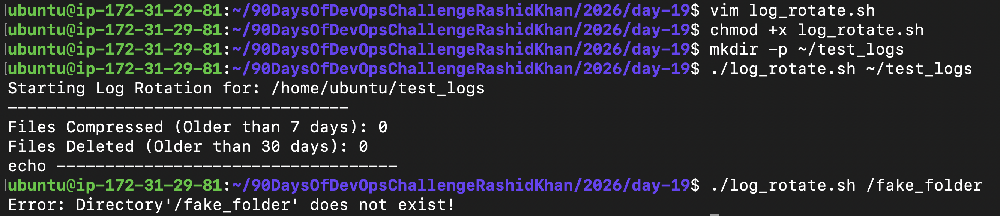
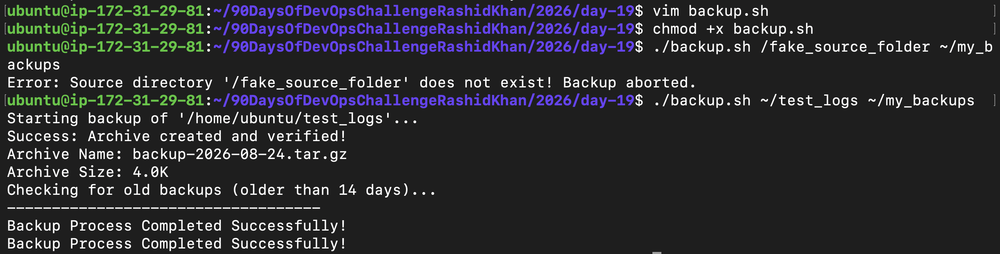
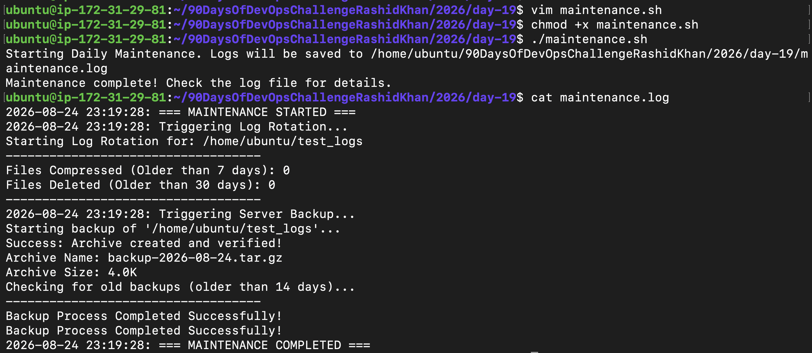

# Day 19: Shell Scripting Project - Log Rotation, Backup & Crontab

## Objective
Apply concepts from previous days (loops, arguments, strict mode, conditionals) to build real-world, production-ready DevOps mini-projects.

---

## Task 1: Log Rotation Script
**Goal:** Create a script to compress old logs and delete very old archives to save disk space. It must validate inputs and count affected files.

**Code (log_rotate.sh):**
```bash
#!/bin/bash
set -euo pipefail

# Requirement: Exits with an error if the directory doesn't exist / Not provided
if [ $# -eq 0 ]; then
    echo "Error: Please provide a log directory as an argument."
    exit 1
fi

LOG_DIR=$1

if [ ! -d "$LOG_DIR" ]; then
    echo "Error: Directory '$LOG_DIR' does not exist!"
    exit 1
fi

# Requirement: Count files to be compressed
COMPRESS_COUNT=$(find "$LOG_DIR" -name "*.log" -type f -mtime +7 | wc -l)

# Requirement: Compresses .log files older than 7 days using gzip
if [ "$COMPRESS_COUNT" -gt 0 ]; then
    find "$LOG_DIR" -name "*.log" -type f -mtime +7 -exec gzip {} \;
fi

# Requirement: Count files to be deleted
DELETE_COUNT=$(find "$LOG_DIR" -name "*.gz" -type f -mtime +30 | wc -l)

# Requirement: Deletes .gz files older than 30 days
if [ "$DELETE_COUNT" -gt 0 ]; then
    find "$LOG_DIR" -name "*.gz" -type f -mtime +30 -exec rm {} \;
fi

# Requirement: Prints how many files were compressed and deleted
echo "-----------------------------------"
echo "Files Compressed (Older than 7 days): $COMPRESS_COUNT"
echo "Files Deleted (Older than 30 days): $DELETE_COUNT"
echo "-----------------------------------"
```

**Output Proof:**


---

## Task 2: Server Backup Script
**Goal:** Create a robust backup script that handles input arguments safely, creates compressed tarballs, verifies creation, and cleans up old backups.

**Code (backup.sh):**
```bash
#!/bin/bash
set -euo pipefail

# Validation: Takes a source directory and backup destination as arguments
if [ $# -ne 2 ]; then
    echo "Error: Missing arguments."
    echo "Usage: ./backup.sh <source_directory> <backup_destination>"
    exit 1
fi

SOURCE_DIR=$1
BACKUP_DEST=$2

# Handles errors — exit if source doesn't exist
if [ ! -d "$SOURCE_DIR" ]; then
    echo "Error: Source directory '$SOURCE_DIR' does not exist! Backup aborted."
    exit 1
fi

# Creates a timestamped .tar.gz archive
TIMESTAMP=$(date +%Y-%m-%d)
ARCHIVE_NAME="backup-${TIMESTAMP}.tar.gz"
ARCHIVE_PATH="${BACKUP_DEST}/${ARCHIVE_NAME}"

# Create the tar archive (Suppressing absolute path warnings using 2>/dev/null)
tar -czf "$ARCHIVE_PATH" "$SOURCE_DIR" 2>/dev/null

# Verifies the archive was created successfully & Prints name and size
if [ -f "$ARCHIVE_PATH" ]; then
    ARCHIVE_SIZE=$(du -sh "$ARCHIVE_PATH" | awk '{print $1}')
    echo "Archive Name: $ARCHIVE_NAME"
    echo "Archive Size: $ARCHIVE_SIZE"
else
    exit 1
fi

# Deletes backups older than 14 days from the destination
find "$BACKUP_DEST" -name "backup-*.tar.gz" -type f -mtime +14 -exec rm {} \;
```

**Output Proof:**


---

## Task 3: Crontab
**Goal:** Understand cron syntax and schedule the scripts built in earlier tasks.

**Cron Syntax:**
```text
* * * * *  command
│ │ │ │ │
│ │ │ │ └── Day of week (0-7)
│ │ │ └──── Month (1-12)
│ │ └────── Day of month (1-31)
│ └──────── Hour (0-23)
└────────── Minute (0-59)
```

**Written Cron Entries:**

Run log_rotate.sh every day at 2 AM:
```bash
0 2 * * * /home/ubuntu/90DaysOfDevOpsChallengeRashidKhan/2026/day-19/log_rotate.sh /home/ubuntu/test_logs
```

Run backup.sh every Sunday at 3 AM:
```bash
0 3 * * 0 /home/ubuntu/90DaysOfDevOpsChallengeRashidKhan/2026/day-19/backup.sh /home/ubuntu/test_logs /home/ubuntu/my_backups
```

Run a health check script every 5 minutes:
```bash
*/5 * * * * /home/ubuntu/90DaysOfDevOpsChallengeRashidKhan/2026/day-19/health_check.sh
```

---

## Task 4: Scheduled Maintenance Script
**Goal:** Combine individual scripts into a master orchestrator script that runs daily, executes tasks sequentially, and logs all outputs properly.

**Code (maintenance.sh):**
```bash
#!/bin/bash
set -euo pipefail

BASE_DIR="/home/ubuntu/90DaysOfDevOpsChallengeRashidKhan/2026/day-19"
LOG_DIR="/home/ubuntu/test_logs"
BACKUP_DEST="/home/ubuntu/my_backups"

MAINTENANCE_LOG="$BASE_DIR/maintenance.log"

log_message() {
    echo "$(date '+%Y-%m-%d %H:%M:%S'): $1" >> "$MAINTENANCE_LOG"
}

log_message "=== MAINTENANCE STARTED ==="

# Triggering Log Rotation
log_message "Triggering Log Rotation..."
$BASE_DIR/log_rotate.sh "$LOG_DIR" >> "$MAINTENANCE_LOG" 2>&1 || log_message "ERROR: Log Rotation Failed!"

# Triggering Server Backup
log_message "Triggering Server Backup..."
$BASE_DIR/backup.sh "$LOG_DIR" "$BACKUP_DEST" >> "$MAINTENANCE_LOG" 2>&1 || log_message "ERROR: Server Backup Failed!"

log_message "=== MAINTENANCE COMPLETED ==="
```

**Cron Entry to run Maintenance Script daily at 1 AM:**
```bash
0 1 * * * /home/ubuntu/90DaysOfDevOpsChallengeRashidKhan/2026/day-19/maintenance.sh
```

**Output Proof:**


---

## What I Learned
1. **Scope and Strict Requirements:** Writing DevOps scripts means sticking strictly to the requested behavior. Handled conditional checking properly to ensure the scripts fail safely if source directories do not exist.
2. **Absolute Paths are King in Cron:** Cron runs in a headless environment without standard user profiles. Using absolute paths for scripts, source folders, and log files is mandatory for successful automation.
3. **Redirection for Observability:** Mastered the redirection operators to ensure background orchestrator scripts operate silently while capturing a full timeline in a dedicated log file.
4. **Mastering the 'find' Command:** Gained deep hands-on experience using `find` with time-based flags (`-mtime +7`, `-mtime +30`) and dynamically executing commands on the results (`-exec gzip {} \;`). This is the backbone of automated file management.
5. **Handling Silent Failures:** Realized the true power of `set -euo pipefail`. Encountered real-world permission issues when testing on system folders and saw firsthand how Strict Mode immediately stops the script instead of causing silent cascading failures.
