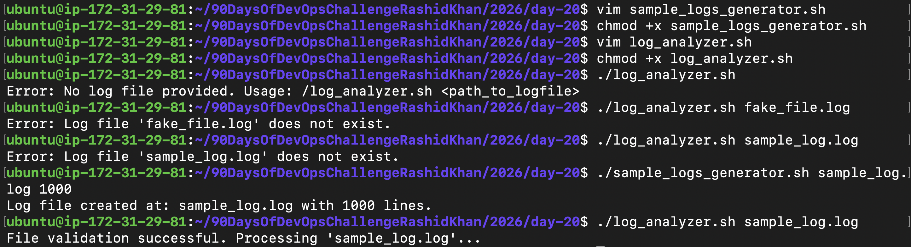
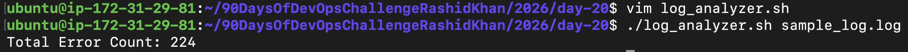
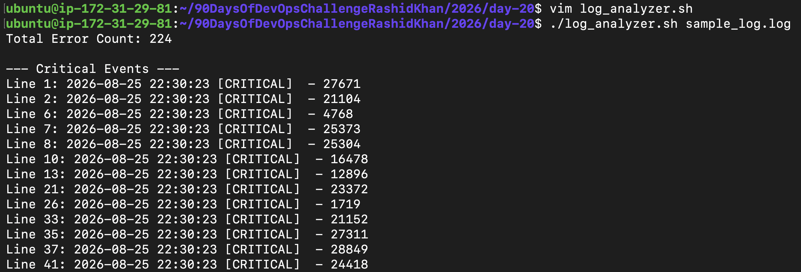
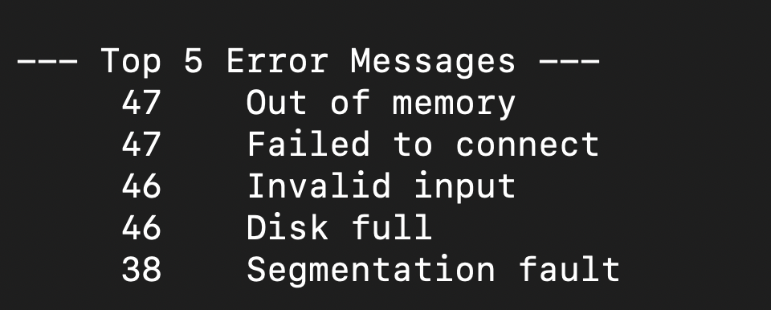
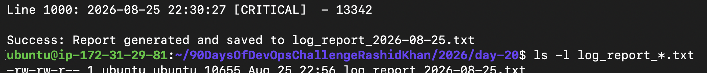
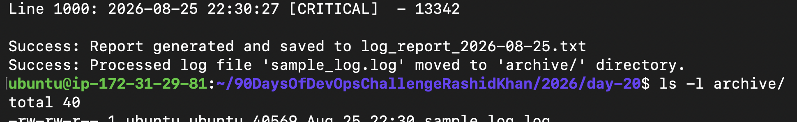

# Day 20: Bash Scripting Challenge - Log Analyzer and Report Generator

## Objective
Build a Bash script to automate the process of analyzing server log files, extracting critical events, counting errors, identifying the top 5 error messages, generating a formatted daily summary report, and archiving the processed log files.

---

## Pre-requisite: Generating the Sample Log
Before analyzing, we need raw log data. We used the provided generator script to create a dummy log file with 1000 lines of randomized logs.

**Script (sample_logs_generator.sh):**
```bash
#!/bin/bash

if [ "$#" -ne 2 ]; then
    echo "Usage: $0 <log_file_path> <num_lines>"
    exit 1
fi

log_file_path="$1"
num_lines="$2"

if [ -e "$log_file_path" ]; then
    echo "Error: File already exists at $log_file_path."
    exit 1
fi

log_levels=("INFO" "DEBUG" "ERROR" "WARNING" "CRITICAL")
error_messages=("Failed to connect" "Disk full" "Segmentation fault" "Invalid input" "Out of memory")

generate_log_line() {
    local log_level="${log_levels[$((RANDOM % ${#log_levels[@]}))]}"
    local error_msg=""
    if [ "$log_level" == "ERROR" ]; then
        error_msg="${error_messages[$((RANDOM % ${#error_messages[@]}))]}"
    fi
    echo "$(date '+%Y-%m-%d %H:%M:%S') [$log_level] $error_msg - $RANDOM"
}

touch "$log_file_path"
for ((i=0; i<num_lines; i++)); do
    generate_log_line >> "$log_file_path"
done

echo "Log file created at: $log_file_path with $num_lines lines."
```

---

## Step-by-Step Execution & Output Proofs

### Task 1: Input and Validation
**Goal:** Accept the path to a log file as a command-line argument. Exit with a clear error message if no argument is provided or if the file does not exist.

**Code Snippet:**
```bash
if [ $# -eq 0 ]; then
    echo "Error: No log file provided. Usage: ./log_analyzer.sh <path_to_logfile>"
    exit 1
fi

LOG_FILE=$1

if [ ! -f "$LOG_FILE" ]; then
    echo "Error: Log file '$LOG_FILE' does not exist."
    exit 1
fi
```
**Output Proof:**



### Task 2: Error Count
**Goal:** Count the total number of lines containing the keyword ERROR or Failed and print the count.

**Code Snippet:**
```bash
ERROR_COUNT=$(grep -E -c "ERROR|Failed" "$LOG_FILE")
echo "Total error count: $ERROR_COUNT"
```
**Output Proof:**



### Task 3: Critical Events
**Goal:** Search for lines containing the keyword CRITICAL and print those lines along with their exact line number.

**Code Snippet:**
```bash
echo "--- Critical Events ---"
grep -n "CRITICAL" "$LOG_FILE" | sed 's/^\([0-9]*\):/Line \1: /'
```
**Output Proof:**



### Task 4: Top 5 Error Messages
**Goal:** Extract all lines containing ERROR, clean the text, identify the top 5 most common error messages, and display them with their occurrence count in descending order.

**Code Snippet:**
```bash
echo "--- Top 5 Error Messages ---"
grep "ERROR" "$LOG_FILE" | awk '{$1=$2=$3=""; print}' | sed 's/ - [0-9]*$//' | sort | uniq -c | sort -rn | head -5
```
**Output Proof:**



### Task 5: Summary Report
**Goal:** Generate a summary report to a text file containing all the analyzed data points using simultaneous console and file output.

**Code Snippet:**
```bash
DATE=$(date +%Y-%m-%d)
REPORT_FILE="log_report_${DATE}.txt"
TOTAL_LINES=$(wc -l < "$LOG_FILE")

# Wrapping the output commands in {} and piping to tee
{
    echo "Date of analysis: $DATE"
    echo "Total lines processed: $TOTAL_LINES"
    # ... (other echo statements) ...
} | tee "$REPORT_FILE"
```
**Output Proof:**



### Task 6 (Optional): Archive Processed Logs
**Goal:** Automatically create an archive folder and move the processed log file into it after successful analysis to keep the workspace clean.

**Code Snippet:**
```bash
ARCHIVE_DIR="archive"
mkdir -p "$ARCHIVE_DIR"
mv "$LOG_FILE" "$ARCHIVE_DIR/"
echo "Success: Processed log file '$LOG_FILE' moved to '$ARCHIVE_DIR/' directory."
```
**Output Proof:**


---

## The Complete Master Script (log_analyzer.sh)

Below is the complete, production-ready script combining all the logic above.

```bash
#!/bin/bash

# Task 1: Input and Validation
if [ $# -eq 0 ]; then
    echo "Error: No log file provided. Usage: ./log_analyzer.sh <path_to_logfile>"
    exit 1
fi

LOG_FILE=$1

if [ ! -f "$LOG_FILE" ]; then
    echo "Error: Log file '$LOG_FILE' does not exist."
    exit 1
fi

# Variables for Task 5 (Summary Report)
DATE=$(date +%Y-%m-%d)
REPORT_FILE="log_report_${DATE}.txt"
TOTAL_LINES=$(wc -l < "$LOG_FILE")

# Task 2: Error Count
ERROR_COUNT=$(grep -E -c "ERROR|Failed" "$LOG_FILE")

# Generate Report and print to console simultaneously using 'tee'
{
    echo "==================================="
    echo "       Log Analysis Report         "
    echo "==================================="
    echo "Date of analysis: $DATE"
    echo "Log file name: $LOG_FILE"
    echo "Total lines processed: $TOTAL_LINES"
    echo "Total error count: $ERROR_COUNT"
    echo ""
    
    # Task 4: Top 5 Error Messages
    echo "--- Top 5 Error Messages ---"
    grep "ERROR" "$LOG_FILE" | awk '{$1=$2=$3=""; print}' | sed 's/ - [0-9]*$//' | sort | uniq -c | sort -rn | head -5
    echo ""
    
    # Task 3: Critical Events
    echo "--- Critical Events ---"
    grep -n "CRITICAL" "$LOG_FILE" | sed 's/^\([0-9]*\):/Line \1: /'
} | tee "$REPORT_FILE"

echo ""
echo "Success: Report generated and saved to $REPORT_FILE"

# Task 6: Archive Processed Logs
ARCHIVE_DIR="archive"
mkdir -p "$ARCHIVE_DIR"
mv "$LOG_FILE" "$ARCHIVE_DIR/"

echo "Success: Processed log file '$LOG_FILE' moved to '$ARCHIVE_DIR/' directory."
```

---

## Tools & Commands Used

**1. grep:** Used with -E for extended regular expressions to search for multiple keywords (ERROR or Failed). Used with -c to count matches and -n to output line numbers.

**2. awk:** Used to manipulate columns. Specifically, awk '{$1=$2=$3=""; print}' nullified the Date, Time, and Level columns so only the core error message remained.

**3. sed (Stream Editor):** Used for advanced text replacement. 
  - To format critical logs: sed 's/^\([0-9]*\):/Line \1: /'
  - To clean random trailing numbers from error messages: sed 's/ - [0-9]*$//'

**4. sort & uniq:** Used in pipeline (sort | uniq -c | sort -rn) to group identical error messages, count their occurrences, and sort them in descending numerical order.
 
**5. head:** Used as head -5 to limit the output to only the top 5 most frequent error messages.

**6. tee:** A highly effective command used to write the report block to standard output (console) and append it to a file simultaneously.

---

## What I Learned (5 Key Points)

**1. Advanced Data Extraction pipeline:** I learned how to chain commands (grep -> awk -> sed -> sort -> uniq) to take raw, messy log data and distill it into a clean, grouped, and mathematically sorted format.

**2. Simultaneous Output with Tee:** Instead of writing multiple echo statements with standard redirection (>>), wrapping a block of code in {} and piping it to tee makes generating physical report files incredibly efficient and clean.

**3. Data Cleaning with Sed:** Real-world logs have dynamic trailing data (like random transaction IDs). I learned that without cleaning that noise using sed regex replacements, grouping and counting with uniq will fail because every line appears strictly unique.

**4. Handling Dynamic Variables in Bash:** Mastered the use of inline command execution like DATE=$(date +%Y-%m-%d) and TOTAL_LINES=$(wc -l < "$LOG_FILE") to create dynamic file names and extract clean numbers without filename artifacts.

**5. Building Fail-Safe Architectures:** By implementing strict input validation (checking for arguments and file existence) and creating backup/archive directories dynamically with mkdir -p, I learned how to prevent scripts from failing in production environments.
