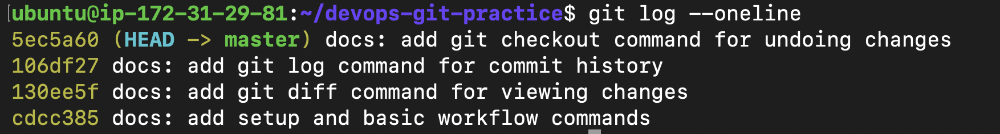

# Day 22: Introduction to Git - Your First Repository

## Objective
To understand the fundamentals of Version Control, set up a local Git repository, build a living Git commands reference, and master the Git workflow (Working Directory -> Staging Area -> Repository).

---

## Task 1 & 2: Git Setup and Initialization
Configured the global Git identity and initialized a fresh local repository to track changes.

**Commands Executed:**
```bash
git config --global user.name "rashid-khan681"
git config --global user.email "rk8539100@gmail.com"
mkdir devops-git-practice
cd devops-git-practice
git init
```

---

## Task 3, 4 & 5: Creating Reference & Building History
Created a `git-commands.md` file, staged it, and made multiple edits to simulate a real-world development workflow, generating a clean commit history.

**Commands Executed:**
```bash
git add git-commands.md
git commit -m "docs: add setup and basic workflow commands"
# Made changes to the file
git add git-commands.md
git commit -m "docs: add git diff command for viewing changes"
# Made further changes
git commit -m "docs: add git log command for commit history"
```

**Proof of Execution (Git Log):**


---

## Task 6: Understand the Git Workflow
Answered core architectural questions regarding the Staging Area, the `.git/` folder, and the difference between `git add` and `git commit`. 

**Output:**
The detailed answers have been saved in a dedicated file named `day-22-notes.md` within this directory. The living reference guide is saved as `git-commands.md`.
