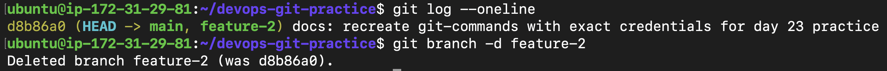
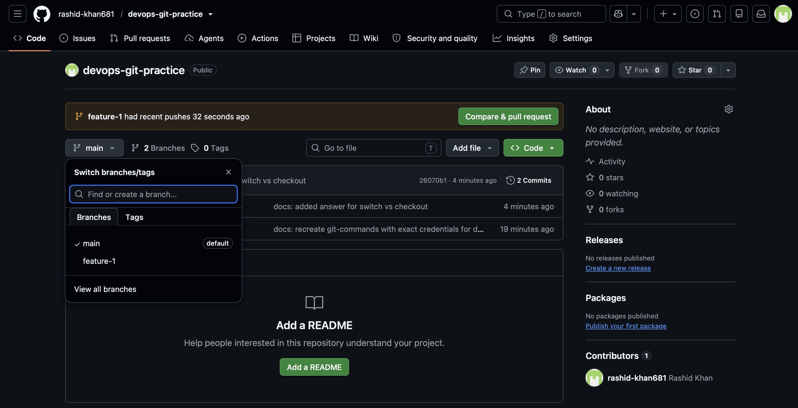
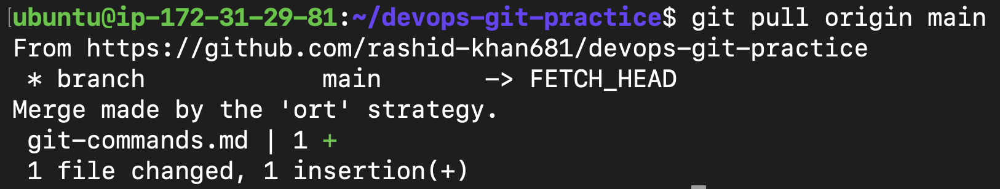

# Day 23: Git Branching & Working with GitHub

## Objective
To master Git branching, understand the difference between local and remote repositories, and learn how to push, pull, fork, and sync code using GitHub.

## Tasks Completed
1. **Understanding Branches**: Answered core concepts about `HEAD`, isolated environments, and branching mechanisms.
2. **Branching Hands-On**: Created, switched (`git switch`), and deleted branches locally.
3. **Push to GitHub**: Created a new remote repository, connected it via `origin`, and pushed multiple branches.
4. **Pull from GitHub**: Simulated remote collaboration by editing code on the GitHub UI and syncing it locally via `git pull` (utilized `git stash` to resolve local conflict warnings).
5. **Clone vs Fork**: Detailed the architectural differences between a standard Git clone and a GitHub fork, including upstream syncing.

## Outputs
- Detailed theoretical answers are stored in `day-23-notes.md`.
- The continuously updated command reference is in `git-commands.md`.

## Proof of Execution
### Branching & Isolation

### Pushing Branches to GitHub Remote

### Pulling Cloud Changes to Local

