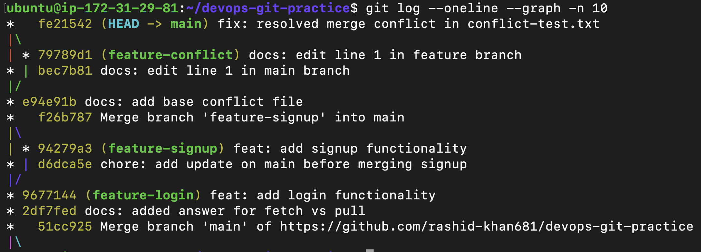
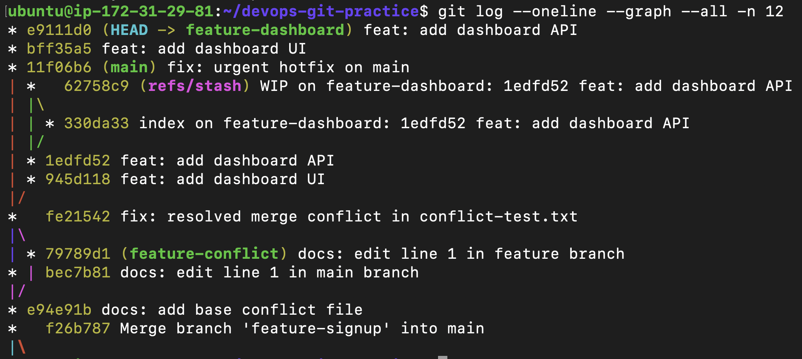
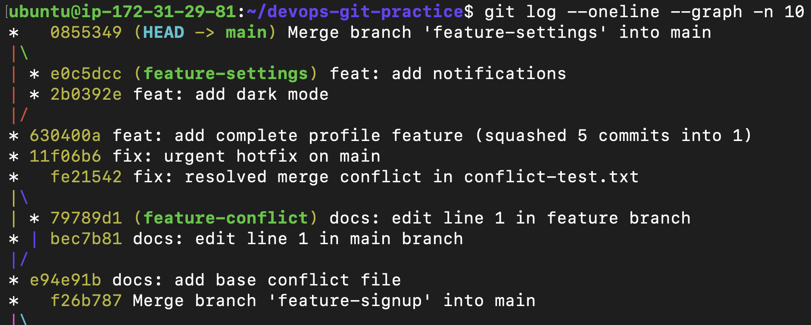
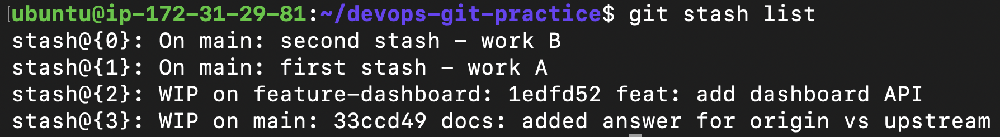
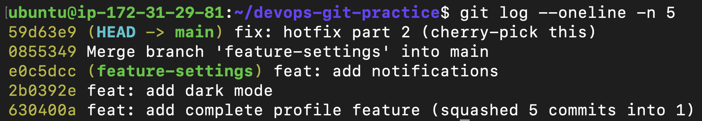

# Day 24: Advanced Git Master Solution

## Step 1: Git Merge & Conflicts
**Objective:** Perform Fast-Forward merge, 3-Way merge, and manually resolve an intentional merge conflict.
```bash
# Simulating a conflict by editing the same line on both branches
git switch -c feature-conflict
echo "Line 1: Edited by feature branch" > conflict-test.txt
git commit -am "docs: edit line 1 in feature branch"

git switch main
echo "Line 1: Edited by main branch" > conflict-test.txt
git commit -am "docs: edit line 1 in main branch"

# Trigger conflict and resolve manually
git merge feature-conflict
echo "Line 1: Resolved text keeping both main and feature changes" > conflict-test.txt
git commit -am "fix: resolved merge conflict in conflict-test.txt"
```
**Output Screenshot:**


---

## Step 2: Git Rebase
**Objective:** Rewrite commit history to maintain a perfectly linear project timeline without merge loops.
```bash
# Branching off, committing, and moving main ahead
git switch -c feature-dashboard
echo "Dashboard UI" > dashboard-ui.txt
git add dashboard-ui.txt
git commit -m "feat: add dashboard UI"

# Rebasing feature onto the new tip of main
git switch feature-dashboard
git rebase main

# Viewing the linear history
git log --oneline --graph --all -n 12
```
**Output Screenshot:**


---

## Step 3: Squash Commit vs Regular Merge
**Objective:** Condense multiple messy Work-In-Progress (WIP) commits into a single clean commit for `main`.
```bash
# Squashing 5 commits from feature-profile into 1
git switch main
git merge --squash feature-profile
git commit -m "feat: add complete profile feature (squashed 5 commits into 1)"

# Regular merge comparison
git switch main
git merge feature-settings --no-ff -m "Merge branch 'feature-settings' into main"
```
**Output Screenshot:**


---

## Step 4: Git Stash
**Objective:** Temporarily save uncommitted changes to safely switch branches during emergencies.
```bash
# Saving uncommitted work to the stash locker
echo "Doing some complex work..." > urgent-work.txt
git add urgent-work.txt
git stash push -m "saving complex work temporarily"

# Popping the stash after returning to the branch
git stash pop

# Applying a specific stash from the list
git stash list
git stash apply stash@{1}
```
**Output Screenshot:**


---

## Step 5: Git Cherry Picking
**Objective:** Extract a single, specific commit from another branch and apply it to the current branch.
```bash
# Grabbing the hash of a specific commit on feature-hotfix
CHERRY_PICK_HASH=$(git rev-parse HEAD)

# Switching to main and applying ONLY that specific commit
git switch main
git cherry-pick $CHERRY_PICK_HASH
```
**Output Screenshot:**


---

## 5 Key Points What I Learned
1. **Merge Conflicts are Protections, Not Errors:** Git physically prevents code overwrites when lines clash, forcing the developer to manually verify and resolve the final state of the code.
2. **Rebase Keeps History Linear:** While `git merge` preserves the exact chronological branching timeline, `git rebase` rewrites history to place feature commits perfectly on top of the main branch, avoiding diamond-shaped merge loops.
3. **Squash Merging Cleans Up Garbage:** Using `--squash` is the best way to combine dozens of messy, minor WIP commits ("typo fix", "test again") into one pristine, meaningful commit on the `main` branch.
4. **Stash is the Ultimate Context-Switcher:** `git stash` safely locks away uncommitted changes so you can jump to another branch for an urgent fix without losing your current progress or making a broken commit.
5. **Cherry-Picking Isolates Hotfixes:** You don't have to merge an entire branch to get a specific fix. `git cherry-pick <hash>` allows you to surgically extract exactly the one commit you need for production.
