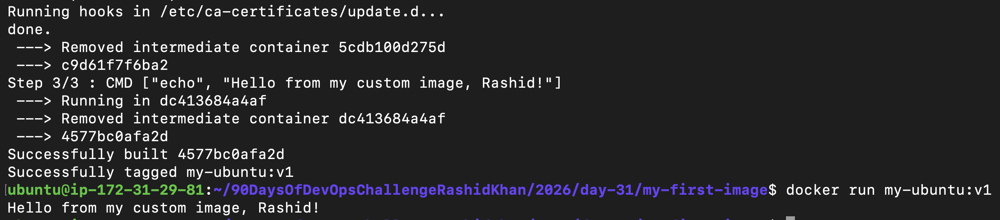
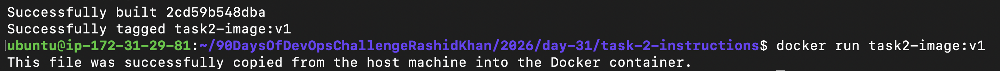
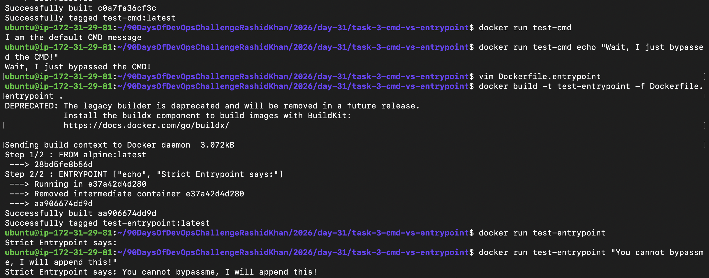
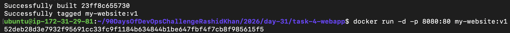
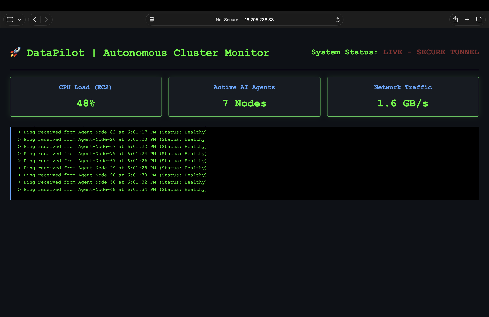
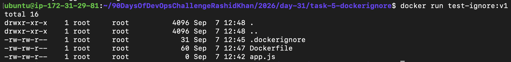
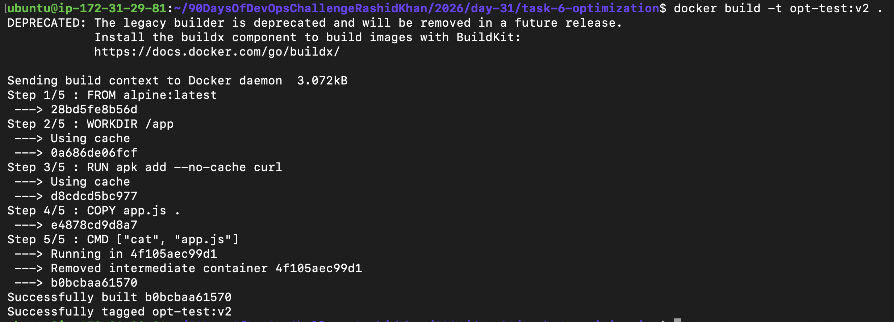

# Day 31: Writing Production-Grade Dockerfiles & Layer Optimization & and build custom images.

Today's session was an incredible hands-on experience on my EC2 instance. Instead of just pulling pre-built images, I wrote my own custom Dockerfiles from scratch. I made mistakes (like adding rogue spaces in package names), debugged them using Vim, and finally understood how Docker layer caching actually works in a production setup.

Below is the complete breakdown of all 6 tasks I executed today.

## Task 1: Building My First Custom Dockerfile
The first task was about setting a solid foundation. I built a custom Ubuntu image, installed `curl`, and configured it to output a custom startup message.

**Dockerfile:**
```dockerfile
FROM ubuntu
RUN apt-get update && apt-get install -y curl
CMD ["echo", "Hello from my custom image, Rashid!"]
```

**Execution & Proof:**
```bash
$ docker build -t my-ubuntu:v1 .
$ docker run my-ubuntu:v1
Hello from my custom image, Rashid!
```


---

## Task 2: Mastering Dockerfile Instructions
Here, I utilized core Dockerfile instructions (`FROM`, `WORKDIR`, `COPY`, `RUN`, `EXPOSE`, `CMD`) to construct an Alpine-based image. 

*Learning moment:* Initially, I mistakenly typed `apk add --no-cache python 3` (with a space). The package manager got confused and threw a `3 (no such package)` error. I quickly realized package names must be exact (`python3`) and fixed it via Vim on the terminal.

**Dockerfile:**
```dockerfile
FROM alpine:latest
WORKDIR /app
COPY host-data.txt .
RUN apk add --no-cache python3
EXPOSE 8000
CMD ["cat", "host-data.txt"]
```

**Execution & Proof:**
```bash
$ docker run task2-image:v1
This file was successfully copied from the host machine into the Docker container.
```


---

## Task 3: The Ultimate Interview Question - CMD vs ENTRYPOINT
In this task, I practically tested the difference between these two critical instructions:
* **`CMD`** acts as a polite default argument—if you pass a new command during `docker run`, it completely overrides the default.
* **`ENTRYPOINT`** acts like a strict rule—it cannot be easily overridden; instead, any extra arguments passed during runtime are appended to it.

**Execution (CMD Override vs ENTRYPOINT Append):**
```bash
# Bypassing CMD
$ docker run test-cmd echo "Wait, I just bypassed the CMD!"
Wait, I just bypassed the CMD!

# Appending to ENTRYPOINT
$ docker run test-entrypoint "You cannot bypassme, I will append this!"
Strict Entrypoint says: You cannot bypassme, I will append this!
```


---

## Task 4: Deploying "DataPilot - Cluster Monitor" (Interactive Web App)
Simple text prints are boring, so I built a futuristic, dark-themed, hacker-style interactive dashboard (`index.html`) named after my DataPilot project. It features real-time CPU load and network traffic updates using CSS/JS. I mounted this onto an `nginx:alpine` image and deployed it live on EC2 port 8080.

**Execution:**
```bash
$ docker run -d -p 8080:80 my-website:v1
```

**Terminal Proof:**


**Live Browser View:**


---

## Task 5: Securing the Build with .dockerignore
To optimize and secure the build context, I implemented a `.dockerignore` file. It successfully acted as a shield, preventing intentionally created heavy folders (`node_modules`), hidden git configs (`.git`), and secret files (`secret.env`) from ever reaching the Docker daemon.

**Verification:**
```bash
$ docker run test-ignore:v1
total 16
drwxr-xr-x    1 root     root          4096 Sep  7 12:48 .
drwxr-xr-x    1 root     root          4096 Sep  7 12:48 ..
-rw-rw-r--    1 root     root            31 Sep  7 12:45 .dockerignore
-rw-rw-r--    1 root     root            60 Sep  7 12:47 Dockerfile
-rw-rw-r--    1 root     root             0 Sep  7 12:42 app.js
```


---

## Task 6: Build Optimization & Layer Caching Magic
This is where I learned how to write production-grade Dockerfiles. By placing infrequently changed layers (like OS packages and library installations) at the TOP, and frequently changing layers (like source code) at the BOTTOM, I optimized the build time.
    
When I modified the source code and triggered a second build, Docker skipped re-downloading the heavy installations and instantly pulled from the cache (`---> Using cache`), dropping the build time to milliseconds!

**Second Build Output Proof:**
```bash
Step 3/5 : RUN apk add --no-cache curl
 ---> Using cache
 ---> d8cdcd5bc977
```


---

## Top 3 Key Learnings

1. **Debugging is Part of the Process:** I experienced firsthand how a tiny syntax error (like `python 3` instead of `python3`) can halt a build. Fixing it directly via Vim on the EC2 terminal reinforced my Linux command-line confidence.
2. **CMD vs ENTRYPOINT is No Longer Confusing:** Seeing `ENTRYPOINT` append my string while `CMD` got completely wiped out by my custom command made this classic interview concept permanently stick in my head.
3. **Order Matters for Caching:** Docker layers are like a stack. Changing anything invalidates all layers below it. Putting `RUN apt-get update` at the top and `COPY . .` at the very bottom is the ultimate secret to lightning-fast builds.
