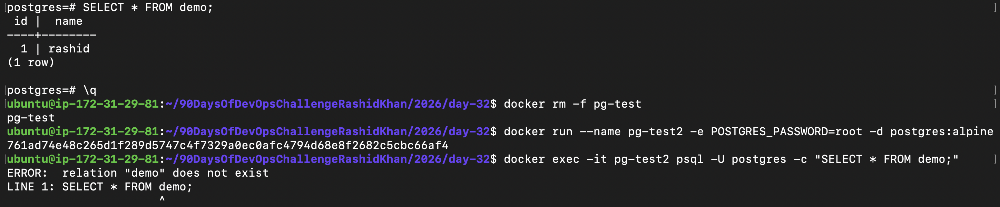
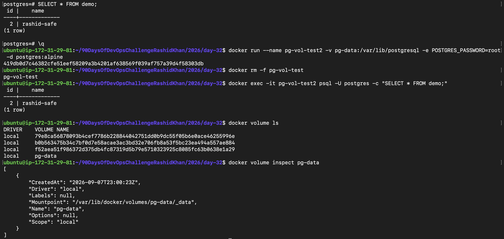
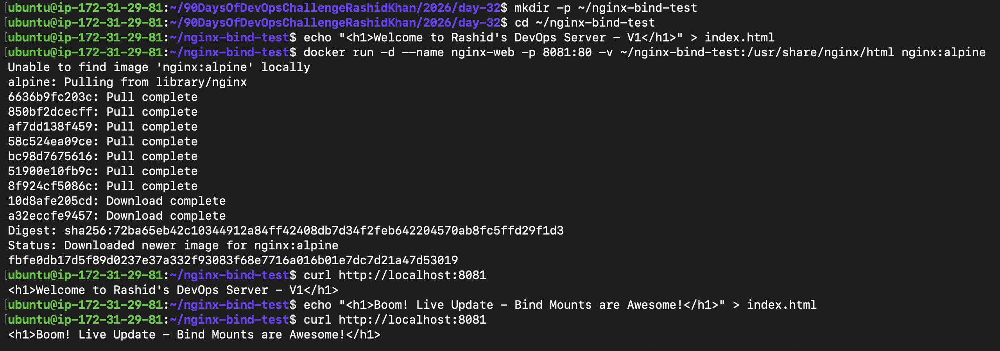
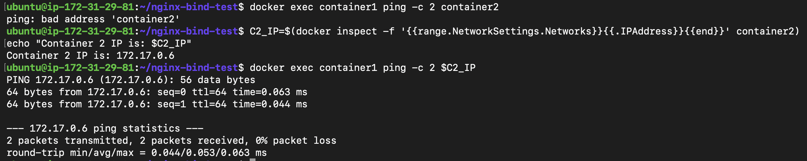
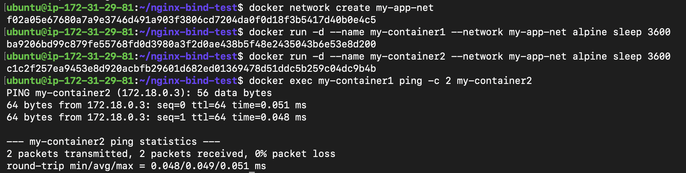
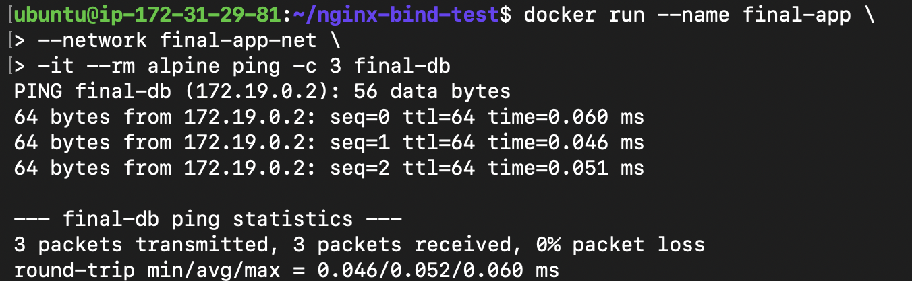

# Day 32: Docker Volumes & Networking

## Overview
Today’s deep dive was all about fixing two major real-world problems in the containerized ecosystem: **Data Persistence** and **Container Communication**. By default, containers are ephemeral (data is lost when destroyed) and isolated (they cannot easily resolve each other by name). Here is how I solved both today.

---

## Task 1: The Problem (Ephemeral Containers)
I started by testing the default behavior of containers to see exactly what happens to data when a container is removed.

**What I did:**
I spun up a Postgres container, jumped into the `psql` shell, and created a demo table with some data.
```bash
docker run --name pg-test -e POSTGRES_PASSWORD=root -d postgres:alpine
docker exec -it pg-test psql -U postgres
# SQL: CREATE TABLE demo (id INT, name TEXT); INSERT INTO demo VALUES (1, 'rashid');
```
Then, I forcefully removed the container (`docker rm -f pg-test`), spun up a new one using the exact same image, and tried to fetch my table.

**The Result & Why:**
I got `ERROR: relation "demo" does not exist`. The data was wiped out completely because it was stored in the container's writable layer, which gets destroyed alongside the container. The ephemeral nature of containers is real!



---

## Task 2: Named Volumes (The Solution)
To persist data, I utilized Docker Named Volumes. 

**A real debugging moment:** 
Initially, I mounted the volume to `/var/lib/postgresql/data`, but the container instantly crashed. Instead of panicking, I checked the logs (`docker logs pg-vol-test`). The logs clearly told me that for Postgres 18+ images, the mount needs to be directly at `/var/lib/postgresql`. Logs are truly a developer's best friend!

**The Fix:**
```bash
docker volume create pg-data
docker run --name pg-vol-test -v pg-data:/var/lib/postgresql -e POSTGRES_PASSWORD=root -d postgres:alpine
```
I recreated the data, destroyed the container, and spun up a brand new one attached to the same `pg-data` volume. This time, the data survived! 



---

## Task 3: Bind Mounts
To understand the difference between Named Volumes and Bind Mounts, I mapped a local directory from my EC2 host directly into an Nginx container.

```bash
docker run -d --name nginx-web -p 8081:80 -v ~/nginx-bind-test:/usr/share/nginx/html nginx:alpine
```
**The Difference:**
* **Named Volumes** are managed entirely by Docker (in `/var/lib/docker/volumes/`). They are best for strict data persistence like databases.
* **Bind Mounts** link an exact file/folder path on the host to the container. I updated `index.html` locally on my Ubuntu host, and the changes reflected instantly on the browser without restarting the container. Great for local dev!



---

## Task 4: Docker Networking Basics
I inspected the default `bridge` network to understand container isolation.

**The Experiment:**
I spun up two Alpine containers and tried to ping `container2` from `container1` by its name.
```bash
docker exec container1 ping -c 2 container2
```
**Result:** `ping: bad address 'container2'`. 
However, when I fetched the exact IP of `container2` and pinged the IP, it worked flawlessly. 
**Why?** The default bridge network does not support automatic DNS resolution. Containers can only communicate via IP on the default bridge, which is terrible for production since IPs change.



---

## Task 5: Custom Networks
To fix the DNS issue, I created a custom bridge network called `my-app-net`.

```bash
docker network create my-app-net
docker run -d --name my-container1 --network my-app-net alpine sleep 3600
docker run -d --name my-container2 --network my-app-net alpine sleep 3600
```

**The Magic:**
When I pinged `my-container2` directly by its name, it succeeded instantly with `0% packet loss`. 
**Why it works:** Custom Docker networks come with an embedded DNS server. It automatically resolves container names to their IPs, allowing name-based communication.



---

## Task 6: Put It Together
I combined both concepts to simulate a real-world microservice setup:
1. Created a custom network `final-app-net`.
2. Ran a backend DB (Postgres) on this network, attaching a persistent volume to keep data safe.
3. Ran a frontend App (Alpine) on the same network to verify connectivity.

```bash
docker run --name final-app --network final-app-net -it --rm alpine ping -c 3 final-db
```
The app container successfully resolved and pinged the database by name. Storage is persistent, and networking is seamless!


