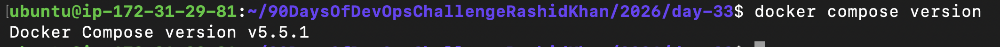
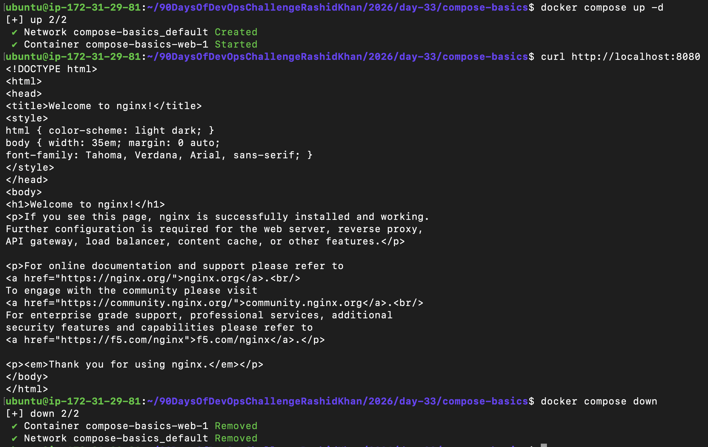
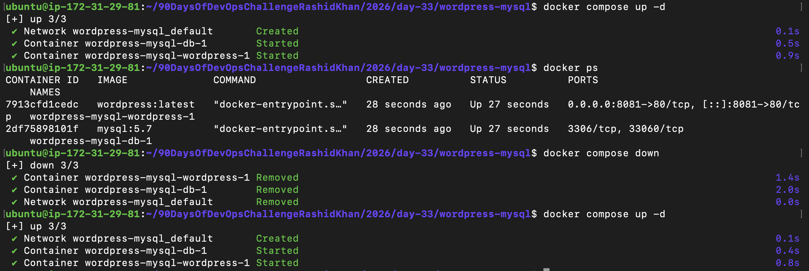
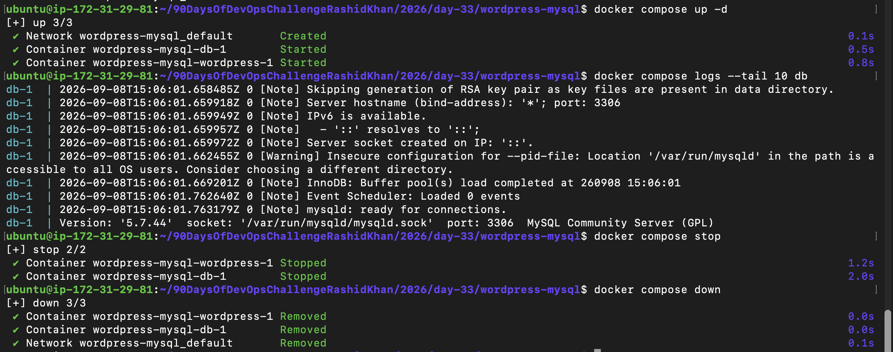
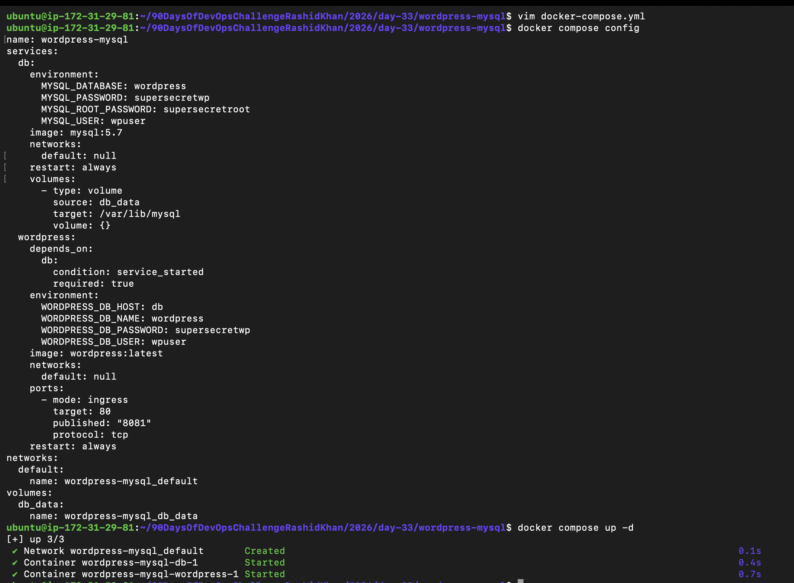

# Day 33 - Docker Compose: Multi-Container Basics 🚀

Yesterday, I spent time manually creating networks, provisioning volumes, and typing out long `docker run` commands to link containers. Today's goal? Automate all of that manual labor into a single YAML file using Docker Compose. 

Here is the log of how I tackled today's challenge, including the hiccups and the real-world fixes.

---

## Task 1: Install & Verify

Right off the bat, I hit a roadblock. Running `sudo apt-get install docker-compose-plugin` on my Ubuntu EC2 instance failed because the package couldn't be located in the default `apt` repos. 

Instead of getting stuck, I took the manual route. I pulled the latest binary directly from Docker's official GitHub releases using `curl`, gave it execution permissions, and moved it to the CLI plugins folder. 

```bash
mkdir -p ~/.docker/cli-plugins/
curl -SL [https://github.com/docker/compose/releases/latest/download/docker-compose-linux-$(uname](https://github.com/docker/compose/releases/latest/download/docker-compose-linux-$(uname) -m) -o ~/.docker/cli-plugins/docker-compose
chmod +x ~/.docker/cli-plugins/docker-compose
docker compose version
```

**Proof of Installation:**


---

## Task 2: Your First Compose File

Time to test the waters. I created a directory `compose-basics` and wrote my very first `docker-compose.yml`. The goal was simple: spin up an Nginx container and map it to port 8080.

**`docker-compose.yml`:**
```yaml
services:
  web:
    image: nginx:alpine
    ports:
      - "8080:80"
```

Spun it up in detached mode using `docker compose up -d`, verified it was serving pages locally with `curl http://localhost:8080`, and then cleanly tore the whole environment down with `docker compose down`. Just like that—no manual network cleanup needed.

**Proof of Execution:**


---

## Task 3: Two-Container Setup (WordPress + MySQL)

This was the main event. I needed to run WordPress and MySQL together. The beauty of Compose is that I didn't even have to define a network manually—Compose automatically created a default bridge network, allowing WordPress to find MySQL simply by its service name (`db`).

I also configured a named volume (`db_data`) so that even if the containers get destroyed, the database records survive.

**`docker-compose.yml`:**
```yaml
services:
  db:
    image: mysql:5.7
    restart: always
    environment:
      MYSQL_ROOT_PASSWORD: rootpassword
      MYSQL_DATABASE: wordpress
      MYSQL_USER: wpuser
      MYSQL_PASSWORD: wppassword
    volumes:
      - db_data:/var/lib/mysql

  wordpress:
    image: wordpress:latest
    restart: always
    ports:
      - "8081:80"
    environment:
      WORDPRESS_DB_HOST: db
      WORDPRESS_DB_USER: wpuser
      WORDPRESS_DB_PASSWORD: wppassword
      WORDPRESS_DB_NAME: wordpress
    depends_on:
      - db

volumes:
  db_data:
```

**The Struggle:** After running `up -d`, the containers were healthy, but my browser couldn't reach port 8081. While configuring my AWS EC2 Security Group to allow inbound TCP on 8081, I accidentally caused a broken pipe and locked myself out of SSH! A quick instance reboot and re-adding the port 22 rule got me back in.

**Persistence Test:** I stopped the environment (`docker compose down`) and brought it back up. My WordPress setup was completely intact thanks to the named volume!

**Proof of Setup:**


---

## Task 4: Compose Commands

I spent some time getting familiar with the daily-driver operational commands. Since MySQL spits out a massive amount of logs on initialization, I used the `--tail` flag to keep my terminal clean.

**Commands practiced:**
*   **Start detached:** `docker compose up -d`
*   **Check status:** `docker compose ps`
*   **View specific logs:** `docker compose logs --tail 10 db` (Pro-tip for avoiding log floods)
*   **Stop gracefully:** `docker compose stop` (keeps networks and containers intact)
*   **Nuke everything:** `docker compose down` (removes containers and networks, but keeps volumes)

**Proof of Commands in Action:**


---

## Task 5: Environment Variables

Hardcoding passwords inside a YAML file is a terrible idea for version control. To fix this, I created a `.env` file in the same directory to hold my secrets securely. 

**`.env` file:**
```env
MYSQL_ROOT_PASSWORD=supersecretroot
MYSQL_DATABASE=wordpress
MYSQL_USER=wpuser
MYSQL_PASSWORD=supersecretwp
```

I then updated the `docker-compose.yml` to interpolate these values using `${VARIABLE_NAME}`. Before spinning it up, I ran `docker compose config` to verify that Docker was correctly picking up the variables from the `.env` file. It worked flawlessly.

*(Note: Added `.env` to `.gitignore` to ensure these secrets never hit the repository).*

**Proof of Variable Interpolation:**


---
*Documented as part of the #90DaysOfDevOps Challenge.*
