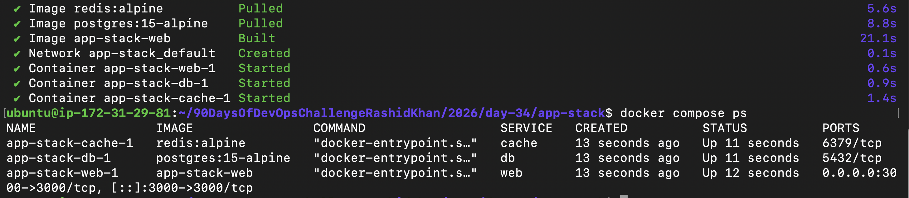
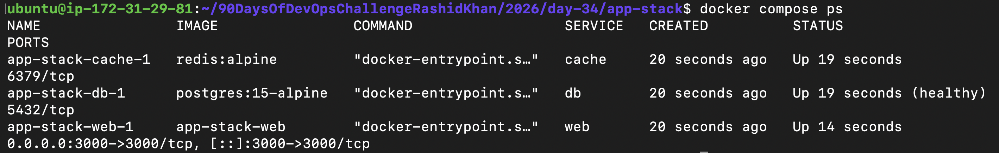
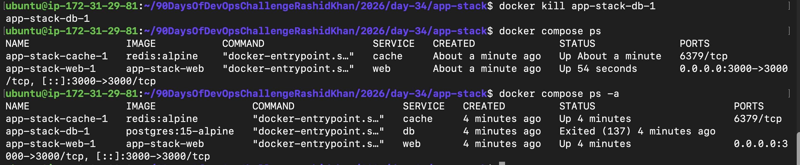
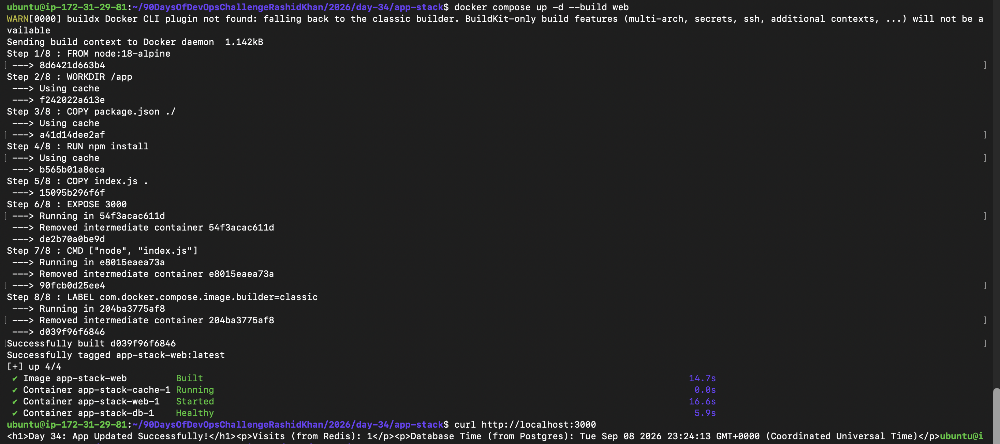
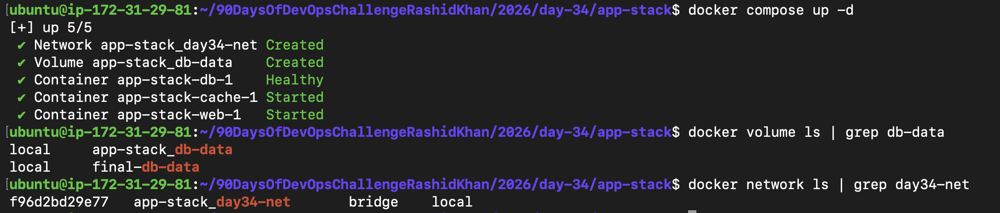
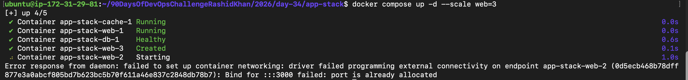

# Day 34: Advanced Docker Compose – Real-World Debugging & App Stacks 

Today was all about getting out of the basic Docker zone and building a production-like environment. I typed out the YAML files manually using `vim` to build that muscle memory, hit a few intentional errors, and deep-dived into how Docker engine actually thinks.

## Task 1: Build Your Own App Stack
Built a 3-tier Node.js stack from scratch. Wrote the `Dockerfile` and `package.json`, and hooked it up with a PostgreSQL database and Redis cache. 
Instead of pulling pre-built images for the app, I configured `docker-compose.yml` to build the web container dynamically. 

## Task 2: depends_on & Healthchecks
**The Problem:** Node.js crashes if it tries to connect to Postgres before the DB is fully ready.
**The Fix:** I added a `healthcheck` (`pg_isready`) to the DB service and set the web service to wait for `condition: service_healthy`. 
*Terminal Proof:* I literally watched the logs wait. The DB hit `Healthy` at 5.8s, and immediately at 5.9s, the web container started. Perfect synchronization!

## Task 3: Restart Policies (The Trick Question)
**Q: Manually kill the database container — does it come back?**
Nope! I ran `docker kill app-stack-db-1`. When I checked `docker compose ps`, it was gone. I had to run `docker compose ps -a` to catch it sitting in an `Exited (137)` state. 
*Why?* Because an explicit `docker kill` command acts as an "Admin Override". Docker assumes that if I explicitly killed it, I don't want it back, completely ignoring the `restart: always` policy.

**Q: When would you use each restart policy?**
* **`restart: always`**: I'd use this for my core infrastructure (like Postgres or Redis). If the container crashes due to memory issues or the EC2 server reboots, Docker will force it back up.
* **`restart: on-failure`**: Better for background tasks. It only restarts if the exit code is non-zero (an error). If the code finishes cleanly (code 0), it stays stopped.

## Task 4: Custom Dockerfiles in Compose
I edited `index.js` via `vim` to change the UI text to `<h1>Day 34: App Updated Successfully!</h1>`. 
Instead of tearing down the whole DB and Cache, I ran a targeted rebuild: `docker compose up -d --build web`. 
Docker's caching magic kicked in (`---> Using cache`), completely skipped the heavy `npm install` step, and pushed my new code live in under 15 seconds.

## Task 5: Named Networks & Volumes
Time to make data permanent. I dropped the default network and created a custom bridge network (`day34-net`) for better isolation. More importantly, I bound the Postgres data directory to a named volume (`db-data`). Verified it by running `docker volume ls | grep db-data`. Now, even if I wipe the containers, my database records survive.

## Task 6: Scaling (Bonus)
**Q: What happens? What breaks? Why doesn't simple scaling work with port mapping?**
I tried to push the limits and scale the web tier using `docker compose up -d --scale web=3`. 
It instantly threw an error: `Bind for :::3000 failed: port is already allocated`.
*The reason:* I hardcoded `"3000:3000"` in my compose file. The first container `web-1` grabbed port 3000 on my EC2 instance. When `web-2` and `web-3` tried to spin up, they crashed because that exact host port was already locked. 
*Lesson:* To properly scale, you have to omit the host port mapping (e.g., just `- "3000"`) and let Docker assign random available ports on the host.

