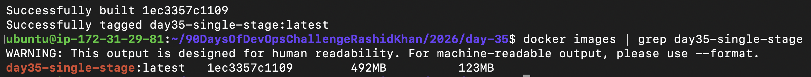
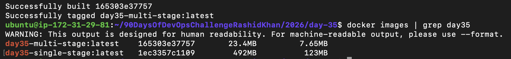
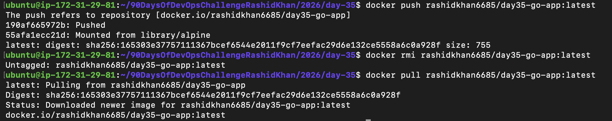
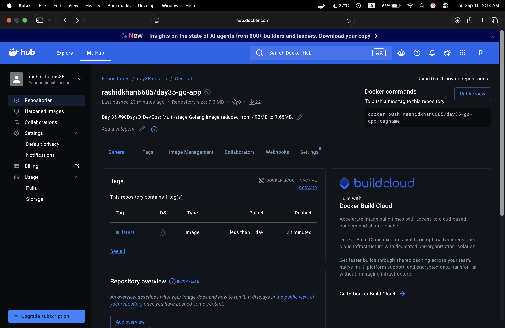
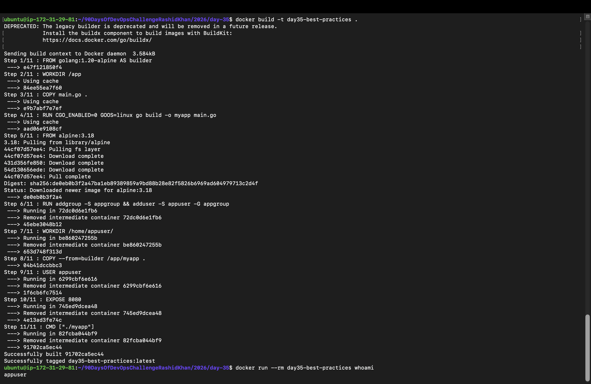

# Day 35: Multi-Stage Builds, Docker Hub & Image Security Best Practices

Today's session was all about moving away from bloated, insecure container images and building production-grade, optimized, and secure microservices. Instead of reading theory, I faced real-world infrastructure constraints (like running out of disk space on an AWS EC2 instance) and solved them directly from the terminal.

---

## Environment & Setup
* Build Server: AWS EC2 (Ubuntu instance with tight storage constraints)
* Verification Environment: Local MacOS (Docker Desktop)
* App Stack: Custom Golang lightweight web server (main.go)

---

## Task 1: The Problem with Large Images (Single-Stage)

To understand why multi-stage builds are critical in production, I started by writing a simple Go web server and containerizing it using a single-stage approach. 

### The Code (main.go)
```go
package main

import (
    "fmt"
    "net/http"
)

func main() {
    http.HandleFunc("/", func(w http.ResponseWriter, r *http.Request) {
        fmt.Fprintf(w, "Hello Day 35! This is a heavy single-stage build.")
    })
    fmt.Println("Server starting on port 8080...")
    http.ListenAndServe(":8080", nil)
}
```

### The Single-Stage Dockerfile
```dockerfile
FROM golang:1.20-alpine
WORKDIR /app
COPY main.go .
RUN go build -o myapp main.go
EXPOSE 8080
CMD ["./myapp"]
```

### Terminal Execution & Reality Check
When I ran the build command:
```bash
docker build -t day35-single-stage .
docker images | grep day35-single-stage
```
* Real Challenge: Initially, attempting a standard heavyweight Go base image crashed my AWS EC2 free-tier instance with a `no space left on device` error because the extracted filesystem layers consumed all 1.2GB of available free space! After a system prune, I switched to `golang:1.20-alpine`, but the final single-stage image still sat at an alarming 492 MB just to serve a basic "Hello World" response.



---

## Task 2: Multi-Stage Build Optimization

To slash the image size, I rewrote the Dockerfile into two separate distinct stages:
1. Builder Stage: Uses the heavy Go SDK compiler to build the standalone binary (`CGO_ENABLED=0`).
2. Production Stage: Discards the SDK entirely and copies only the compiled binary into a bare-minimum Alpine OS.

### The Multi-Stage Dockerfile
```dockerfile
# --------- STAGE 1: Builder ---------
FROM golang:1.20-alpine AS builder
WORKDIR /app
COPY main.go .
RUN CGO_ENABLED=0 GOOS=linux go build -o myapp main.go

# --------- STAGE 2: Production ---------
FROM alpine:latest
WORKDIR /root/
COPY --from=builder /app/myapp .
EXPOSE 8080
CMD ["./myapp"]
```

### Build & Comparison
```bash
docker build -t day35-multi-stage .
docker images | grep day35
```

* The Result: The image size dropped from 492 MB down to 7.65 MB (actual unique disk space used). That is a massive 98.4% reduction in size! This drastically cuts down deployment time, security vulnerability surface area, and registry storage costs.



---

## Task 3: Pushing & Pulling via Docker Hub

Once the image was optimized, I distributed it via Docker Hub using secure CLI authentication (Personal Access Token).

### Commands Executed:
```bash
# Authenticate securely using PAT
docker login

# Tag the image with Docker Hub username
docker tag day35-multi-stage:latest rashidkhan6685/day35-go-app:latest

# Push to Docker Hub registry
docker push rashidkhan6685/day35-go-app:latest

# Verify by clearing local cache and pulling back down
docker rmi rashidkhan6685/day35-go-app:latest
docker pull rashidkhan6685/day35-go-app:latest
```

* Observation: Verified cross-environment compatibility by pulling the image seamlessly onto my local MacOS environment and inspecting it inside Docker Desktop. (Note: Docker Desktop retains the original build timestamp metadata from EC2, showing the creation history correctly).



---

## Task 4: Docker Hub Repository & Documentation

Maintained production hygiene by configuring the repository directly on the Docker Hub UI:
* Added a clear, concise short description ("Day 35 #90DaysOfDevOps: Multi-stage Golang image reduced from 492MB to 7.65MB").
* Verified the tag versioning (`latest`), repository digest, and compressed storage size (7.3 MB).



---

## Task 5: Security Best Practices (Non-Root User & Pinned Tags)

By default, Docker containers run as the `root` user, creating a severe vulnerability window if an attacker manages to break out of the container (Container Escape). I applied production hardening rules:

1. Pinned Base Image Tags: Avoided `latest` in production and used a specific stable version (`alpine:3.18`).
2. Non-Root User Creation: Added system user and group directives inside the Dockerfile.
3. User Switching: Enforced the execution context to shift away from root prior to runtime.

### Final Production Dockerfile:
```dockerfile
# --------- STAGE 1: Builder ---------
FROM golang:1.20-alpine AS builder
WORKDIR /app
COPY main.go .
RUN CGO_ENABLED=0 GOOS=linux go build -o myapp main.go

# --------- STAGE 2: Production ---------
FROM alpine:3.18

# Create dedicated non-root user and group
RUN addgroup -S appgroup && adduser -S appuser -G appgroup

WORKDIR /home/appuser/
COPY --from=builder /app/myapp .

# Switch active execution context to non-root user
USER appuser

EXPOSE 8080
CMD ["./myapp"]
```

### Security Verification:
```bash
docker build -t day35-best-practices .
docker run --rm day35-best-practices whoami
```
* Output: Successfully returned `appuser` instead of `root`, proving that process isolation is fully active.



---

## Key Takeaways
* Heavy base images will quietly choke your cloud servers (like my EC2 disk space crash). Multi-stage builds are non-negotiable for production.
* Always use explicit tags (`alpine:3.18`) instead of `latest` for reproducible builds.
* Running containers as a non-root `appuser` is a mandatory security baseline to prevent container-escape privilege escalations.
