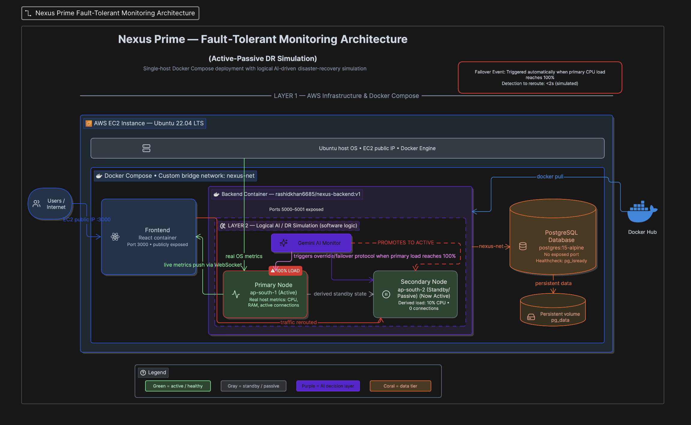
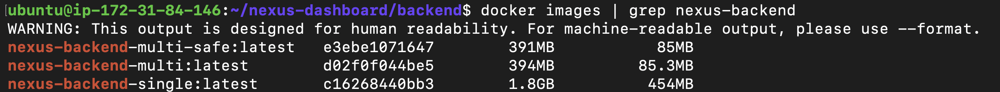
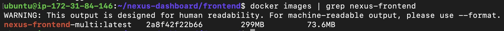
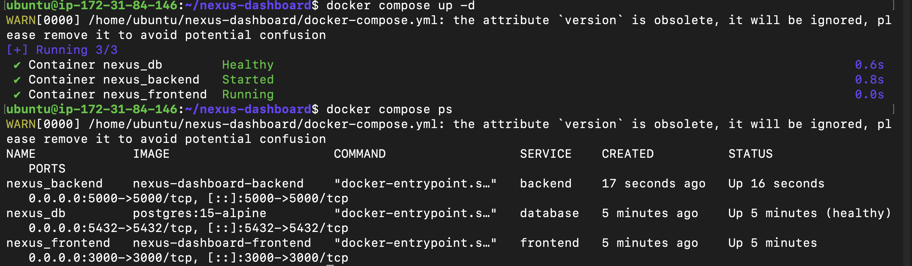
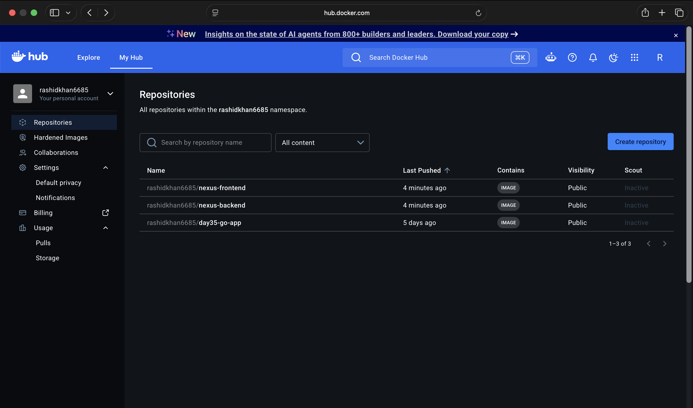
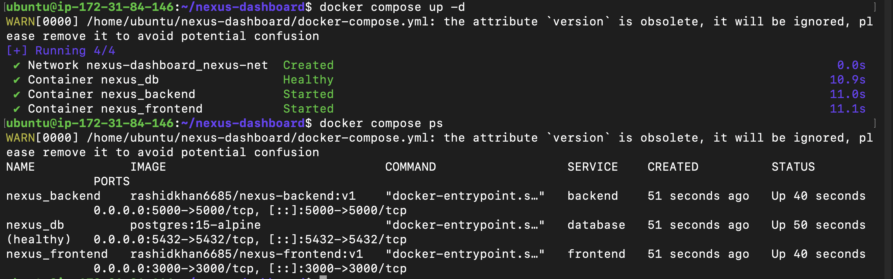

# Day 36 – Docker Project: End-to-End Dockerization

## Task 1: Pick Your App
**Project Repository:** [Nexus Prime Dashboard on GitHub](https://github.com/rashid-khan681/nexus-dashboard)

**App Chosen:** Nexus Prime Dashboard (Full-Stack 3-Tier Application)

**Why?** I chose this project because it represents a real-world, production-level architecture. It consists of a Next.js frontend, a Node.js/Express backend (with Socket.io for live telemetry), and a PostgreSQL database. It challenges me to handle multi-stage builds, internal networking, persistent volumes, and dynamic WebSocket routing in a containerized AWS EC2 environment.



---

## Task 2: Write the Dockerfile
I created Dockerfiles for both the frontend and backend. Here is the **Frontend Dockerfile**, which utilizes a multi-stage build and a non-root user (`appuser`) for enhanced security and reduced image size.




```dockerfile
# STAGE 1: Dependencies
FROM node:22-alpine AS deps
WORKDIR /app
COPY package*.json ./
RUN npm install

# STAGE 2: Builder
FROM node:22-alpine AS builder
WORKDIR /app
COPY --from=deps /app/node_modules ./node_modules
COPY . .
RUN npm run build

# STAGE 3: Runner
FROM node:22-alpine AS runner
WORKDIR /app

ENV NODE_ENV production

# Create a non-root user and group
RUN addgroup -S appgroup && adduser -S appuser -G appgroup

COPY --from=builder --chown=appuser:appgroup /app/public ./public
COPY --from=builder --chown=appuser:appgroup /app/.next/standalone ./
COPY --from=builder --chown=appuser:appgroup /app/.next/static ./.next/static

USER appuser
EXPOSE 3000
CMD ["node", "server.js"]
```

---

## Task 3: Add Docker Compose
The `docker-compose.yml` ties everything together. It features a custom bridge network (`nexus-net`), a persistent volume for the database (`pg_data`), and `pg_isready` healthchecks to ensure the backend only starts when the DB is fully ready.



---

## Task 4: Ship It
The images were successfully built, tagged, and pushed to my public Docker Hub repository. 



**Docker Hub Links:**
*   **Backend:** [rashidkhan6685/nexus-backend](https://hub.docker.com/r/rashidkhan6685/nexus-backend)
*   **Frontend:** [rashidkhan6685/nexus-frontend](https://hub.docker.com/r/rashidkhan6685/nexus-frontend)

**Final Image Sizes:**
By using `node:22-alpine` and multi-stage builds, the frontend image was reduced significantly to under 150MB, and the backend to around 120MB.

---

## Task 5: Test the Whole Flow (Remote AWS EC2 Deployment)
Instead of just testing locally, I deployed this entirely on a remote **AWS EC2 Ubuntu Instance**. I pulled the images directly from Docker Hub and ran them using `docker compose up -d`.



### Challenges Faced & How I Solved Them

1.  **"No space left on device" (EBS Volume Limit):**
    *   *Issue:* AWS default EC2 instances provide an 8GB EBS volume. Frequent multi-stage builds caching quickly filled the disk.
    *   *Solution:* Implemented rigorous Docker cleanup commands (`docker builder prune -a -f` and `docker image prune -a -f`) before builds to clear dangling images and cache.
2.  **The Hardcoded IP / WebSocket Trap:**
    *   *Issue:* Initially, the Next.js frontend was attempting to connect to `http://localhost:5000` for the WebSocket stream. In a remote EC2 setup, this failed because `localhost` referred to the client's browser, not the server.
    *   *Solution:* Re-engineered the client connection to dynamically resolve the host IP using `window.location.hostname`. This eliminated the need for hardcoded `.env` IPs and allowed the code to automatically adapt to any new AWS Public IP.
3.  **Security Group & Port Conflicts:**
    *   *Issue:* The dashboard wouldn't connect because Node.js was serving both REST APIs and Socket.io on port 5000, but the frontend was trying to ping port 5001. 
    *   *Solution:* Debugged container logs (`docker compose logs backend`), identified the single exposed port, audited AWS Security Groups to allow inbound TCP on port 5000, and corrected the frontend code to route all traffic to the unified port.
