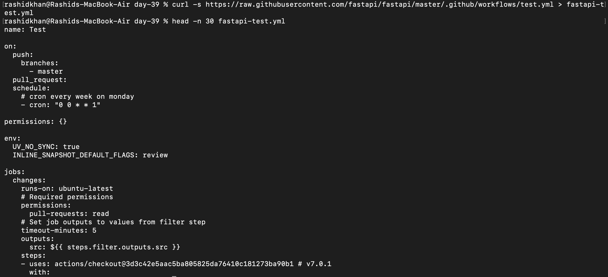

# Day 39: Understanding CI/CD Concepts

Before writing any pipeline code, it is critical to understand the architecture, problems solved, and exact terminology behind Continuous Integration and Continuous Delivery/Deployment.

## Task 1: The Problem (Manual Deployments & Integration)
*   **What can go wrong with 5 developers pushing manually?**
    In the industry, this is known as **"Integration Hell."** Manual deployments lack automated quality gates. Developers overwrite configurations, miss database migrations, or deploy untested code. The result is silent production breakages and extended downtime.
*   **What does "it works on my machine" mean?**
    This is officially called **Configuration Drift**. A developer's local environment (OS versions, hidden `.env` files, global dependencies) slowly drifts away from the actual production server state. It works locally due to unrecorded dependencies but crashes in production, making triage a guessing game between Dev and Ops teams.
*   **How many times a day can a team safely deploy manually?**
    According to **DORA Metrics** (the standard for DevOps performance), teams relying on manual deployments are categorized as "Low Performers." They can safely deploy perhaps once a month or once a week. Manual deployments inherently carry a high Change Failure Rate (46%–60%).

---

## Task 2: CI vs CD Definitions
*   **Continuous Integration (CI):**
    The automated process where developers frequently merge code into a central repository. On every push, automated build scripts and unit tests execute immediately. It acts as a quality gate to catch syntax errors and broken dependencies early.
    *   *Example:* A developer pushes code; GitHub Actions instantly runs `pytest` and blocks the Pull Request if existing functions break.
*   **Continuous Delivery (CD):**
    An extension of CI where the codebase is always maintained in a deployable state. Artifacts are automatically built and deployed to a Staging environment. However, promoting the release to the live Production environment requires a **manual human approval**.
    *   *Example:* QA verifies the code on `staging.myapp.com`. A Release Manager then manually clicks "Deploy to Prod" in Jenkins.
*   **Continuous Deployment (CD):**
    The ultimate level of automation. Every code change that successfully passes all automated test gates is deployed directly to the live Production servers with **zero human intervention**.
    *   *Example:* A Netflix developer pushes a UI patch. It passes automated tests and goes live to millions of users 15 minutes later without management approval.

---

## Task 3: Pipeline Anatomy
Real-world pipelines execute using these hierarchical components:
*   **Trigger:** An event listener that initiates the pipeline (e.g., a webhook for `git push`, or a time-based CRON schedule).
*   **Stage:** A macro logical phase (Build, Test, Deploy). Stages run sequentially; a failure in 'Test' halts execution, preventing 'Deploy'.
*   **Job:** A defined unit of work executing on a single runner. Jobs within the same stage can run concurrently in parallel, but a single job cannot be split across multiple servers.
*   **Step:** The smallest executable unit within a job (e.g., running `npm install` or checking out code). Steps run sequentially and share the same filesystem.
*   **Runner:** The actual compute infrastructure (VM, Docker container, or EC2 instance) executing the job.
*   **Artifact:** A persistent output file (compiled binary, `.zip` archive, or Docker image) generated by a successful job, passed to subsequent stages.

---

## Task 4: CI/CD Pipeline Diagram
*Scenario: Push -> Test -> Docker Build -> Staging Deploy*

    [ Developer ]
          │ (git push origin main)
          ▼
    ===================================================
               CI/CD PIPELINE (GitHub Actions)
    ===================================================
          │
    ┌─────▼─────┐
    │  STAGE 1  │
    │ Unit Test │
    └─────┬─────┘
          │ (If tests pass)
    ┌─────▼─────┐
    │  STAGE 2  │ ────(Push)────► [ Docker Registry ]
    │ Build App │
    └─────┬─────┘
          │ (Pull image)
    ┌─────▼─────┐
    │  STAGE 3  │
    │ Deploy    │
    └─────┬─────┘
          │ (SSH / Update)
    ======▼============================================
    [ Staging Server (AWS EC2) ]

---

## Task 5: Explore in the Wild (Open-Source Analysis)
Using the terminal, I fetched the actual production CI/CD workflow of the popular Python framework **FastAPI**.

*   **Repository Analyzed:** `tiangolo/fastapi`
*   **Workflow File:** `.github/workflows/test.yml`
*   **What triggers it?**
    It utilizes the `on:` keyword to define webhook triggers. Specifically, it executes on `push` and `pull_request` events targeting the `master` branch. It also has a cron schedule `0 0 * * 1` to run weekly on Mondays.
*   **How many jobs does it have?**
    The top of the file defines initial jobs like `changes` (using a filter to check modified files) before dynamically spinning up test jobs.
*   **What does it do?**
    It executes the core CI process. It checks out the code, evaluates permissions, and sets up dependencies to rigorously test FastAPI against multiple Python versions and operating systems via matrix strategies.

