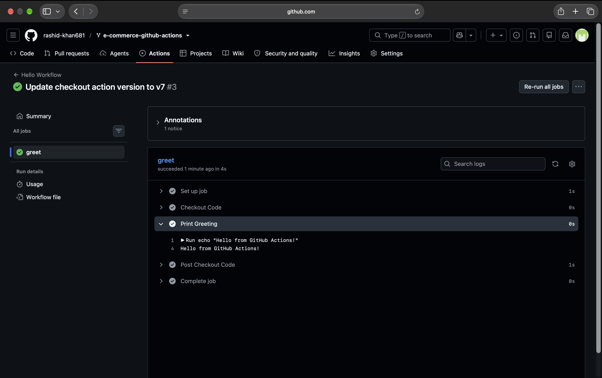
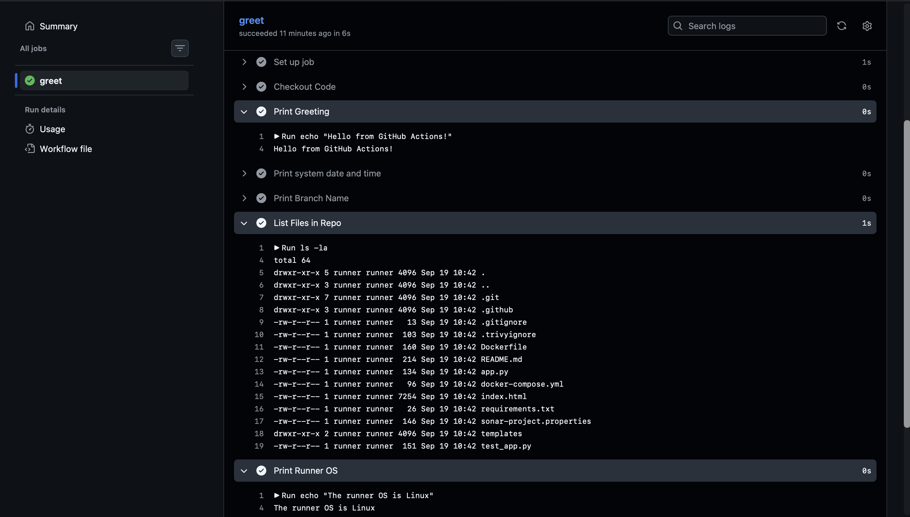
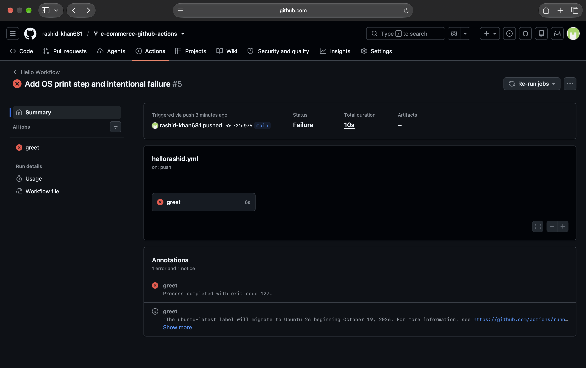

# Day 40: Your First GitHub Actions Workflow

This document records the execution of my first GitHub Actions Continuous Integration (CI) pipeline, moving from theoretical architecture (Day 39) to practical implementation on an active repository.

## Task 1 & 2: Set Up and Hello Workflow
Instead of an empty practice repository, I utilized my existing forked repository (`e-commerce-github-actions`) to simulate a real-world CI/CD environment. 

Below is the initial configuration designed to verify runner allocation and basic execution:

    # =====================================================================
    # GOAL: Execute the first basic GitHub Actions pipeline to verify CI setup
    # TRIGGER: Executes automatically on every push to any branch
    # =====================================================================
    name: Hello Workflow

    on:
      push:

    jobs:
      # -------------------------------------------------------------------
      # JOB 1: A simple greeting job to test runner execution and checkout
      # -------------------------------------------------------------------
      greet:
        runs-on: ubuntu-latest
        steps:
          - name: Checkout Code
            uses: actions/checkout@v4
          
          - name: Print Greeting
            run: echo "Hello from GitHub Actions!"

**Verification:**
The pipeline was triggered automatically on push. GitHub provisioned an `ubuntu-latest` runner, checked out the code, and successfully executed the bash command.

---

## Task 3: Understand the Anatomy
Based on official GitHub Actions architecture documentation, here is the technical breakdown of the workflow configuration keys:

*   **`on:`** Defines the trigger mechanism. It listens for specific webhook events (like `push` or `pull_request`) or time-based CRON schedules to initiate execution.
*   **`jobs:`** A macro-level container for a set of steps. By default, multiple jobs within a workflow execute concurrently in parallel to optimize overall execution time.
*   **`runs-on:`** Specifies the exact infrastructure environment. Declaring `ubuntu-latest` provisions a fresh, ephemeral Ubuntu Linux virtual machine hosted by GitHub for the duration of the job.
*   **`steps:`** The granular, executable units of work within a job. Steps strictly execute sequentially one after the other. They run on the same runner and share the exact same local filesystem, memory, and environment variables.
*   **`uses:`** Invokes a predefined, reusable Action. Instead of writing custom shell scripts for common tasks, this calls packaged code (e.g., `actions/checkout@v4` pulls the repository source code into the runner's workspace).
*   **`run:`** Executes raw shell commands directly on the runner's operating system (e.g., `npm install` or `ls`).
*   **`name:`** A human-readable identifier attached to a job or step. It does not affect execution logic but is critical for observability and debugging in the UI logs.

---

## Task 4: Add More Steps (Dynamic Context Injection)
Pipelines must react to the context of the code being pushed. By injecting additional shell commands and GitHub Context variables (`${{ ... }}`), the pipeline becomes dynamic.

*   Executing `date` confirmed the internal system time of the ephemeral runner.
*   Using `${{ github.ref_name }}` dynamically extracted the exact branch name (`main`) that triggered the webhook, which is critical for branch-specific deployment routing.
*   Running `ls -la` proved that the `actions/checkout` step successfully pulled the remote code into the runner's isolated workspace.
*   Using `${{ runner.os }}` verified the underlying operating system.

---

## Task 5: Break It On Purpose (Error Handling)
In real-world CI/CD, pipelines act as quality gates. To understand failure states, I intentionally injected a syntax error into the bash script (`echho` instead of `echo`).

**Observations of a Failed Pipeline:**
1.  **Immediate Halt:** The runner hit the unrecognized command, logged an `exit 127` (Command not found) non-zero exit code, and immediately halted execution.
2.  **UI Feedback:** The GitHub Actions tab marked the run with a Red Cross (❌). If this were a Pull Request, branch protection rules would automatically block the code from being merged into `main`.
3.  **Debugging:** By clicking into the failed step, the logs explicitly highlighted the exact line where the shell failed, making remediation straightforward.

