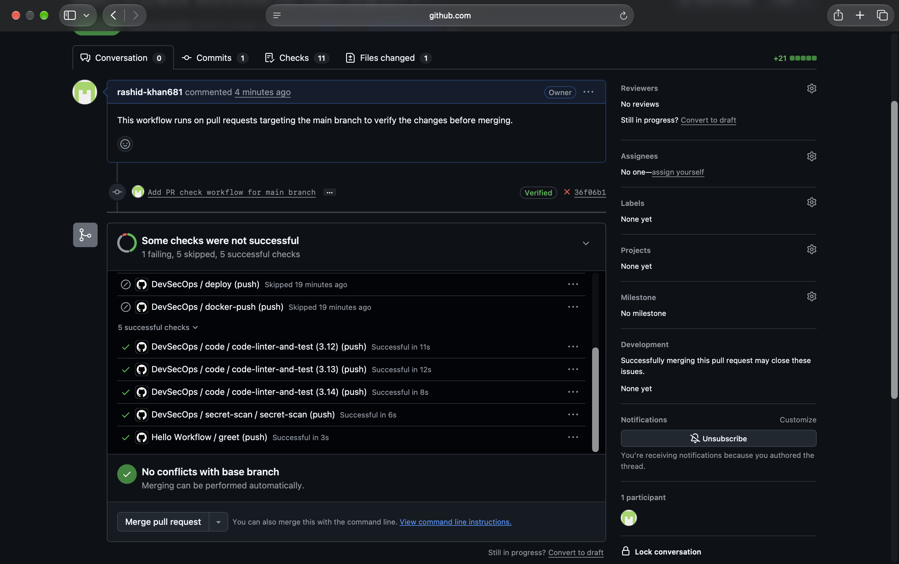
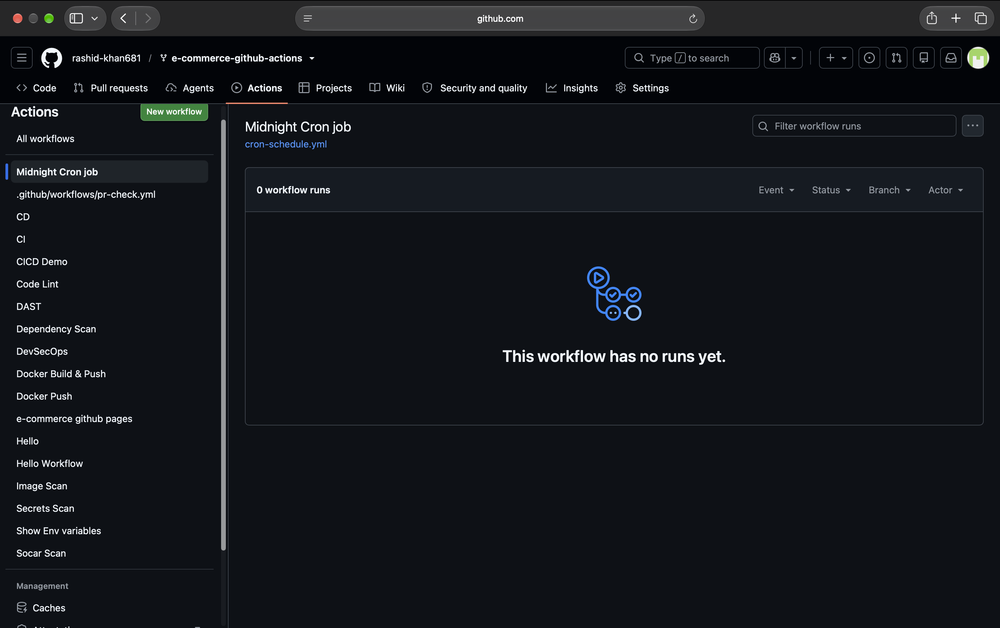
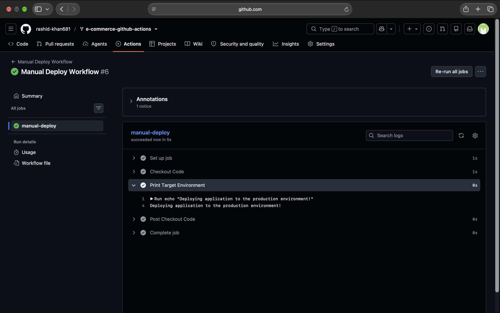
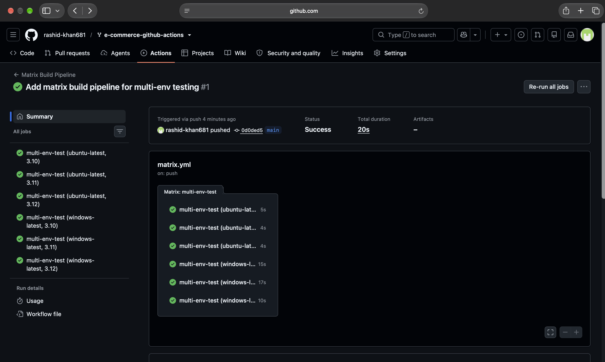
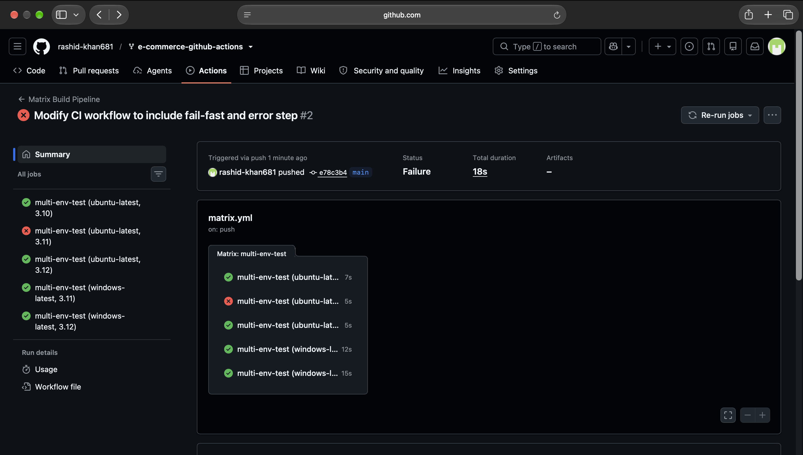

# Day 41: GitHub Actions Triggers & Matrix Builds

This document outlines the implementation of various GitHub Actions triggers, parallel execution using matrix strategies, and workflow control mechanisms.

## Task 1: Trigger on Pull Request
**Objective:** Execute pipeline strictly on Pull Requests targeting the `main` branch.
**Implementation Notes:** Initially encountered cross-repo merge permission issues by targeting the upstream repository (`LondheShubham153:main`). Resolved by correcting the base repository to the local fork (`rashid-khan681/e-commerce-github-actions`). Noted interference from legacy DevSecOps `on: push` workflows which were safely ignored.

```yaml
name: PR Check Workflow
on:
  pull_request:
    branches:
      - main
    types: [opened, synchronize]
jobs:
  pr-verification:
    runs-on: ubuntu-latest
    steps:
      - name: Checkout Code
        uses: actions/checkout@v4
      - name: Print Branch Name
        run: echo "PR check running for branch: ${{ github.head_ref }}"
```
**Proof of Execution:**


---

## Task 2: Scheduled Trigger
**Objective:** Run a job every day at midnight UTC using standard cron syntax.
**Question:** What is the cron expression for every Monday at 9 AM?
**Answer:** `0 9 * * 1` (0th minute, 9th hour, every day of the month, every month, 1 = Monday).

```yaml
name: Midnight Cron Job
on:
  schedule:
    - cron: '0 0 * * *'
jobs:
  nightly-backup-mock:
    runs-on: ubuntu-latest
    steps:
      - name: Execute Nightly Task
        run: echo "Starting nightly database backup at 00:00 UTC..."
```
**Proof of Registration:**


---

## Task 3: Manual Trigger (`workflow_dispatch`)
**Objective:** Trigger workflows manually with custom environment inputs.
**Implementation Notes:** Encountered a context parsing bug where the variable rendered as an empty string. Diagnosed that `environment` is a reserved keyword in GitHub Actions environments. Resolved by refactoring the input key to `target_env`.

```yaml
name: Manual Deploy Workflow
on:
  workflow_dispatch:
    inputs:
      target_env:
        description: 'Target Environment (staging/production)'
        required: true
        default: 'staging'
        type: choice
        options:
          - staging
          - production
jobs:
  manual-deploy:
    runs-on: ubuntu-latest
    steps:
      - name: Checkout Code
        uses: actions/checkout@v4
      - name: Print Target Environment
        run: echo "Deploying application to the ${{ inputs.target_env }} environment!"
```
**Proof of Execution:**


---

## Task 4: Matrix Builds
**Objective:** Run the exact same pipeline parallelly across multiple Python versions and Operating Systems.
**Question:** How many total jobs run when matrix includes 3 Python versions and 2 OS?
**Answer:** 6 jobs run in parallel (3 versions × 2 OS).
**Implementation Notes:** Logged a Node.js 20 deprecation warning linked to `actions/setup-python@v5`. This is a library-side dependency issue and does not affect the matrix execution integrity.

```yaml
name: Matrix Build Pipeline
on:
  push:
    branches: [ main ]
jobs:
  multi-env-test:
    runs-on: ${{ matrix.os }}
    strategy:
      matrix:
        os: [ubuntu-latest, windows-latest]
        python-version: ["3.10", "3.11", "3.12"]
    steps:
      - name: Checkout Code
        uses: actions/checkout@v4
      - name: Setup Python
        uses: actions/setup-python@v5
        with:
          python-version: ${{ matrix.python-version }}
      - name: Print Environment Info
        run: python -c "import sys; print(f'Running Python {sys.version.split()[0]} on ${{ matrix.os }}')"
```
**Proof of Execution:**


---

## Task 5: Exclude & Fail-Fast
**Objective:** Remove specific combinations from the matrix and control workflow failure behavior.
**Question:** What does `fail-fast: true` (the default) do vs `false`?
**Answer:** 
* `fail-fast: true`: Immediately cancels all other running jobs in the matrix if a single job fails to save compute resources.
* `fail-fast: false`: Allows all running jobs in the matrix to finish their execution independent of individual job failures, useful for comprehensive matrix testing.

```yaml
name: Matrix Build Pipeline
on:
  push:
    branches: [ main ]
jobs:
  multi-env-test:
    runs-on: ${{ matrix.os }}
    strategy:
      fail-fast: false
      matrix:
        os: [ubuntu-latest, windows-latest]
        python-version: ["3.10", "3.11", "3.12"]
        exclude:
          - os: windows-latest
            python-version: "3.10"
    steps:
      - name: Checkout Code
        uses: actions/checkout@v4
      - name: Setup Python
        uses: actions/setup-python@v5
        with:
          python-version: ${{ matrix.python-version }}
      - name: Intentional Error (To test fail-fast)
        if: matrix.os == 'ubuntu-latest' && matrix.python-version == '3.11'
        run: |
          echo "Simulating a crash..."
          exit 1
```
**Proof of Execution:**

