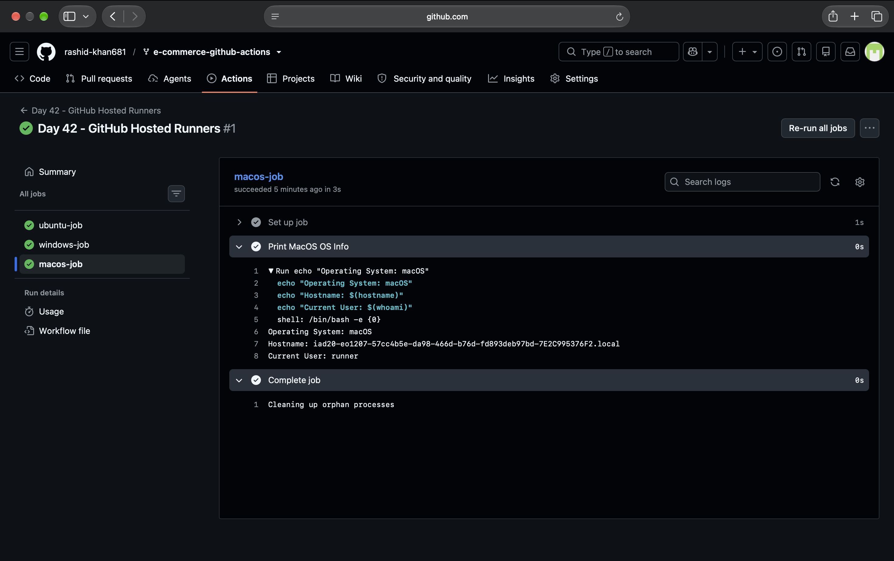
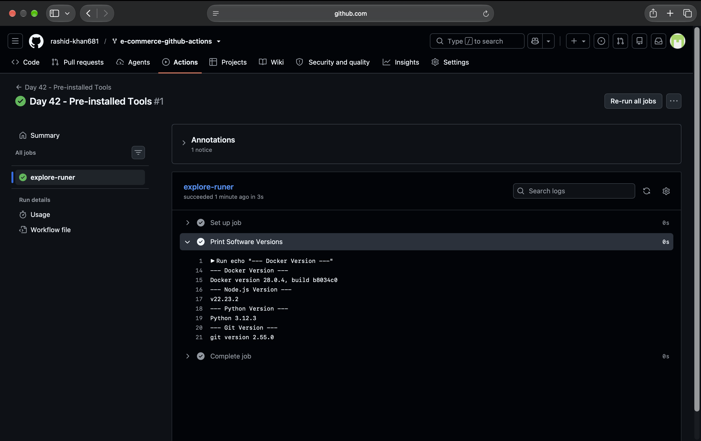
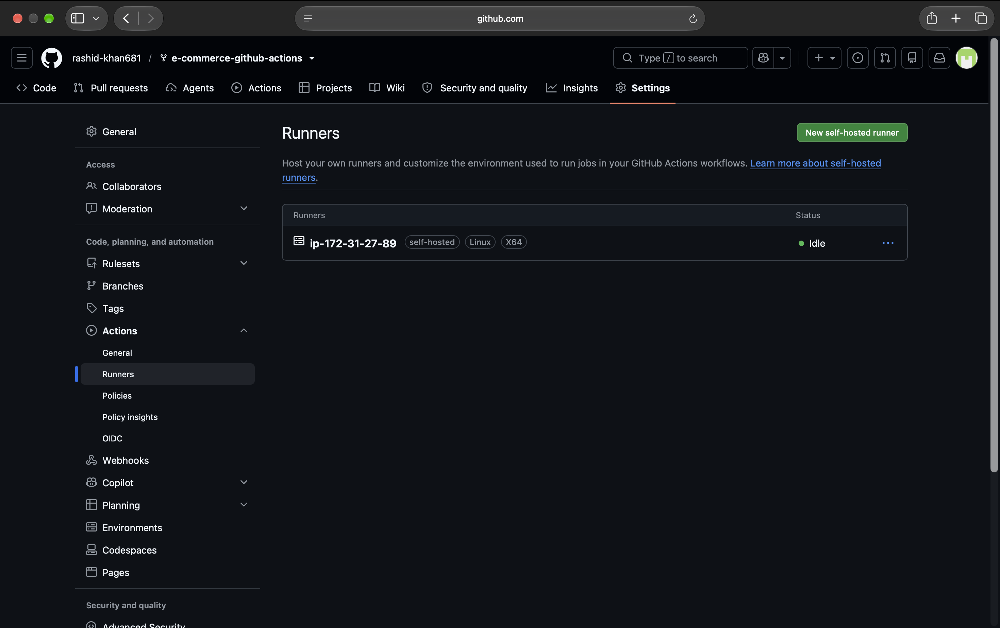
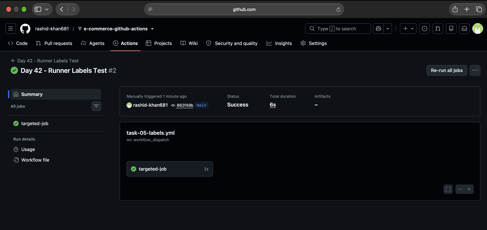

# Day 42 - GitHub Actions: GitHub-Hosted vs Self-Hosted Runners

Today I completed the hands-on tasks to understand where GitHub Actions jobs actually execute, exploring both GitHub-hosted runners and setting up my own AWS EC2 self-hosted runner.

## Task 1: GitHub-Hosted Runners
I created a workflow with 3 jobs (`ubuntu-latest`, `windows-latest`, `macos-latest`) running in parallel. Each job successfully printed the OS name, runner hostname, and current user.

**Notes:**
* **What is a GitHub-hosted runner?** It is a temporary virtual machine provided by GitHub that spins up just to run your job and gets destroyed immediately after.
* **Who manages it?** - *GitHub manages it completely.

---

## Task 2: Explore What's Pre-installed
I ran a step on the `ubuntu-latest` runner to print the versions of Docker, Python, Node, and Git to see what is already available.

**Notes:**
* **Why does it matter that runners come with tools pre-installed?** - It saves a lot of execution time. If we had to write commands to download and install tools like Node or Docker on every single pipeline run, it would make our CI/CD process very slow.

---

## Task 3: Set Up a Self-Hosted Runner
I created an AWS EC2 instance (Ubuntu) and followed the GitHub instructions to download and configure it as a self-hosted runner for my repository.

**Proof:** Verified that my EC2 runner appeared in the Runners list with a green dot and Idle status.

---

## Task 4: Use Your Self-Hosted Runner
I created `.github/workflows/self-hosted.yml` and set `runs-on: self-hosted`. The job successfully ran on my EC2 machine. It printed my EC2 hostname, the working directory, and created a `my-proof.txt` file which I manually verified inside the server's terminal.

---

## Task 5: Labels
I added a custom label `my-linux-runner` to my EC2 self-hosted runner. Then, I updated my workflow to use `runs-on: [self-hosted, my-linux-runner]` and triggered it. It successfully picked up the job based on the label.

**Notes:**
* **Why are labels useful when you have multiple self-hosted runners?** - Labels help route specific jobs to the correct machines. If you have different servers (e.g., one for testing, one for database, one with a GPU), labels ensure the job runs exactly on the hardware it is meant for.

---

## Task 6: GitHub-Hosted vs Self-Hosted

| Feature | GitHub-Hosted | Self-Hosted |
| :--- | :--- | :--- |
| **Who manages it?** | GitHub | Me (Developer / DevOps Engineer) |
| **Cost** | Free (up to monthly limit) | I pay for the server running it (AWS EC2 bill) |
| **Pre-installed tools** | Yes (Docker, Git, Node, Python, etc.) | No, I have to install everything manually |
| **Good for** | Standard CI/CD, quick and easy setups | Custom hardware, accessing private VPCs, large workloads |
| **Security concern** | Safe (machine is destroyed after run) | Risky (a bad workflow script could delete files on my actual server) |

