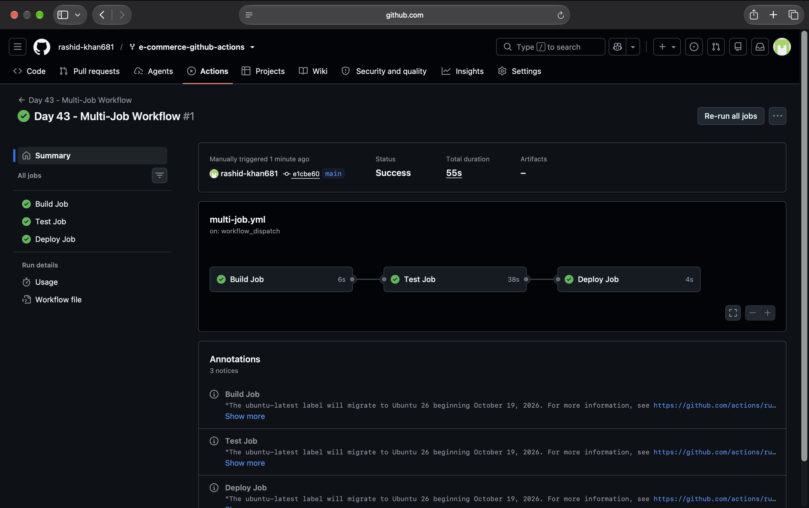
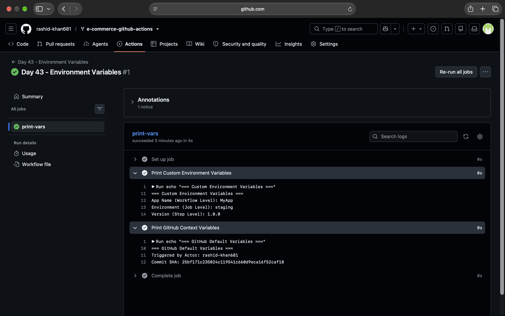
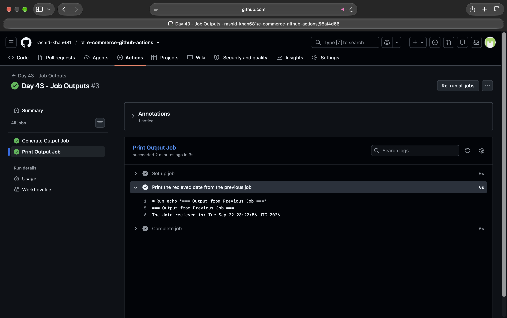
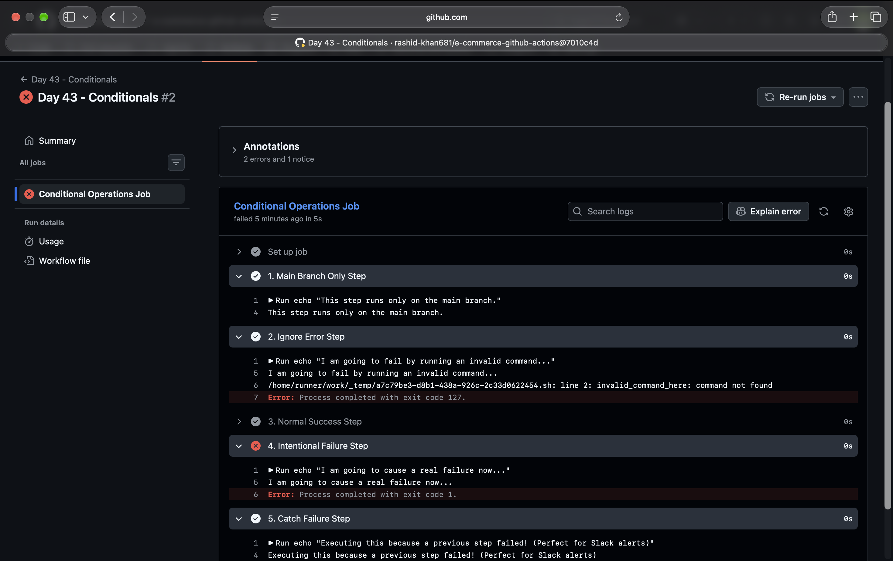
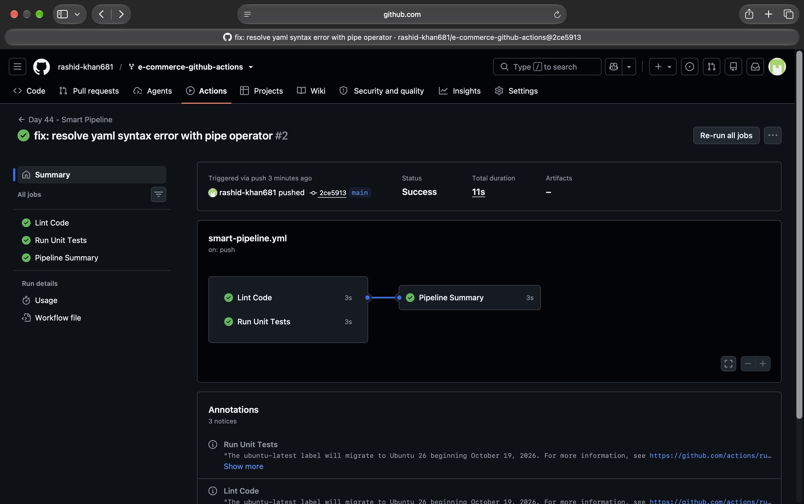

# Day 43: Jobs, Steps, Env Vars & Conditionals in GitHub Actions

Today, I leveled up my CI/CD game by moving from simple "dumb scripts" to **Smart and Dynamic Workflows**. I learned how to control the flow of a pipeline using dependencies, environment variables, job outputs, and conditional statements.

---

## Task 1: Multi-Job Workflow (Dependency Chain)
Created a workflow with three jobs (`build`, `test`, `deploy`). I used the `needs` keyword to ensure strict execution order. If `build` fails, `test` won't run. If `test` fails, `deploy` is blocked.

---

## Task 2: Environment Variables
Practiced variable scoping at three different levels:
1. **Workflow Level:** Accessible to all jobs (e.g., `APP_NAME`).
2. **Job Level:** Accessible only inside a specific job (e.g., `ENVIRONMENT`).
3. **Step Level:** Accessible only inside a specific step (e.g., `VERSION`).
Also fetched dynamic GitHub Context variables like `${{ github.actor }}` and `${{ github.sha }}`.

---

## Task 3: Job Outputs (Passing Data Between Jobs)
Since every GitHub Actions job runs on a fresh, isolated Virtual Machine, they don't share memory. I created a job that generates today's date, saves it to `$GITHUB_OUTPUT`, and passes it to a completely independent second job.

**Why pass outputs between jobs?**
In real-world scenarios, Job 1 might build the code and generate a dynamic version tag (like `v1.2.4`). Job 2 needs this exact tag to push the Docker image to a registry or deploy it to a server. Outputs bridge this gap between isolated VMs.

---

## Task 4: Conditionals & Error Handling
Used the `if` condition to make pipelines intelligent:
* Ran steps only if the branch was `main`.
* Intentionally failed a step but used `continue-on-error: true` to prevent pipeline crash.
* Used `if: failure()` to create a step that *only* runs when a previous step fails (perfect for sending Slack/Email alerts).

---

## Task 5: The Smart Pipeline
Combined all concepts into a final `smart-pipeline.yml`. 
* `lint` and `test` jobs run in **parallel** to save time.
* `summary` job runs only after both succeed.
* Used context variables to dynamically print the commit message and check branch types.

---

## Key Takeaways
* **`needs:`** acts as the traffic controller of the pipeline. It defines strict prerequisites, ensuring downstream jobs only run when upstream jobs succeed.
* **`outputs:`** is the communication bridge. It allows securely passing dynamic, generated data across completely separate Virtual Machines (runners) during a single workflow run.