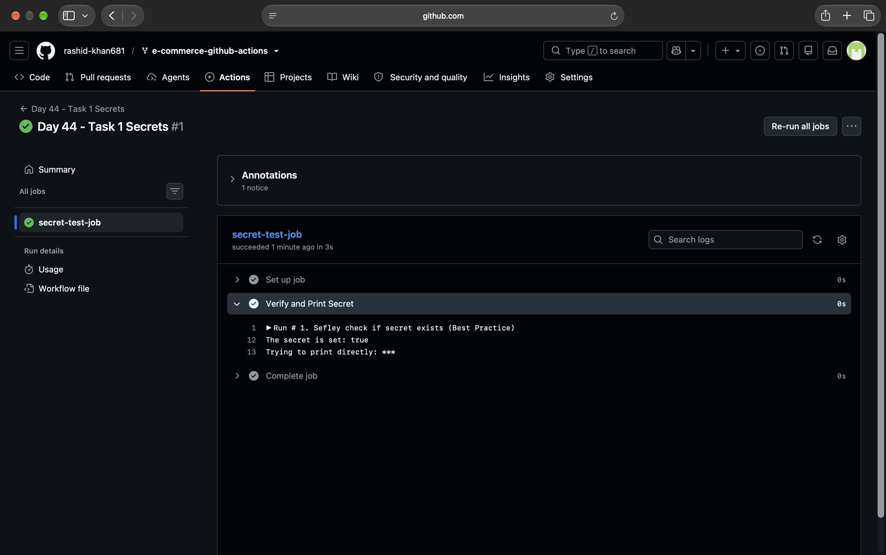
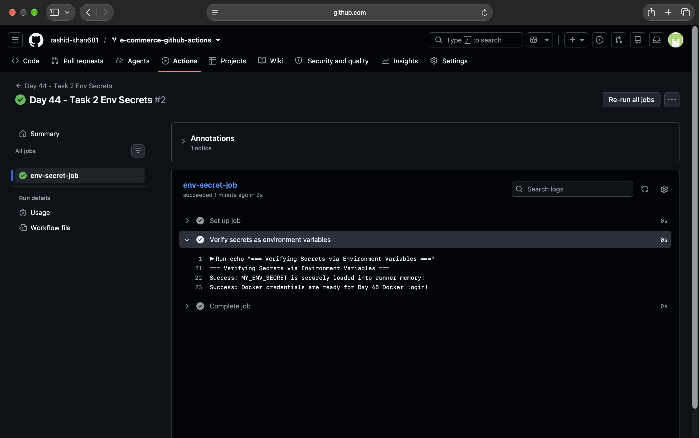
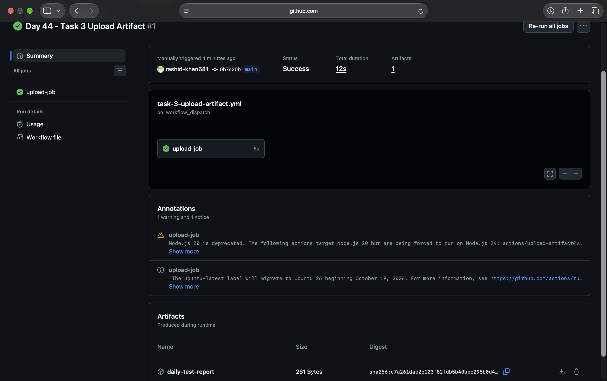
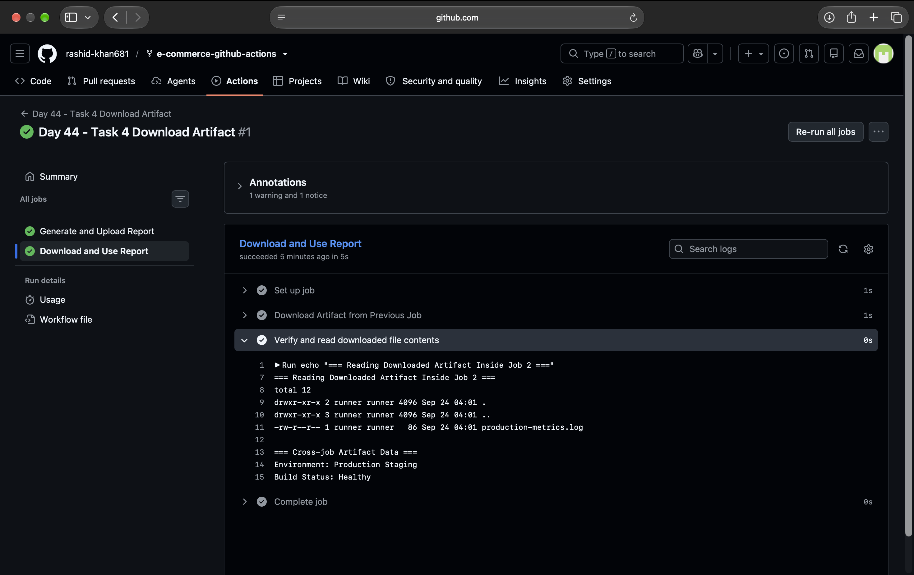
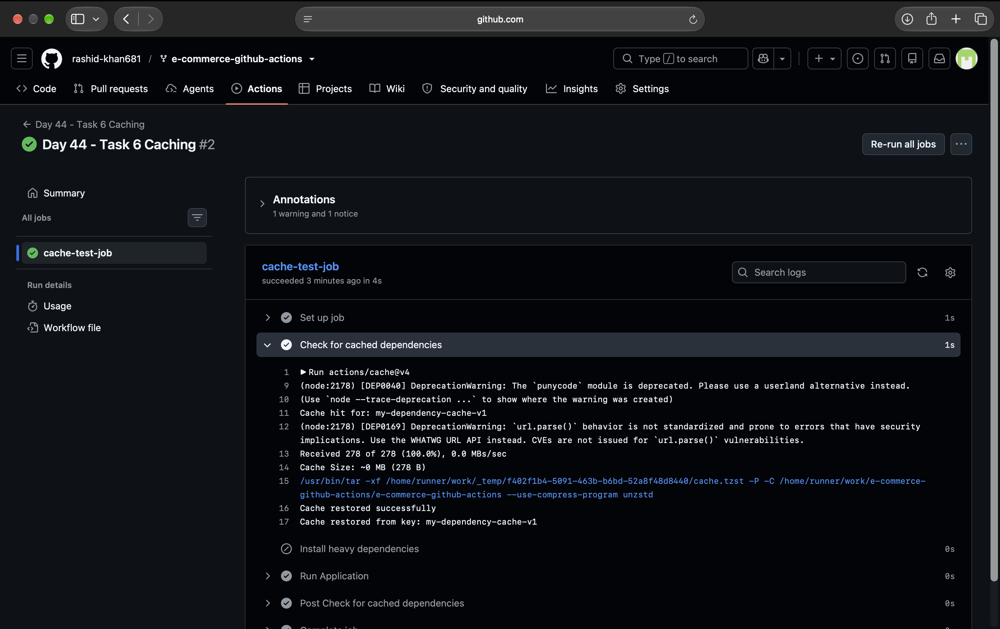

# Day 44 - Secrets, Artifacts & Running Real Tests in CI

Today's pipeline starts doing real work — storing sensitive values securely, saving build outputs, and running actual tests.

---

## Task 1: GitHub Secrets
I created a repository secret named `MY_SECRET_MESSAGE` and wrote a workflow to read and print it. GitHub automatically masked the direct output with `***`.

**Question: Why should you never print secrets in CI logs?**
- **Answer:** You should never print secrets directly because anyone with read access to the repository's action logs can see them if masking fails, or it can be logged in third-party systems. Printing them directly in a bash command (`run: echo ${{ secrets.XYZ }}`) also opens up the risk of command injection.

*Proof of GitHub masking the secret:*

---

## Task 2: Use Secrets as Environment Variables
Instead of printing directly, I mapped the secret to an environment variable (`MY_ENV_SECRET`) within the step. I also added `DOCKER_USERNAME` and `DOCKER_TOKEN` as secrets to the repository for future use.

*Proof of securely loading secrets via Environment Variables:*

---

## Task 3: Upload Artifacts
I created a step that generates a `test-report.txt` file and used `actions/upload-artifact@v4` to save it. 

**Verification:** Yes, after the workflow ran, the `daily-test-report` artifact was successfully generated, visible, and downloadable as a `.zip` file from the Actions summary tab.

*Proof of Artifact available for download in GitHub Actions:*

---

## Task 4: Download Artifacts Between Jobs
I created a multi-job workflow where `Job 1` generates a file and uploads it, and `Job 2` (which depends on Job 1) downloads that artifact and prints its contents. 

**Question: When would you use artifacts in a real pipeline?**
- **Answer:** Since every GitHub Actions job runs on a fresh, isolated virtual machine that gets destroyed after the job finishes, artifacts are crucial for:
1. Passing built/compiled files (like `.jar`, `.exe`, or docker builds) from a Build Job to a Deploy Job.
2. Saving test reports, code coverage, or error logs so developers can download and analyze them after the pipeline finishes.

*Proof of Job 2 successfully downloading and reading the artifact from Job 1:*

---

## Task 5: Run Real Tests in CI
I added a Python unit test (`tests/math_operations.py`) to the repository and created a workflow to run it. 

I intentionally broke the logic to ensure the pipeline goes **Red (Failed)**, then fixed the logic to verify the pipeline goes **Green (Passed)**.

*Proof of failing test run (Pipeline breaks as expected):*

*Proof of passing test run (Pipeline fixed and green):*

---

## Task 6: Caching
I implemented `actions/cache@v4` to simulate caching dependencies. I ran it twice to observe the time difference between a cache-miss (downloading dependencies) and a cache-hit (restoring dependencies instantly).

**Question: What is being cached and where is it stored?**
- **Answer:** Specific directories (like `node_modules` for Node.js or `~/.cache/pip` for Python) are zipped and cached. These files are stored securely on GitHub's internal cloud storage infrastructure. They are linked to a unique cache `key`, and if the key matches in future runs, GitHub restores the files directly to the runner VM, bypassing the internet download and saving time.

*Proof of Caching execution in the workflow:*

