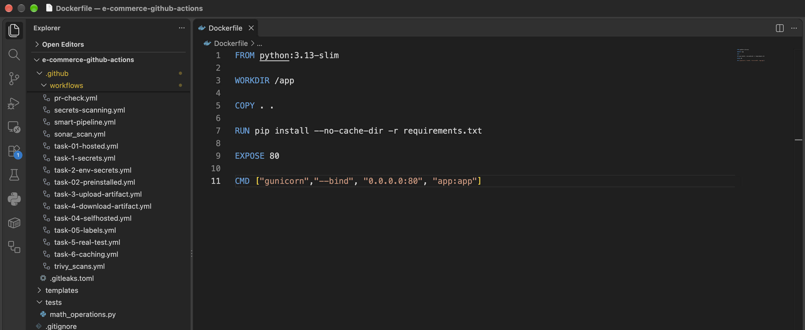
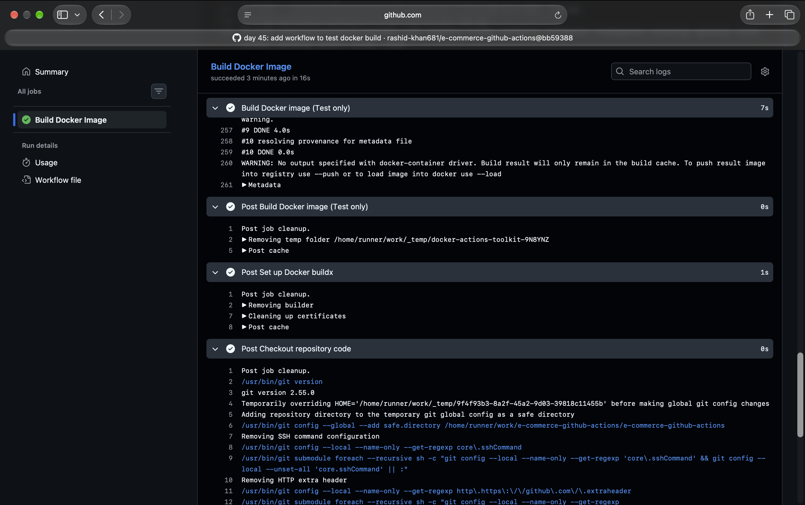
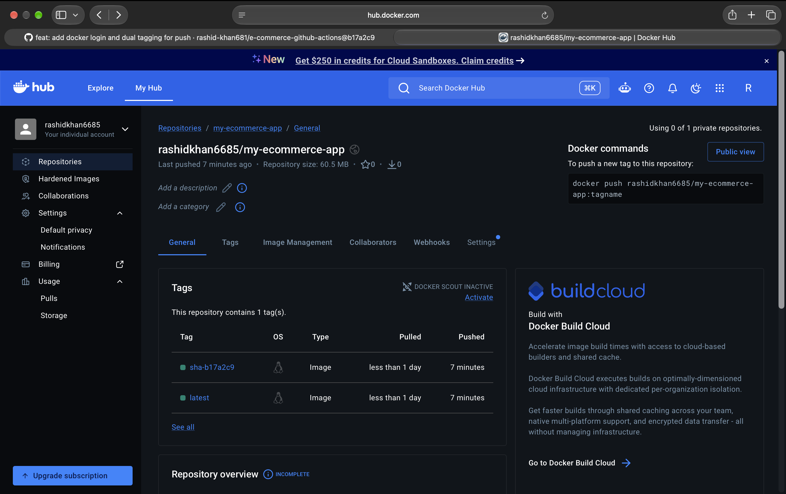
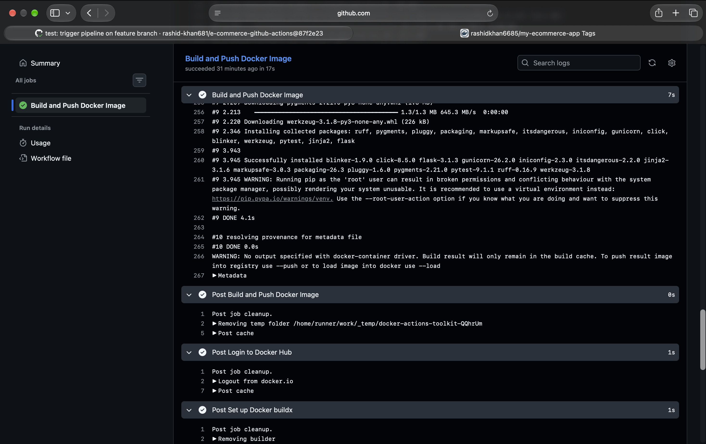
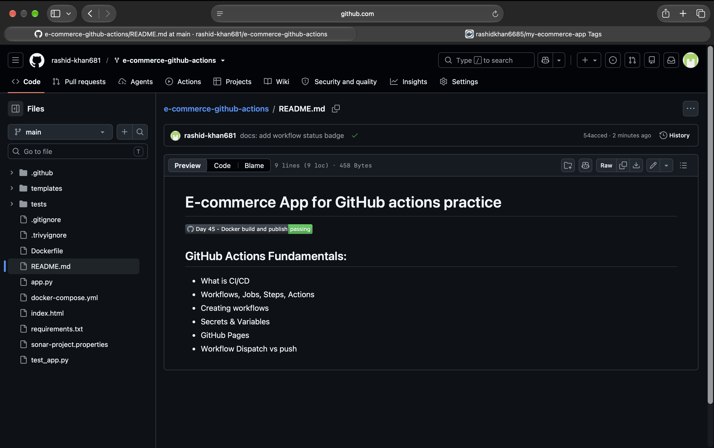
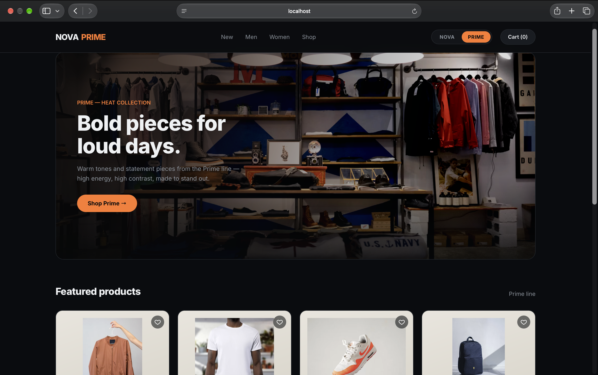

# Day 45: Docker Build & Push in GitHub Actions

## Task 1: Prepare
Verified the Python Flask e-commerce application and the minimalistic production Dockerfile. Configured GitHub repository secrets `DOCKER_USERNAME` and `DOCKER_TOKEN` for Docker Hub authentication.



## Task 2: Build the Docker Image in CI
Created the `.github/workflows/docker-publish.yml` to trigger on pushes to the `main` branch. The workflow checks out the code, sets up Docker Buildx, and builds the container image.

**Complete Workflow YAML:**
```yaml
name: Docker Build and Publish

on:
  push:
    branches:
      - main
      - test-pipeline

jobs:
  build-and-push:
    runs-on: ubuntu-latest
    steps:
      - name: Checkout code
        uses: actions/checkout@v4

      - name: Set up Docker Buildx
        uses: docker/setup-buildx-action@v3

      - name: Login to Docker Hub
        uses: docker/login-action@v3
        with:
          username: ${{ secrets.DOCKER_USERNAME }}
          password: ${{ secrets.DOCKER_TOKEN }}

      - name: Extract short SHA
        id: vars
        run: echo "sha_short=$(git rev-parse --short HEAD)" >> $GITHUB_ENV

      - name: Build and push
        uses: docker/build-push-action@v5
        with:
          context: .
          push: ${{ github.ref == 'refs/heads/main' }}
          tags: |
            rashidkhan6685/my-ecommerce-app:latest
            rashidkhan6685/my-ecommerce-app:sha-${{ env.sha_short }}
```



## Task 3: Push to Docker Hub
Configured the workflow to securely log into Docker Hub using secrets and push the image with dual tags (`latest` and `sha-<short-commit-hash>`).

**Docker Hub Link:** https://hub.docker.com/r/rashidkhan6685/my-ecommerce-app



## Task 4: Only Push on Main
Added branch protection using the condition `push: ${{ github.ref == 'refs/heads/main' }}`. Verified that pushing to a feature branch triggers the build successfully in the runner cache but explicitly aborts the push to Docker Hub.



## Task 5: Add a Status Badge
Obtained the workflow status badge URL from the Actions tab and embedded it into the repository's `README.md` to dynamically display a passing green build status.



## Task 6: Pull and Run It
Pulled the automated cloud-built image to the local machine and verified the application execution. Overcame the local Apple Silicon architecture mismatch by enforcing the `--platform linux/amd64` flag during extraction and execution.

**Question: What is the full journey from git push to a running container?**
- **Answer:**
1. **Push:** A developer pushes code changes to the GitHub `main` branch.
2. **Trigger:** GitHub Actions detects the push event and provisions an Ubuntu runner.
3. **Checkout & Auth:** The runner checks out the source code, configures Docker Buildx, and authenticates with Docker Hub using repository secrets.
4. **Build:** The runner executes the instructions within the Dockerfile to compile the container image locally in the CI environment.
5. **Tag & Push:** The built image is tagged with `latest` and the unique Git commit SHA, then pushed to the public Docker Hub registry.
6. **Pull:** The deployment server or local machine executes `docker pull` to download the newly pushed image from Docker Hub.
7. **Run:** The `docker run` command is executed to spin up the container, map ports, and bring the application live.


