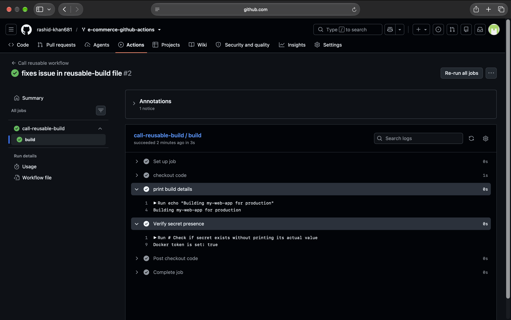
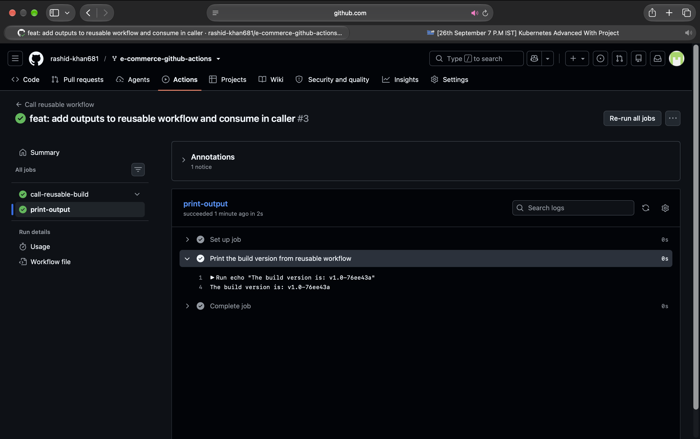
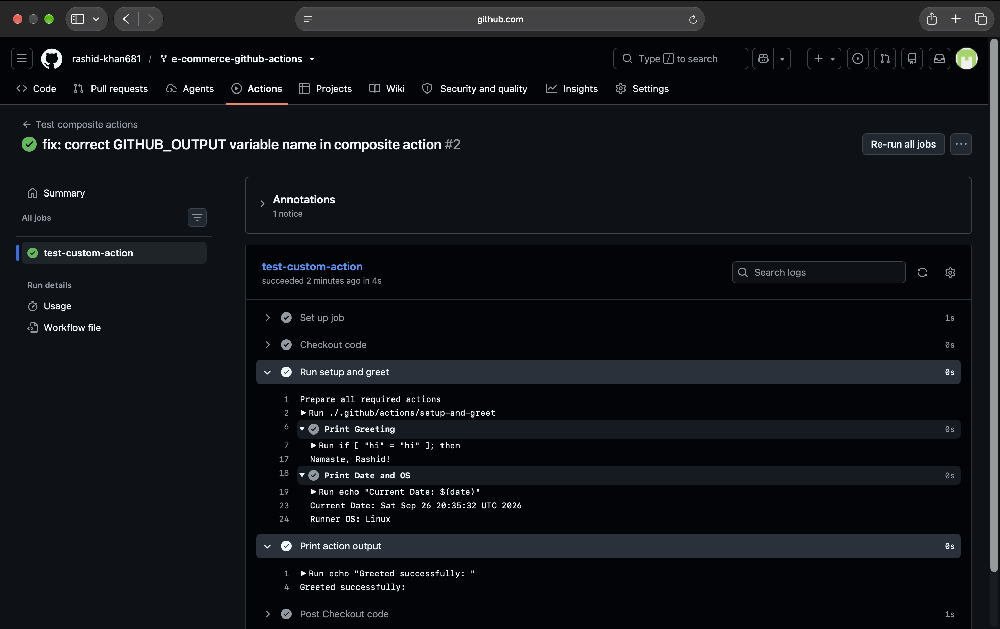

# Day 46: Reusable Workflows & Composite Actions

## Task 1: Understand `workflow_call`
**1. What is a reusable workflow?**
  - It is a standard GitHub Actions workflow designed to act like a function. Instead of being triggered directly by events like `push`, it is called by other workflows.

**2. What is the `workflow_call` trigger?**
  - It is the specific event trigger (`on: workflow_call`) that makes a workflow reusable, allowing it to define expected `inputs`, `secrets`, and `outputs`.

**3. How is calling a reusable workflow different from using a regular action (`uses:`)?**
  - A regular action is used *inside* a job's `steps`. A reusable workflow is an entire pipeline (with its own jobs and steps) that is called at the *job level*.

**4. Where must a reusable workflow file live?**
  - It must live inside the `.github/workflows/` directory.

---

## Task 2: Create Your First Reusable Workflow
Created a central reusable pipeline (`.github/workflows/reusable-build.yml`) configured to accept `app_name`, `environment`, and a `docker_token` secret. 

**Reusable Workflow YAML:**
```yaml
name: Reusable Build Workflow
on:
  workflow_call:
    inputs:
      app_name:
        required: true
        type: string
      environment:
        required: true
        default: 'staging'
        type: string
    secrets:
      docker_token:
        required: true
    outputs:
      build_version:
        value: ${{ jobs.build.outputs.version }}

jobs:
  build:
    runs-on: ubuntu-latest
    outputs:
      version: ${{ steps.set_version.outputs.version_tag }}
    steps:
      - uses: actions/checkout@v4
      - run: echo "Building ${{ inputs.app_name }} for ${{ inputs.environment }}"
      - run: |
          if [ -n "${{ secrets.docker_token }}" ]; then
            echo "Docker token is set: true"
          else
            echo "Docker token is set: false"
          fi
      - id: set_version
        run: |
          SHORT_SHA=$(git rev-parse --short HEAD)
          VERSION="v1.0-$SHORT_SHA"
          echo "version_tag=$VERSION" >> $GITHUB_OUTPUT
```

---

## Task 3: Create a Caller Workflow
Created a caller workflow (`.github/workflows/call-build.yml`) that triggers on a push to `main` and passes the required inputs to the reusable workflow.



---

## Task 4: Add Outputs to the Reusable Workflow
Updated both workflows to pass dynamic data back to the caller. The reusable workflow generates a version string (e.g., `v1.0-76ee43a`), and a secondary job in the caller workflow consumes and prints it.

**Caller Workflow YAML:**
```yaml
name: Call Reusable Workflow
on:
  push:
    branches:
      - main

jobs:
  call-reusable-build:
    uses: ./.github/workflows/reusable-build.yml
    with:
      app_name: "my-web-app"
      environment: "production"
    secrets:
      docker_token: ${{ secrets.DOCKER_TOKEN }}

  print-output:
    runs-on: ubuntu-latest
    needs: call-reusable-build
    steps:
      - run: echo "The build version is: ${{ needs.call-reusable-build.outputs.build_version }}"
```



---

## Task 5: Create a Composite Action
Created a custom composite action at `.github/actions/setup-and-greet/action.yml` to bundle logic into reusable steps. Successfully passed inputs (`name`, `language`) and returned outputs while executing bash scripts.

**Composite Action YAML:**
```yaml
name: 'Setup and Greet'
description: 'Greets the user in a specified language and prints runner info'
inputs:
  name:
    required: true
  language:
    required: false
    default: 'en'
outputs:
  greeted:
    value: ${{ steps.greet.outputs.success }}
runs:
  using: "composite"
  steps:
    - id: greet
      shell: bash
      run: |
        if [ "${{ inputs.language }}" = "hi" ]; then
          echo "Namaste, ${{ inputs.name }}!"
        else
          echo "Hello, ${{ inputs.name }}!"
        fi
        echo "success=true" >> $GITHUB_OUTPUT
    - shell: bash
      run: |
        echo "Current Date: $(date)"
        echo "Runner OS: $RUNNER_OS"
```



---

## Task 6: Reusable Workflow vs Composite Action

| Feature | Reusable Workflow | Composite Action |
| :--- | :--- | :--- |
| **Triggered by** | `workflow_call` | `uses:` in a step |
| **Can contain jobs** | Yes (It defines its own jobs) | No (It runs *inside* a job) |
| **Can contain multiple steps** | Yes | Yes |
| **Lives where** | Strictly in `.github/workflows/` | Anywhere (usually `.github/actions/name/action.yml`) |
| **Can accept secrets directly** | Yes (Using `secrets:` block) | No (Must be passed as standard `inputs`) |
| **Best for** | Standardizing entire CI/CD pipelines (e.g., Build-Test-Deploy) | Bundling a sequence of repetitive steps |
