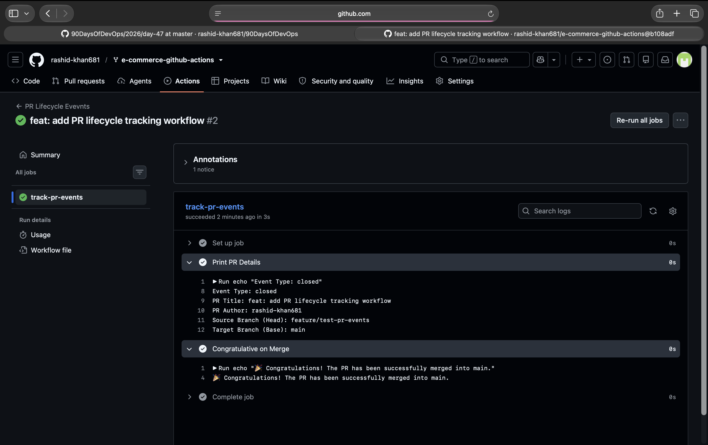
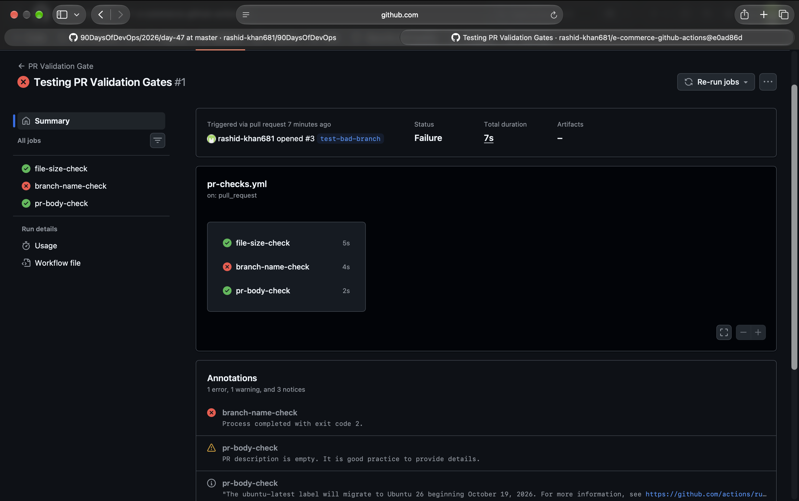
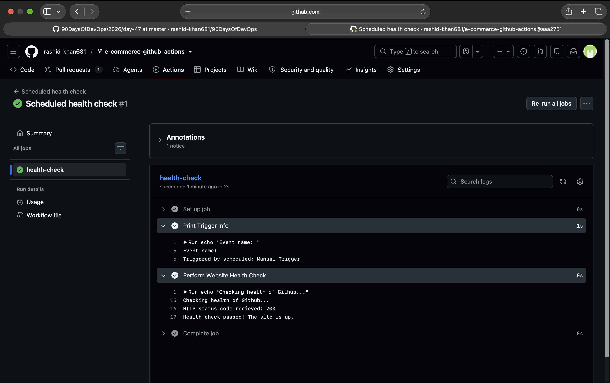
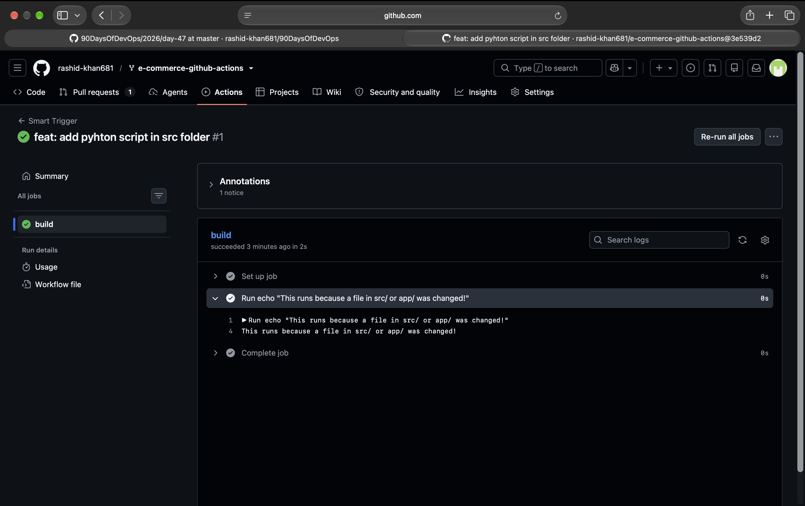
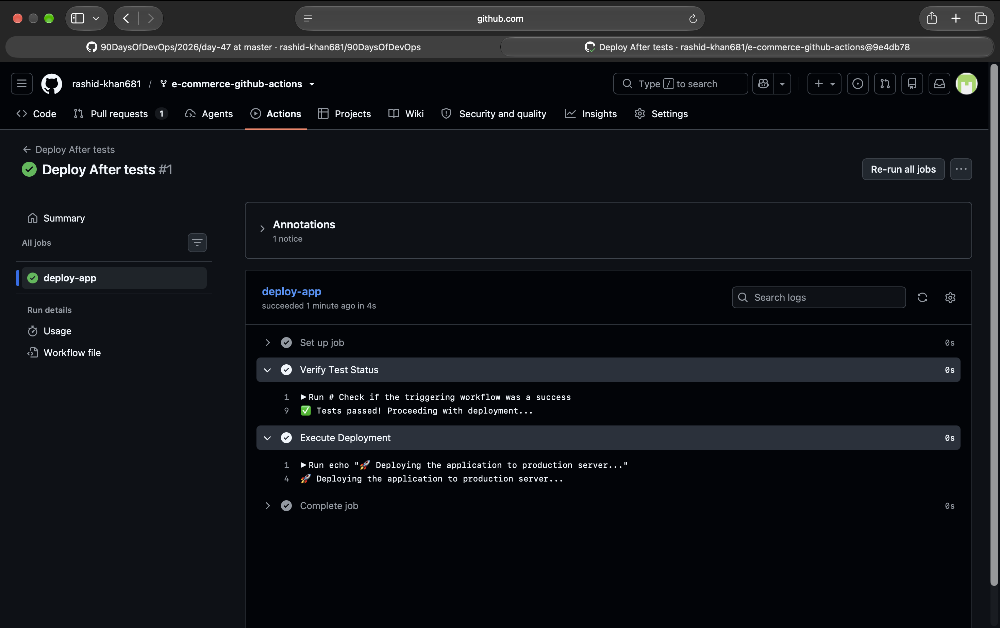
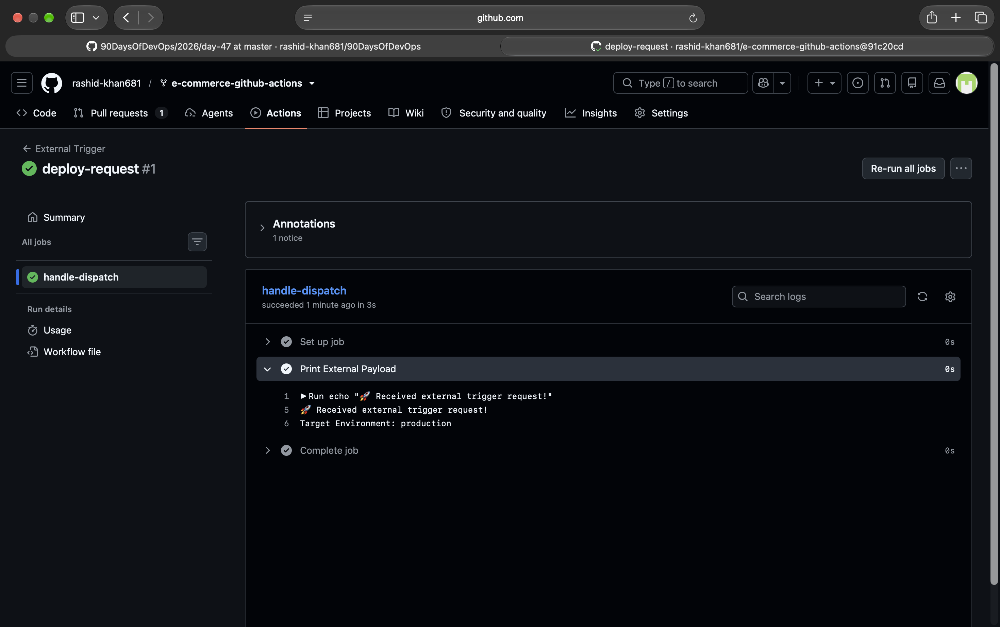

# Day 47: Advanced Triggers - PR Events, Cron Schedules & Event-Driven Pipelines

This document contains the execution details, answers to challenge questions, and screenshots for Day 47 of the 90DaysOfDevOps challenge.

## Task 1: Pull Request Event Types
Created `.github/workflows/pr-lifecycle.yml` to trigger on specific PR activity types (opened, synchronize, reopened, closed). Added a conditional step that only runs when the PR is successfully merged.

**Proof of Execution:**

## Task 2: PR Validation Workflow
Created `.github/workflows/pr-checks.yml` as a PR gate on the main branch. It verifies the branch name (feature/*, fix/*, docs/*), checks file sizes (fails if > 1MB), and warns if the PR description is empty.

**Proof of Execution:**

## Task 3: Scheduled Workflows (Cron Deep Dive)
Created `.github/workflows/scheduled-tasks.yml` with a cron schedule and `workflow_dispatch` for manual testing. 

**Notes & Answers:**
* The cron expression for every weekday at 9 AM IST: `30 3 * * 1-5`
* The cron expression for the first day of every month at midnight: `0 0 1 * *`
* Why GitHub says scheduled workflows may be delayed or skipped on inactive repos: To conserve compute resources, GitHub automatically disables scheduled workflows if the repository has been inactive for 60 days. They must be re-enabled manually.

**Proof of Execution:**

## Task 4: Path & Branch Filters
Created `.github/workflows/smart-triggers.yml` to trigger only when files in `src/` or `app/` change. Created another workflow using `paths-ignore` to skip runs when only documentation (`*.md`) is changed.

**Notes & Answers:**
* When would you use paths vs paths-ignore?
    - Use `paths` when a workflow is strictly tied to a specific component (e.g., running backend tests only when backend code changes). Use `paths-ignore` for general CI workflows where you want to run checks on all code changes except for specific non-functional files like documentation, READMEs, or images.

**Proof of Execution:**

## Task 5: workflow_run — Chain Workflows Together
Created `tests.yml` and `deploy-after-tests.yml`. The deployment workflow uses the `workflow_run` trigger to start only after the test workflow completes successfully.

**Notes & Answers:**
* Explanation of workflow_run vs workflow_call:
    - `workflow_run` is event-driven. It automatically triggers a workflow based on the execution or completion of another workflow (like a chain reaction).
    - `workflow_call` makes a workflow reusable. It does not trigger automatically; instead, another workflow explicitly calls it like a function passing inputs and secrets.

**Proof of Execution:**

## Task 6: repository_dispatch — External Event Triggers
Created `.github/workflows/external-trigger.yml` that listens for the `deploy-request` event type. Triggered it using the GitHub CLI with a custom JSON client payload.

**Notes & Answers:**
* When would an external system trigger a pipeline?
    - This is used when integrating external tools with GitHub Actions. For example, triggering a deployment via a custom Slack bot command, running an emergency rollback when a monitoring tool like Datadog detects a production failure, or triggering a build when content is updated in an external CMS.

**Proof of Execution:**
