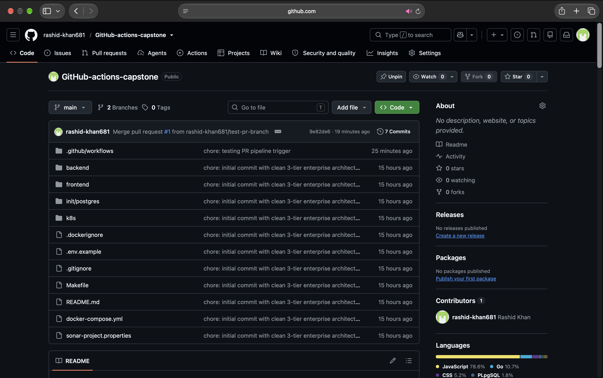
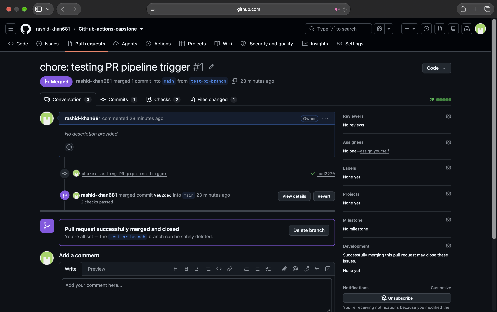
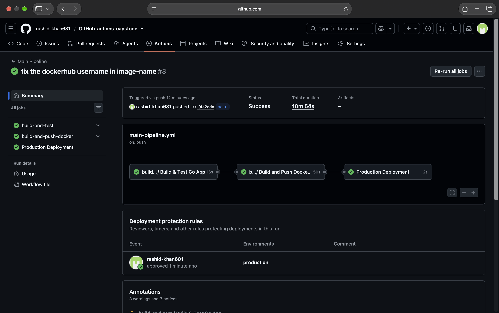
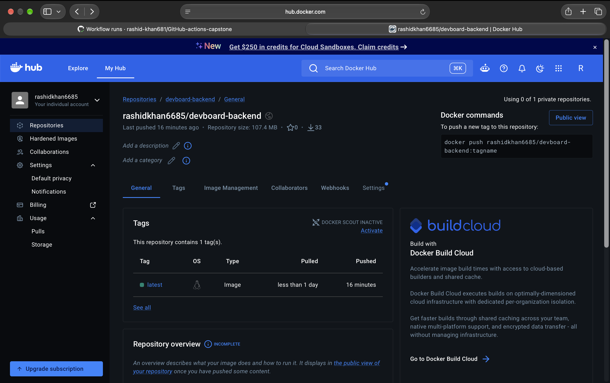
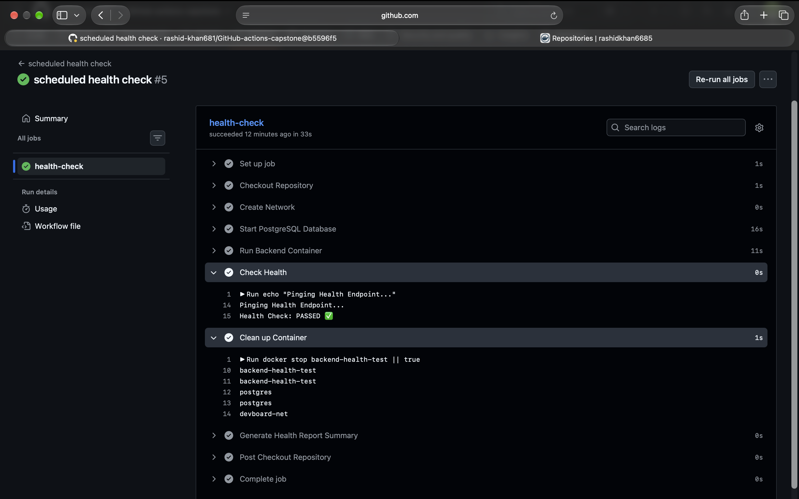
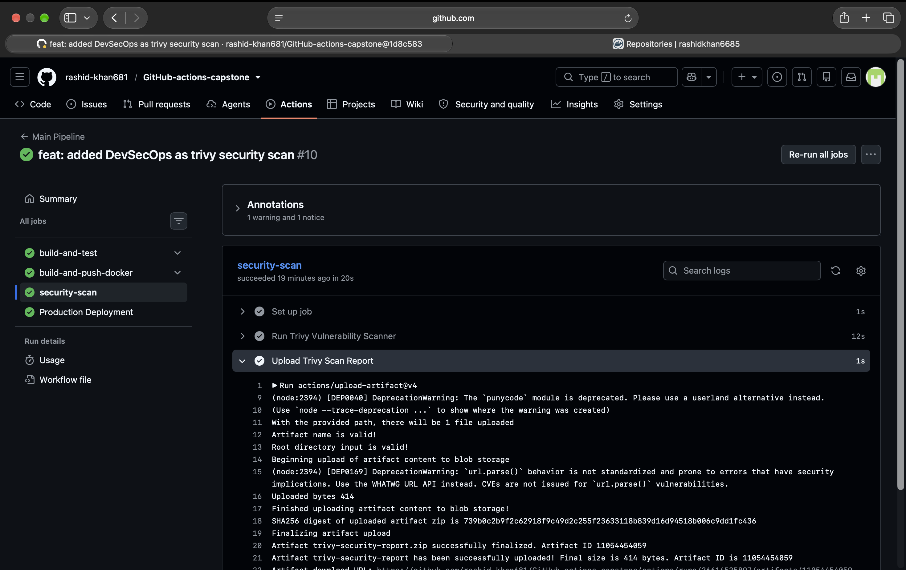

# Day 48 Actions Project: End-to-End CI/CD Pipeline

This document covers the complete CI/CD pipeline built for the DevBoard backend. It includes automated testing, Docker containerization, security scanning, and scheduled health checks using GitHub Actions.

## Pipeline Architecture Flow
1. PR Opened -> pr-pipeline -> Code Checkout -> Setup Environment -> Run Tests -> Output PR check status.
2. Push to Main -> main-pipeline -> Run Tests -> Docker Build & Push (tag: latest & short-sha) -> Trivy Vulnerability Scan -> Manual Deployment Approval -> Deploy step.
3. Every 12 Hours (Cron) -> health-check -> Pull Docker Image -> Setup custom Docker network -> Initialize Postgres Database -> Run Backend Container -> Curl /health endpoint -> Generate Action Summary -> Teardown network and containers.

## Task 1: Set Up the Project Repo
Configured the github-actions-capstone repository containing the DevBoard Go/Node backend. Added a Dockerfile to containerize the application and set up basic health check endpoints for testing.

**Proof of Execution:**

## Task 2: Reusable Workflow - Build & Test
Created `.github/workflows/reusable-build-test.yml` using the `workflow_call` trigger. It handles the CI part by checking out the code, setting up the runtime environment, installing dependencies, and running tests. It does not contain any deployment logic.

## Task 3: Reusable Workflow - Docker Build & Push
Created `.github/workflows/reusable-docker.yml` (triggered via `workflow_call`). It securely logs into Docker Hub using GitHub Secrets (`DOCKER_USERNAME`, `DOCKER_TOKEN`), builds the image, and pushes it to the registry with two tags: `latest` and a dynamically generated `sha-<short-commit-hash>`.

## Task 4: PR Pipeline
Created `.github/workflows/pr-pipeline.yml`. It triggers strictly on `pull_request` to the `main` branch. It calls the reusable build-test workflow to ensure code quality and runs a standalone job to print a summary comment. It explicitly avoids building or pushing Docker images to prevent registry clutter from untested code.

**Proof of Execution:**

## Task 5: Main Branch Pipeline
Created `.github/workflows/main-pipeline.yml` for the core CD process. It triggers on push to main, running the test workflow, followed by the Docker build and push workflow. 
For deployment, I set up a `production` environment in GitHub repository settings with protection rules. The final deploy job waits in a pending state until a reviewer manually approves the deployment.

**Proof of Execution:**

**Docker Hub Image Link:**
https://hub.docker.com/r/rashidkhan6685/devboard-backend

## Task 6: Scheduled Health Check
Created `.github/workflows/health-check.yml` running on a `0 */12 * * *` cron schedule.

**Extra Work & Troubleshooting:**
During the initial run, the health check failed (exit code 1) because the DevBoard backend crashes immediately if it cannot connect to a PostgreSQL database on startup. A simple `docker run` was not enough.
To fix this inside the GitHub runner, I added steps to mimic the production environment:
1. Created a custom Docker network (`devboard-net`).
2. Spun up a `postgres:16-alpine` container, mapping the initialization volume (`-v "$PWD/init/postgres":/docker-entrypoint-initdb.d:ro`) to load required tables.
3. Spun up the backend container connected to the same network, passing the `POSTGRES_URL` environment variable.
4. Mapped the container port to host port 8081 and ran the curl command against `http://localhost:8081/health`.
5. Created the markdown summary and added an `if: always()` cleanup step to remove containers and the custom network.

**Proof of Execution:**

## Task 7: Badges & Documentation
Status badges for `pr-pipeline`, `main-pipeline`, and `health-check` have been added to the root `README.md`. This architecture file was created to document the workflow files and execution proofs.

## Brownie Points: Security Pipeline (DevSecOps)
Implemented a DevSecOps step in the main pipeline using the `aquasecurity/trivy-action`. 
It runs immediately after the Docker image is built and pushed. It scans the image for vulnerabilities, is configured to fail the pipeline only if a `CRITICAL` severity CVE is found, and successfully outputs a scan report. The report is uploaded as an artifact (`trivy-security-report.zip`) which can be downloaded from the Action summary.

**Proof of Security Scan Artifact:**

## What I would improve next
1. **Server Deployment:** Swap the dummy deploy echo statement with a real SSH action (like Appleboy SSH) to pull the image and run it on an AWS EC2 instance.
2. **Persistent Storage:** Implement Docker Named Volumes on the EC2 host so PostgreSQL data persists across multiple automated container restarts.
3. **Automated Rollback:** Add logic to revert to the previous Git SHA image if the post-deployment health check fails.

## Workflow YAML Code
[Note: Insert the raw code of your YAML files here if required by the submission guidelines]