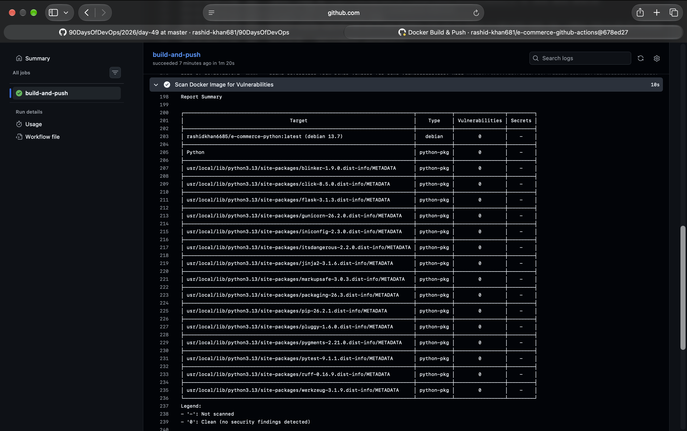
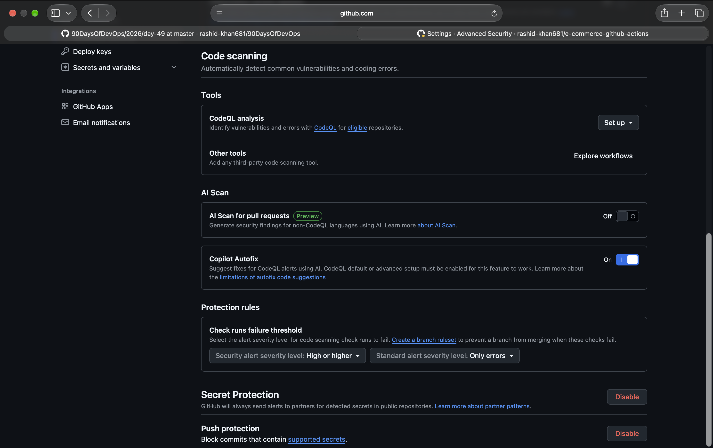
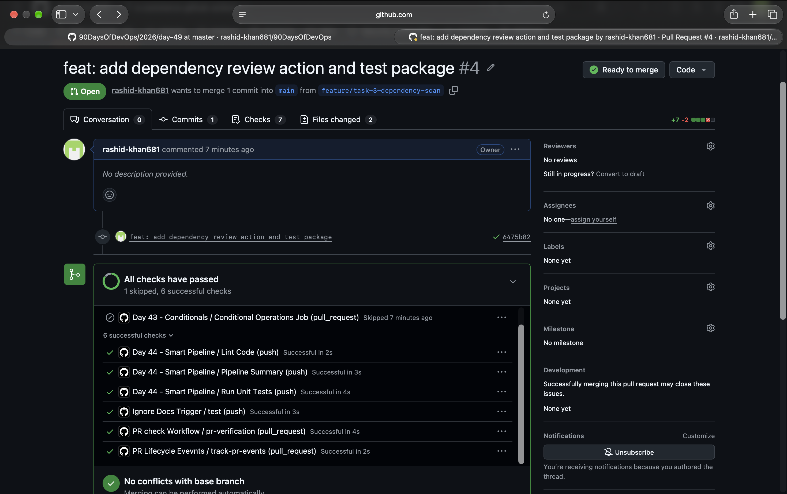
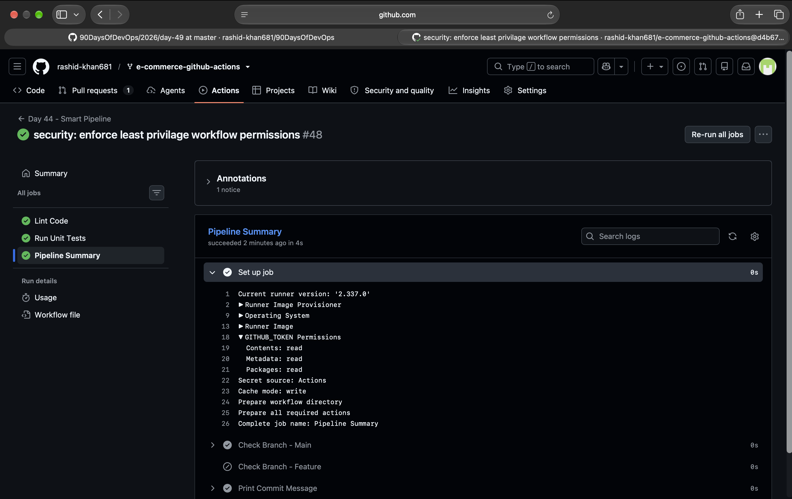

# Day 49: DevSecOps - Adding Security to CI/CD Pipeline

## What is DevSecOps?
  - DevSecOps is the practice of embedding automated security checks directly into the CI/CD pipeline, rather than treating security as a final, separate phase. By integrating tools like image scanners and secret detectors early in the process, we can proactively catch vulnerabilities, leaked credentials, and insecure dependencies in minutes before they are merged into production.

---

## Task 1: Scan Your Docker Image for Vulnerabilities
Added the Aqua Security Trivy action to the main branch pipeline to scan the Docker image for known CVEs after the build step and before pushing it to Docker Hub.

**My Notes:**
*   **Base Image Used:** The Docker image uses `python:3.13` built on the `debian:13.7` base operating system.
*   **CVEs Found:** Trivy detected a total of 54 HIGH vulnerabilities and 0 CRITICAL vulnerabilities.
    *   OS-level (50): Primarily found in the `util-linux` package (e.g., CVE-2026-76642).
    *   Python-pkg (4): Included vulnerabilities in `setuptools` and `urllib3`.
    *   Since the pipeline was configured to fail only on CRITICAL (`exit-code: '1'`, `severity: 'CRITICAL'`), the image passed the check successfully.

> **Screenshot of Trivy Scan Output:**


---

## Task 2: Enable GitHub's Built-in Secret Scanning
Enabled Secret Scanning and Push Protection in the repository settings under Code security and analysis to prevent credential leaks.

**What I Learned:**
*   **Secret Scanning vs. Push Protection:** 
      - Secret scanning is a reactive measure that scans the repository's history and alerts administrators if secrets are found. Push protection is a proactive measure that intercepts the `git push` command and outright blocks the commit from reaching the repository if a supported secret is detected.
*   **Leaked AWS Key Handling:** 
      - If an AWS key is pushed, GitHub immediately notifies AWS via their Partner Program. AWS automatically attaches an `AWSCompromisedKeyQuarantineV2` policy to the IAM user/role to restrict high-risk operations (like spinning up EC2 instances) and notifies the account owner.

> **Screenshot of Secret Scanning:**


---

## Task 3: Scan Dependencies for Known Vulnerabilities
Added `actions/dependency-review-action@v4` to the PR workflow with `fail-on-severity: critical`. 

**What I Learned:**
*   This action specifically targets `pull_request` events. It checks any new dependencies (like pip or npm packages) introduced in the PR against a vulnerability database. If a developer attempts to introduce a critically vulnerable package, the check fails and blocks the PR from merging into the main branch.

> **Screenshot of Dependency Review:**


---

## Task 4: Add Permissions to Your Workflows
Locked down workflows to enforce the Principle of Least Privilege by explicitly declaring permissions.

```yaml
permissions:
  contents: read
```

**My Notes:**
*   **Why limit workflow permissions?** 
      - Workflows should only have the exact access they require. If a compromised third-party GitHub Action has `write` access, an attacker could exploit it to silently push malicious code, alter releases, or steal repository secrets.

> **Screenshot of Workflow Permissions:**
> 

---

## Task 5: The Full Secure Pipeline (Updated Diagram)

Here is the updated architecture of the DevSecOps pipeline incorporating both official tasks and custom security integrations:

```text
PR opened
  -> build & test
  -> dependency vulnerability check     [Security Step]
  -> PR checks pass or fail

Merge to main
  -> devsecops_pipeline.yml (Master Orchestration)
      -> code linting (Ruff) & testing
      -> Docker build
      -> Trivy image scan (fail on CRITICAL) [Security Step]
      -> SonarCloud SAST Code Analysis       [Security Step]
      -> Docker push (only if scans pass)
      -> Deploy to AWS EC2 (Self-Hosted Runner)
      -> DAST (OWASP ZAP Baseline Scan)      [Security Step]

Always active
  -> GitHub secret scanning             [Security Step]
  -> push protection for secrets        [Security Step]
```

---

## Official Brownie Points (Implemented & Researched)

1.  **Pin Actions to Commit SHAs:**
      - To protect against supply chain attacks where a tag (like `@v3`) is silently changed by the author, I pinned external actions to their exact 40-character commit SHAs. 
    *Example implemented in DAST:* `uses: zaproxy/action-baseline@7c4deb1000000000000000000000000000000000`
2.  **Upload Scan Results to GitHub Security Tab:**
      - By changing Trivy's format to SARIF, we can upload the scan output directly to GitHub's native Security tab using the CodeQL action:
    ```yaml
    - uses: aquasecurity/trivy-action@master
      with:
        image-ref: 'username/app:latest'
        format: 'sarif'
        output: 'trivy-results.sarif'
    - uses: github/codeql-action/upload-sarif@v3
      with:
        sarif_file: 'trivy-results.sarif'
    ```
3.  **Learn About OIDC (Keyless Authentication):**
      - OpenID Connect (OIDC) allows GitHub Actions to securely authenticate to cloud providers (AWS, GCP, Azure) using short-lived tokens generated via a trust relationship. This completely eliminates the need to store long-lived, hardcoded cloud credentials in GitHub Secrets, significantly reducing the risk of credential theft.

---

## Extra Custom Brownie Points (Real-World Implementation)

Beyond the standard requirements, I implemented a full-scale Master DevSecOps Pipeline (`devsecops_pipeline.yml`) utilizing `workflow_call` to orchestrate multiple advanced security stages:

*   **SonarCloud SAST Integration:** Integrated SonarQube scanning and resolved major Code Smells/Vulnerabilities.
    *   **Fixed Script Injection (Rule S7630):** Prevented shell script injection by securely mapping user-controlled variables (e.g., `github.head_ref`) to `env` blocks instead of injecting them directly into `run` bash blocks.
*   **DAST via OWASP ZAP:** Added dynamic testing (`dast.yml`) to scan the live AWS EC2 endpoint for vulnerabilities automatically post-deployment.
*   **Resolved Deployment Blockers:** Debugged and resolved complex EC2 runner issues, including Docker Socket (`docker.sock`) permission denials, Exit Code 127 (missing Ruff linter), and port binding conflicts.
