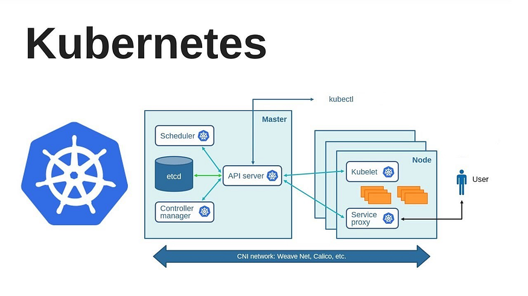
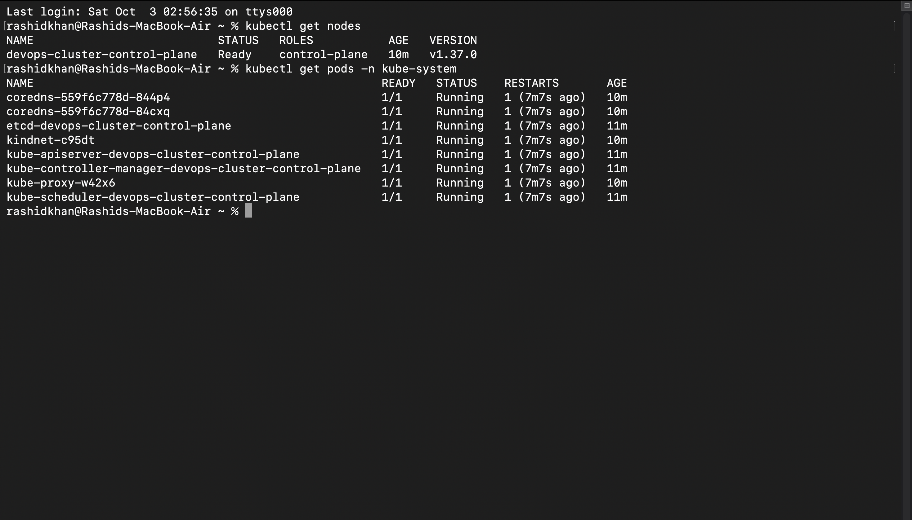

# Day 50: Kubernetes Architecture and Cluster Setup

## Task 1: The Kubernetes Story

**Q1: Why was Kubernetes created? What problem does it solve that Docker alone cannot?**
  - **Answer:** Kubernetes was created as an open-source container orchestration software for the management of containers at scale. While containerizing an application is highly versatile, supporting a distributed architecture with hundreds of identical containers behind a load balancer is complex and error-prone. Kubernetes solves problems that standalone container engines cannot by automatically monitoring active workloads and reconciling any differences between the cluster's desired state and its actual state. If a worker node machine fails entirely, Kubernetes automatically recreates those containers onto another healthy machine (self-healing), and it continuously redistributes containers to balance workloads.

**Q2: Who created Kubernetes and what was it inspired by?**
  - **Answer:** Kubernetes is an open-source container orchestration platform that was originally designed by Google. It was heavily inspired by "Borg," Google's highly secretive internal system that they used to manage massive, large-scale distributed production workloads for over a decade.

**Q3: What does the name "Kubernetes" mean?**
  - **Answer:** The name "Kubernetes" originates from the Greek language, meaning "helmsman" or "pilot" (the person who steers a ship). It is commonly abbreviated as "K8s" because there are exactly 8 letters between the "K" and the "s" in the word Kubernetes.

---

## Task 2: Kubernetes Architecture

**Kubernetes Architecture Diagram:**
```text
[ CONTROL PLANE (Master) ]
  ├── kube-apiserver      <-- Front-end/API gateway of the control plane
  ├── etcd                <-- Consistent and highly-available key-value backing store
  ├── kube-scheduler      <-- Watches for newly created Pods and assigns them to Nodes
  └── kube-controller-manager <-- Runs controller processes (maintains desired state)

           ↕ (Network Communication via API)

[ WORKER NODE(S) ]
  ├── kubelet             <-- An agent that ensures containers are running in a Pod
  ├── kube-proxy          <-- Maintains network rules to allow communication to Pods
  └── Container Runtime   <-- Software responsible for running containers (e.g., containerd/Docker)
```



**Q1: What happens when you run `kubectl apply -f pod.yaml`?**
  - **Answer:** `kubectl` submits the desired Pod state to the kube-apiserver via a REST API call. The API server authenticates the request and persists the initial configuration into the etcd backing store. The kube-scheduler continuously watches the API server; it notices the newly created Pod with no assigned node, evaluates resource requirements, and selects an optimal Worker Node. The API server updates etcd with this binding. Finally, the kubelet on the target Worker Node detects the assignment via the API server, instructs the Container Runtime to start the container, and reports the Pod's running status back to the API server.

**Q2: What happens if the API server goes down?**
  - **Answer:** The kube-apiserver is the front end of the Kubernetes control plane. If it goes down, the cluster becomes inaccessible for administrative commands (e.g., `kubectl` will timeout). However, already scheduled and running Pods on Worker Nodes will continue to run without interruption because the kubelet and Container Runtime manage local execution. The cluster simply cannot be updated or scaled until the API server is restored.

**Q3: What happens if a worker node goes down?**
  - **Answer:** The kubelet continuously sends health checks (heartbeats) to the control plane. If a worker node goes down and stops sending heartbeats, the Node controller (part of the kube-controller-manager) notices the timeout. It marks the node's status as `Unknown` or `NotReady`. The controller then evicts the Pods from the unavailable node and reschedules them onto other healthy, available worker nodes to maintain the desired cluster state.

---

## Task 4: Local Cluster Setup

**Which tool did you choose and why?**
  - **Answer:** I chose **kind (Kubernetes in Docker)** to set up my local cluster. According to the official Kubernetes SIGs documentation, `kind` is a tool for running local Kubernetes clusters using Docker container "nodes". I selected it because it is significantly more lightweight and faster than provisioning full Virtual Machines (which alternative tools like minikube often require). Since my macOS development environment already has Docker Desktop configured, `kind` natively leverages this existing container runtime, minimizing resource overhead and providing a highly efficient cluster bootstrapping experience.

---

## Task 5: Explore Your Cluster

> **Screenshot of Nodes and Kube-System Pods:**
> 

**What each `kube-system` pod does:**
*   **kube-apiserver:** The component of the Kubernetes control plane that exposes the Kubernetes API. It acts as the front end for the Kubernetes control plane.
*   **etcd:** A consistent and highly-available key-value store used as Kubernetes' backing store for all cluster data.
*   **kube-scheduler:** The control plane component that watches for newly created Pods with no assigned node, and selects a node for them to run on.
*   **kube-controller-manager:** The control plane component that runs controller processes, constantly watching the state of the cluster through the apiserver and making changes attempting to move the current state towards the desired state.
*   **kube-proxy:** A network proxy that runs on each node in your cluster, implementing part of the Kubernetes Service concept by maintaining network rules on nodes.
*   **coredns:** A flexible, extensible DNS server that serves as the Kubernetes cluster DNS, allowing pods to discover services by name.

---

## Task 6: Cluster Lifecycle & Configuration

**What is a kubeconfig? Where is it stored on your machine?**
  - **Answer:** According to the official Kubernetes documentation, a `kubeconfig` file is a configuration file used by `kubectl` to organize information about clusters, users, namespaces, and authentication mechanisms. The `kubectl` command-line tool uses kubeconfig files to find the information it needs to choose a cluster and communicate with the API server of a cluster. By default, `kubectl` looks for a file named `config` located in the `$HOME/.kube` directory on the local machine (e.g., `~/.kube/config`).