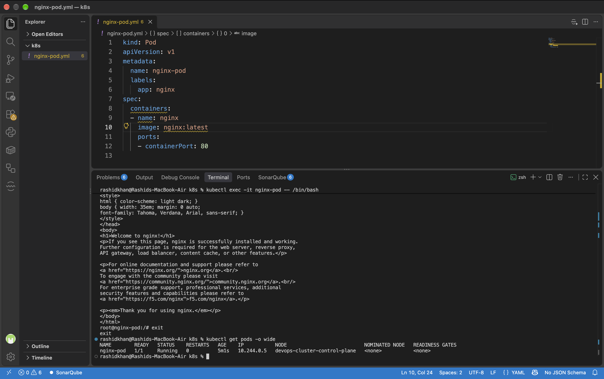
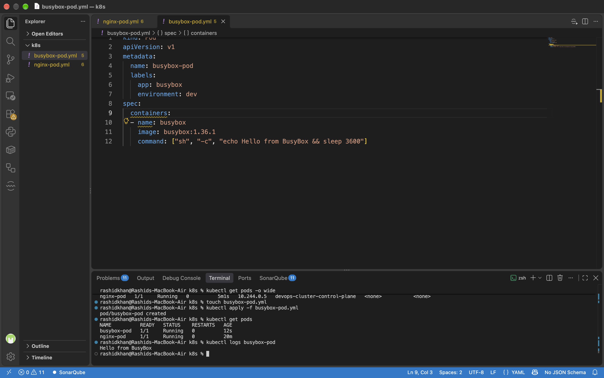

# Day 51: Kubernetes Manifests and Your First Pods

## Task 1: Create Your First Pod (Nginx)

**The Four Required Fields of a Kubernetes Manifest:**
According to the official Kubernetes API documentation, every resource manifest requires four top-level fields:
1. **`apiVersion`**: Defines the versioned schema (e.g., `v1` for Pods).
2. **`kind`**: Represents the resource type you are creating (e.g., `Pod`).
3. **`metadata`**: Contains data that helps uniquely identify the object (e.g., `name`, `labels`, `namespace`).
4. **`spec`**: Describes the actual desired state of the object (e.g., containers, images, ports).

**Manifest (`nginx-pod.yaml`):**
```yaml
apiVersion: v1
kind: Pod
metadata:
  name: nginx-pod
  labels:
    app: nginx
spec:
  containers:
  - name: nginx
    image: nginx:latest
    ports:
    - containerPort: 80
```

**Proof of Execution:**


---

## Task 2: Create a Custom Pod (BusyBox)

**Manifest (`busybox-pod.yaml`):**
```yaml
apiVersion: v1
kind: Pod
metadata:
  name: busybox-pod
  labels:
    app: busybox
    environment: dev
spec:
  containers:
  - name: busybox
    image: busybox:latest
    command: ["sh", "-c", "echo Hello from BusyBox && sleep 3600"]
```
*Note: A `command` field is explicitly required here. BusyBox does not run a continuous background daemon by default. Without a long-running process (like `sleep 3600`), the container would exit immediately upon startup, causing a `CrashLoopBackOff` state.*

**Proof of Execution:**


---

## Task 3: Imperative vs Declarative

*   **Imperative Management (`kubectl run`):** 
      - Direct CLI commands to create/modify resources. Fast for one-off tasks and generating YAML templates via `--dry-run`, but hard to track.
*   **Declarative Management (`kubectl apply -f`):** 
      - Writing YAML configuration files specifying the *desired state*. Best for production, version control (GitOps), and team collaboration.

---

## Task 4: Validate Before Applying

**What error does Kubernetes give when the image field is missing?**
  - When applying a broken manifest (missing the `image` field) and validating it via the API server (`--dry-run=server`), Kubernetes strictly catches the error before creation:
`The Pod "broken-pod" is invalid: spec.containers[0].image: Required value`

---

## Task 5: Pod Labels and Filtering

**My Third Pod Manifest (`third-pod.yaml`):**
```yaml
apiVersion: v1
kind: Pod
metadata:
  name: labeled-pod
  labels:
    app: frontend
    environment: staging
    team: devops
spec:
  containers:
  - name: my-container
    image: nginx:alpine
```
*Filtering pods based on labels ensures you can easily group, manage, or delete specific resources without affecting the rest of the cluster.*

---

## Task 6: Clean Up

**What happens when you delete a standalone Pod?**
  - When you delete a standalone Pod, it is terminated and gone forever. There is no controller (like a ReplicaSet or Deployment) actively monitoring its state to recreate it. This is why bare Pods are rarely used directly in production environments.