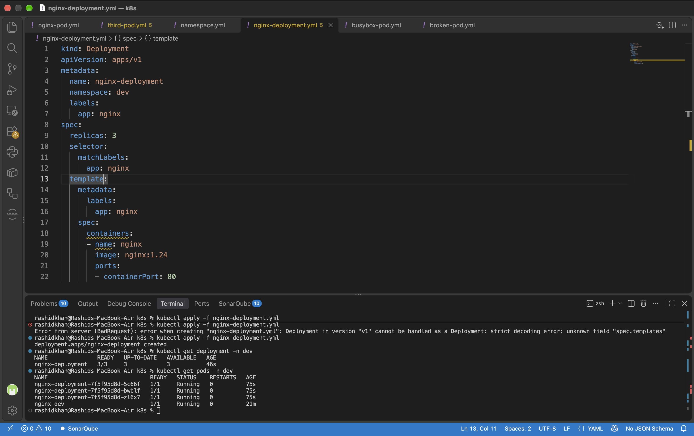

# Day 52: Kubernetes Namespaces and Deployments

## 1. Namespaces: What and Why?
**What:** Namespaces act as virtual clusters inside a single physical Kubernetes cluster.
**Why:** They provide logical isolation for resources. For example, creating `dev`, `staging`, and `prod` namespaces prevents naming collisions (e.g., having an `nginx-pod` in both dev and prod) and allows for strict access control and resource quotas across different teams.

---

## 2. My First Deployment Manifest
**Manifest (`nginx-deployment.yaml`):**
```yaml
apiVersion: apps/v1
kind: Deployment
metadata:
  name: nginx-deployment
  namespace: dev
  labels:
    app: nginx
spec:
  replicas: 3
  selector:
    matchLabels:
      app: nginx
  template:
    metadata:
      labels:
        app: nginx
    spec:
      containers:
      - name: nginx
        image: nginx:1.24
        ports:
        - containerPort: 80
```
**Explanation of Sections:**
*   **`kind: Deployment`**: Specifies we are creating a deployment controller, not a bare pod.
*   **`replicas: 3`**: Tells the controller to maintain exactly 3 running pod instances at all times.
*   **`selector.matchLabels`**: The mechanism the deployment uses to identify which pods it owns and manages.
*   **`template`**: The blueprint used to create the actual pods when scaling up or replacing crashed pods.

**Proof of Execution (Deployment & Pods across namespaces):**


---

## 3. Self-Healing: Deployment vs. Standalone Pod
*   **Standalone Pod:** When deleted or crashed, it is gone forever. No controller is watching to revive it.
*   **Deployment Pod:** When I deleted `nginx-deployment-7f5f95d8d-5c66f`, the Deployment controller immediately detected that current replicas (2) did not match desired replicas (3). It instantly spun up a new replacement pod with a completely different hash name (`kzpn4`). This is Kubernetes self-healing in action.

---

## 4. Scaling (Imperative vs Declarative)
Scaling adjusts the number of pod replicas to handle load changes.
*   **Imperative Scaling:** Executed directly via CLI: `kubectl scale deployment nginx-deployment --replicas=5 -n dev`. Kubernetes immediately provisions 2 extra pods.
*   **Declarative Scaling:** Editing the `replicas: 5` field in `nginx-deployment.yaml` and running `kubectl apply -f nginx-deployment.yaml`.

---

## 5. Rolling Updates and Rollbacks
*   **Rolling Updates:** Updates application versions with **zero downtime**. When I updated to `nginx:1.25`, Kubernetes created a new replica set, spun up new pods one by one, and only terminated the old pods once the new ones were healthy and ready to receive traffic.
*   **Rollbacks:** If a deployment fails or contains bugs, we can instantly revert to the previous stable state using `kubectl rollout undo deployment/nginx-deployment -n dev`. My verification `describe` command confirmed the image reverted perfectly back to `nginx:1.24`.