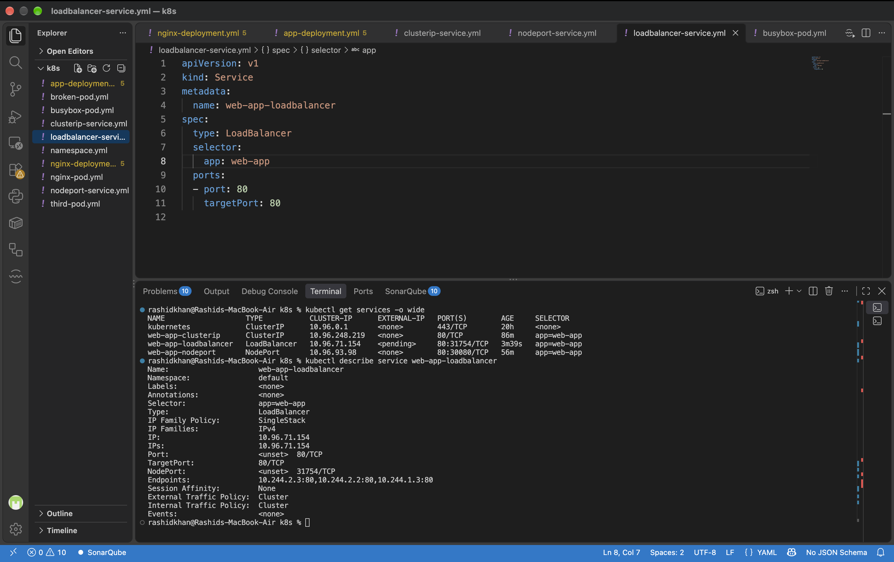

# Day 53: Kubernetes Services

## Why Services?
Every Pod gets its own IP address. But there are two problems:
1. Pod IPs are not stable — when a Pod restarts or gets replaced, it gets a new IP.
2. A Deployment runs multiple Pods — connecting to a specific IP is unreliable for clients.

A Service solves both problems by providing a stable IP and DNS name that never changes, along with load balancing across all Pods that match its selector.

---

## Challenge Tasks & Verification

### Task 1: Deploy the Application
Created a Deployment manifest `app-deployment.yaml` with 3 replicas of Nginx.
**Verify:** Are all 3 pods running? Note down their IP addresses.
> **Answer:** Yes, all 3 pods are running successfully. Based on the `kubectl get pods -o wide` output, they were assigned the following ephemeral IPs:
> * `web-app-56b5ddf4c5-gppdj`: `10.244.2.2`
> * `web-app-56b5ddf4c5-s5rlx`: `10.244.2.3`
> * `web-app-56b5ddf4c5-t59wk`: `10.244.1.3`

### Task 2: ClusterIP Service (Internal Access)
Created `clusterip-service.yml` to expose the pods internally.

```yml
apiVersion: v1
kind: Service
metadata:
  name: web-app-clusterip
spec:
  type: ClusterIP
  selector:
    app: web-app
  ports:
  - port: 80
    targetPort: 80
```
**Verify:** Does the Service respond? Try running the wget command multiple times.
> **Answer:** Yes, the service responds. When executing `wget -qO- http://web-app-clusterip` from inside the temporary `test-client` pod, it successfully returned the Nginx welcome HTML. The Service load-balanced the request to one of the 3 underlying pods.

### Task 3: Discover Services with DNS
Tested Kubernetes built-in DNS using a temporary `dns-test` pod.
**Verify:** What IP does nslookup return? Does it match the CLUSTER-IP from kubectl get services?
> **Answer:** Running `nslookup web-app-clusterip` returned the IP address `10.96.248.219`. Yes, this perfectly matches the CLUSTER-IP assigned to `web-app-clusterip` in the `kubectl get services` output.

### Task 4: NodePort Service (External Access via Node)
Created `nodeport-service.yml` to expose the application on port `30080` across all cluster nodes.

```yml
apiVersion: v1
kind: Service
metadata:
  name: web-app-nodeport
spec:
  type: NodePort
  selector:
    app: web-app
  ports:
  - port: 80
    targetPort: 80
    nodePort: 30080
```
**Verify:** Can you see the Nginx welcome page from your browser or terminal using the NodePort?
> **Answer:** Yes. Due to Mac/Kind Docker networking limitations, direct Node IP curl timed out. However, using the standard workaround `kubectl port-forward service/web-app-nodeport 30080:80`, I was able to successfully view the Nginx page via `localhost:30080`.

### Task 5: LoadBalancer Service (Cloud External Access)
Created `loadbalancer-service.yml` for external cloud load balancing.

```yml
apiVersion: v1
kind: Service
metadata:
  name: web-app-loadbalancer
spec:
  type: LoadBalancer
  selector:
    app: web-app
  ports:
  - port: 80
    targetPort: 80
```
**Verify:** What does the EXTERNAL-IP column show? Why is it `<pending>` on a local cluster?
> **Answer:** The `EXTERNAL-IP` column shows `<pending>`. This is the expected official Kubernetes behavior for local environments (like Kind or Minikube) because there is no external cloud provider (like AWS, GCP, or Azure) attached to the cluster to physically provision a public Load Balancer.

### Task 6: Understand the Service Types Side by Side
Used `kubectl describe service web-app-loadbalancer` to inspect the underlying architecture.
**Verify:** Does the LoadBalancer service also have a ClusterIP and NodePort assigned?
> **Answer:** Yes. The describe command confirmed that the LoadBalancer inherently builds on the other types. It had a ClusterIP (`10.96.71.154`) and automatically assigned a NodePort (`31754/TCP`).

### Task 7: Clean Up
**Verify:** Is everything cleaned up?
> **Answer:** Yes. After running the respective `kubectl delete -f` commands, `kubectl get pods` and `kubectl get services` returned empty results (except for the default `kubernetes` service).

---

## Documentation

* **What problem Services solve and how they relate to Pods and Deployments:**
  Services decouple the frontend/clients from the backend Pods. While Deployments manage the lifecycle and scaling of Pod replicas, Services provide a static, permanent network identity (IP and DNS) and load-balance incoming traffic to the healthy, dynamically changing IPs of those Pods.

* **Your three Service manifests with an explanation of each type:**
  * **ClusterIP:** Exposes the service on a cluster-internal IP. Reachable only within the cluster.
  * **NodePort:** Exposes the service on each Node's IP at a static port (30000-32767).
  * **LoadBalancer:** Exposes the service externally using a cloud provider's load balancer.

* **The difference between ClusterIP, NodePort, and LoadBalancer:**
  | Type | Accessible From | Use Case |
  | :--- | :--- | :--- |
  | **ClusterIP** | Inside the cluster only | Internal communication (e.g., Backend to DB). |
  | **NodePort** | Outside via `<NodeIP>:<NodePort>` | Direct node access, local testing. |
  | **LoadBalancer** | Outside via Cloud LB | Production traffic in cloud environments. |

* **How Kubernetes DNS works for service discovery:**
  Kubernetes (CoreDNS) automatically creates DNS records for Services. Instead of hardcoding IPs, pods can communicate with services using the FQDN: `<service-name>.<namespace>.svc.cluster.local`. 

* **What Endpoints are and how to inspect them:**
  Endpoints are the exact, active IP addresses of the individual Pods that the Service routes traffic to. They are dynamically updated by the Service's `selector`. 
  *How to inspect:* `kubectl describe service <name>`. My LoadBalancer output showed `Endpoints: 10.244.2.3:80,10.244.2.2:80,10.244.1.3:80`, proving it tracked my 3 Pods perfectly.

* **Screenshot of your services and the test output:**
  