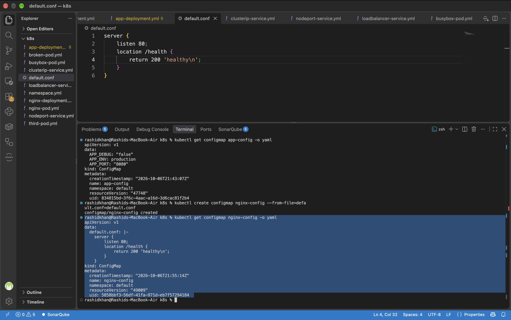
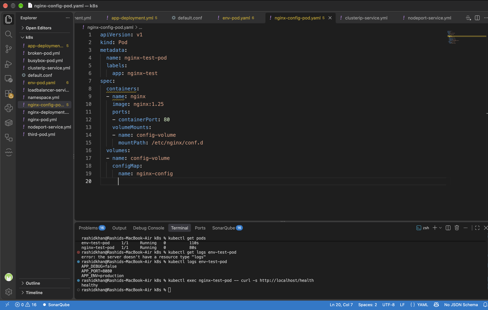
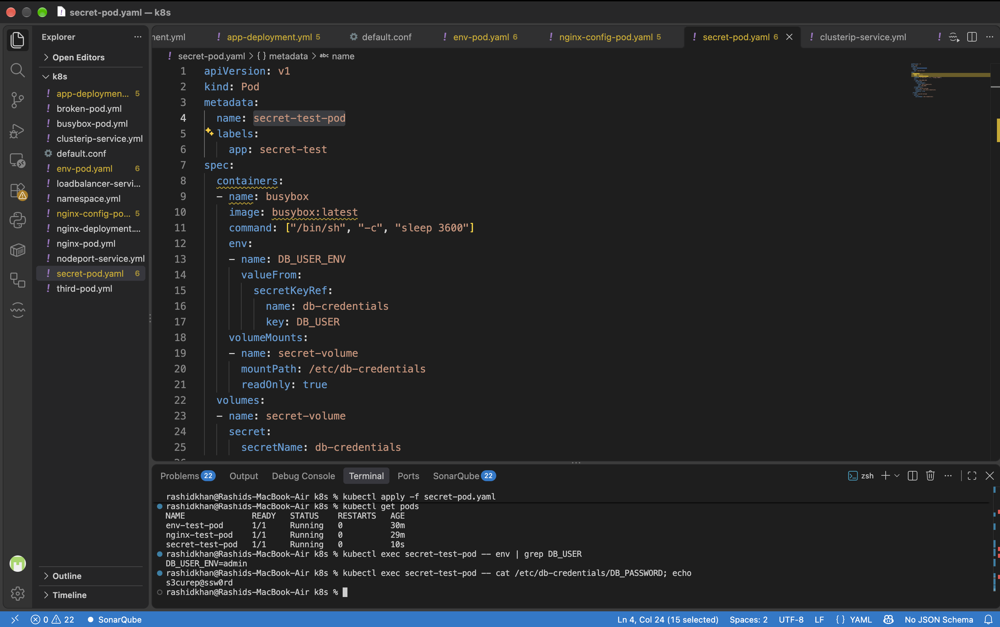
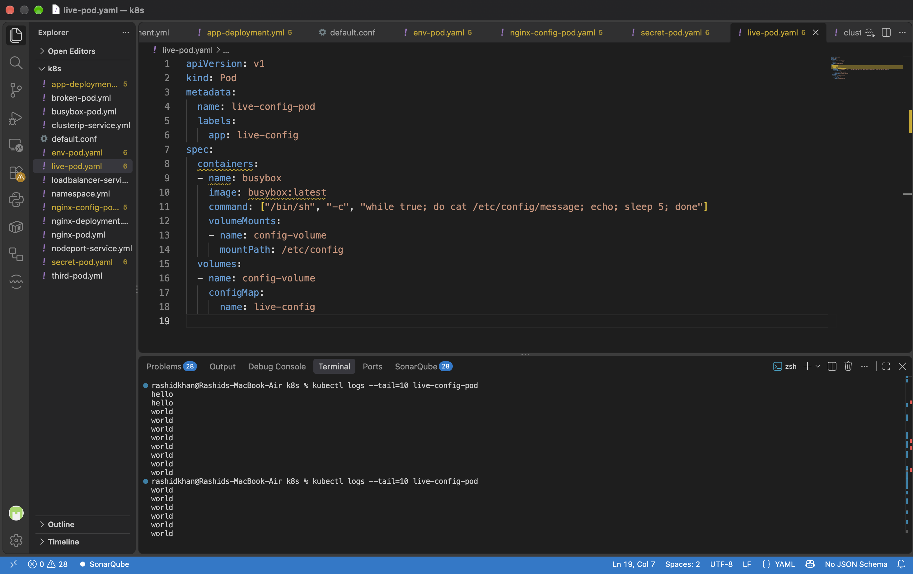

# Day 54: Kubernetes ConfigMaps and Secrets

## Challenge Tasks & Verification

### Task 1: Create a ConfigMap from Literals
*   **Verification Question:** Can you see all three key-value pairs?
*   **Official Answer & Output:** Yes. According to the Kubernetes official documentation, ConfigMaps store data as plain text to decouple configuration from image content. When I ran `kubectl get configmap app-config -o yaml`, it explicitly showed the values in plain text without any encryption:
    ```yaml
    data:
      APP_DEBUG: "false"
      APP_ENV: production
      APP_PORT: "8080"
    ```

### Task 2: Create a ConfigMap from a File
*   **Verification Question:** Does `kubectl get configmap nginx-config -o yaml` show the file contents?
*   **Official Answer & Output:** Yes. Creating a ConfigMap `--from-file` maps the filename as the key and the file's contents as the value. My output clearly showed `default.conf` as the key holding my Nginx server block:
    ```yaml
    data:
      default.conf: |-
        server {
            listen 80;
            location /health {
                return 200 'healthy\n';
            }
        }
    ```
*   **Task Proof (Screenshot):**
    

### Task 3: Use ConfigMaps in a Pod
*   **Verification Question:** Does the `/health` endpoint respond?
*   **Official Answer & Output:** Yes. The file was successfully mounted into the Nginx container at `/etc/nginx/conf.d`. When testing internal connectivity using `kubectl exec nginx-test-pod -- curl -s http://localhost/health`, the server responded exactly as configured:
    ```text
    healthy
    ```
*   **Task Proof (Screenshot):**
    

### Task 4: Create a Secret
*   **Verification Question:** Can you decode the password back to plaintext?
*   **Official Answer & Output:** Yes. The official Kubernetes documentation explicitly warns that Secrets are merely Base64 encoded, not encrypted. By passing the encoded string through `base64 --decode` in my terminal, I easily converted `czNjdXJlUEBzc3cwcmQ=` back to its original plaintext form: `s3cureP@ssw0rd`.

### Task 5: Use Secrets in a Pod
*   **Verification Question:** Are the mounted file values plaintext or base64?
*   **Official Answer & Output:** They are automatically decoded into plaintext by Kubernetes when mounted or injected. My terminal execution proved this:
    *   **Environment Variable Injection:** `kubectl exec secret-test-pod -- env | grep DB_USER` returned `DB_USER_ENV=admin`.
    *   **Volume Mount Injection:** `kubectl exec secret-test-pod -- cat /etc/db-credentials/DB_PASSWORD` returned `s3curep@ssw0rd`.
*   **Task Proof (Screenshot):**
    

### Task 6: Update a ConfigMap and Observe Propagation
*   **Verification Question:** Did the volume-mounted value change without a pod restart?
*   **Official Answer & Output:** Yes. As per official Kubernetes documentation: *"When a ConfigMap currently consumed in a volume is updated, projected keys are eventually updated as well."* The kubelet syncs these changes automatically (typically within 1 minute), updating the mounted files without requiring a pod restart.
*   **Task Proof (Screenshot):**
    

### Task 7: Clean Up
All created Pods, ConfigMaps, and Secrets were successfully deleted using `kubectl delete` to keep the cluster environment clean.

---

## Documentation

*   **What ConfigMaps and Secrets are and when to use each:**
    *   **ConfigMaps:** Used to store non-confidential data in key-value pairs (e.g., URLs, environment modes, configuration files). They decouple configuration artifacts from image content to keep containerized applications portable.
    *   **Secrets:** Intended to hold a small amount of sensitive data such as passwords, OAuth tokens, or SSH keys. Putting this information in a Secret is safer than putting it verbatim in a Pod definition or in a container image, as it allows tighter RBAC control and stores data in memory (tmpfs) on nodes.

*   **The difference between environment variables and volume mounts:**
    *   **Environment Variables (`envFrom` / `valueFrom`):** Good for simple, short string values (like port numbers). However, they are injected only at Pod startup and **do not update** dynamically if the ConfigMap/Secret changes.
    *   **Volume Mounts (`volumeMounts`):** Ideal for larger files (like `nginx.conf`). They are mounted as actual files inside the container and **automatically update** (propagate) when the underlying ConfigMap or Secret changes in the cluster.

*   **Why base64 is encoding, not encryption:**
    Base64 is a data-encoding scheme designed to translate binary data into a text format. It uses no cryptographic keys and can be effortlessly reversed (decoded) by anyone using standard command-line tools. Kubernetes Secrets use Base64 to safely transmit data across APIs, but it provides zero cryptographic security. To truly secure Secrets, Encryption at Rest must be enabled on the etcd cluster.

*   **How ConfigMap updates propagate to volumes but not env vars:**
    When a ConfigMap is mounted as a volume, the local `kubelet` component periodically checks whether the mounted ConfigMap is fresh. If a change is detected, `kubelet` automatically updates the file in the container. In contrast, environment variables are tied to the container's main process (`PID 1`) at the exact moment of creation and cannot be modified dynamically without restarting the entire Pod.