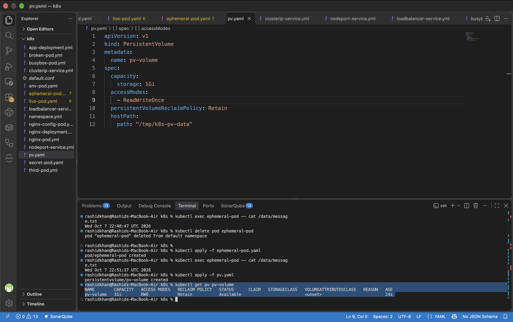
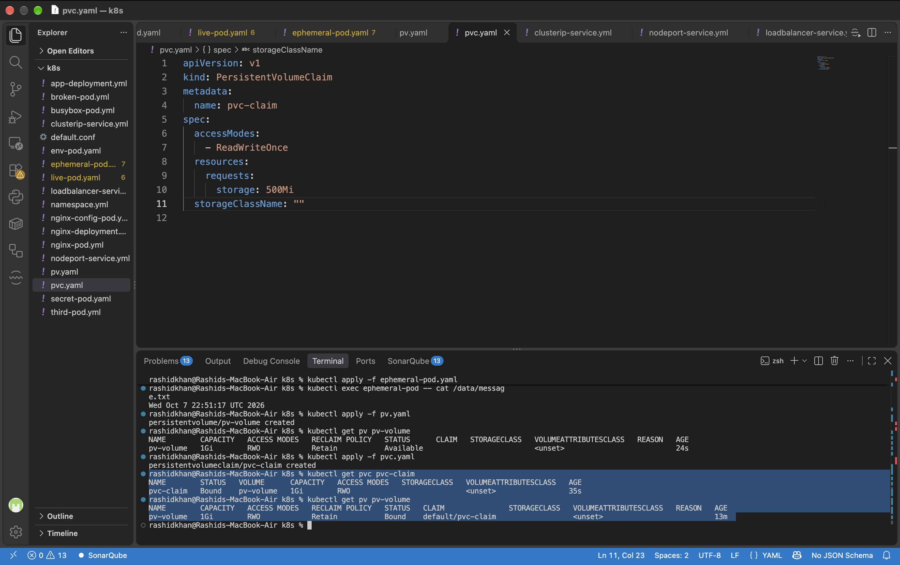
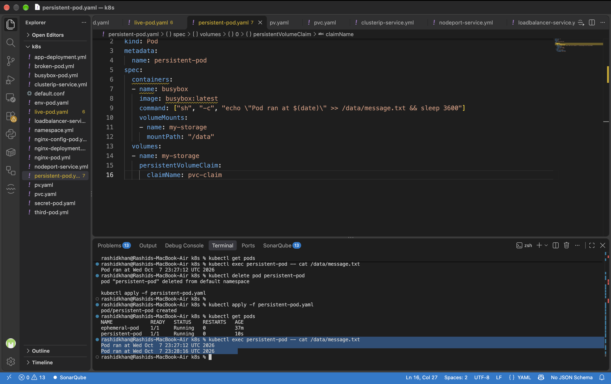
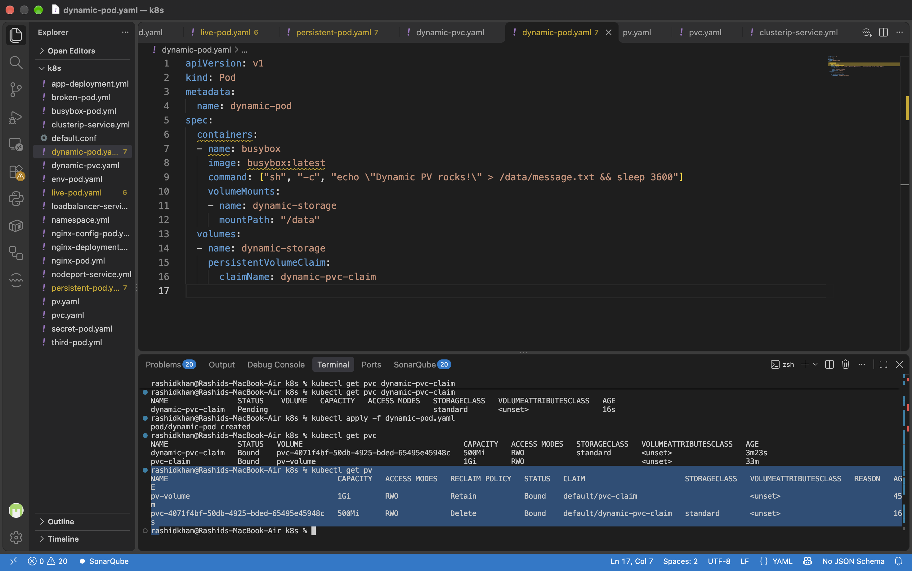

# Day 55: Persistent Volumes (PV) and Persistent Volume Claims (PVC)

## Challenge Tasks & Verification

### Task 1: See the Problem — Data Lost on Pod Deletion
*   **Verification Question:** Is the timestamp the same or different after recreation?
*   **Official Answer & Output:** The timestamp is different. According to the official Kubernetes documentation, when a Pod ceases to exist, Kubernetes destroys ephemeral volumes (like `emptyDir`). The data is strictly tied to the Pod's lifecycle. When the Pod was deleted and recreated, a completely new timestamp was generated, proving data loss.
    ```text
    # Output from the recreated pod:
    Wed Oct 7 22:51:17 UTC 2026
    ```

### Task 2: Create a PersistentVolume (Static Provisioning)
*   **Verification Question:** What is the STATUS of the PV?
*   **Official Answer & Output:** The status is `Available`. The official Kubernetes documentation states that a PV is "Available" when it is a free resource that has not yet been bound to a claim. 
    ```text
    NAME        CAPACITY   ACCESS MODES   RECLAIM POLICY   STATUS      CLAIM   STORAGECLASS
    pv-volume   1Gi        RWO            Retain           Available           <unset>
    ```
*   **Task Proof (Screenshot):**
    

### Task 3: Create a PersistentVolumeClaim
*   **Verification Question:** What does the VOLUME column in `kubectl get pvc` show?
*   **Official Answer & Output:** It shows the name of the bound PV (`pv-volume`). The Kubernetes control plane watches for new PVCs and finds a matching PV (by capacity and access modes). If found, it binds them together, changing the status to `Bound`.
    ```text
    NAME        STATUS   VOLUME      CAPACITY   ACCESS MODES   STORAGECLASS
    pvc-claim   Bound    pv-volume   1Gi        RWO            <unset>
    ```
*   **Task Proof (Screenshot):**
    

### Task 4: Use the PVC in a Pod — Data That Survives
*   **Verification Question:** Does the file contain data from both the first and second Pod?
*   **Official Answer & Output:** Yes. As per Kubernetes documentation, once a PVC is mounted as a volume in a Pod, the data written to it persists independently of the Pod's lifecycle. After deleting and recreating the Pod, both timestamps were preserved.
    ```text
    Pod ran at Wed Oct  7 23:27:12 UTC 2026
    Pod ran at Wed Oct  7 23:28:16 UTC 2026
    ```
*   **Task Proof (Screenshot):**
    

### Task 5: StorageClasses and Dynamic Provisioning
*   **Verification Question:** What is the default StorageClass in your cluster?
*   **Official Answer & Output:** The default StorageClass is `standard`, backed by the `rancher.io/local-path` provisioner. Crucially, its `VOLUMEBINDINGMODE` is set to `WaitForFirstConsumer`, which means Kubernetes delays the binding and provisioning of a PersistentVolume until a Pod using the PersistentVolumeClaim is actually created.
    ```text
    NAME                 PROVISIONER             RECLAIMPOLICY   VOLUMEBINDINGMODE      
    standard (default)   rancher.io/local-path   Delete          WaitForFirstConsumer   
    ```

### Task 6: Dynamic Provisioning
*   **Verification Question:** How many PVs exist now? Which was manual, which was dynamic?
*   **Official Answer & Output:** Two PVs exist. The one named `pv-volume` was created manually (Static Provisioning). The second one with the UUID name (`pvc-4071f4bf...`) was created dynamically by the `standard` StorageClass provisioner without manual administrative intervention.
    ```text
    NAME                                       CAPACITY   RECLAIM POLICY   STATUS   CLAIM                       STORAGECLASS
    pv-volume                                  1Gi        Retain           Bound    default/pvc-claim           <unset>
    pvc-4071f4bf-50db-4925-bded-65495e45948c   500Mi      Delete           Bound    default/dynamic-pvc-claim   standard
    ```
*   **Task Proof (Screenshot):**
    

### Task 7: Clean Up
*   **Verification Question:** Which PV was auto-deleted and which was retained? Why?
*   **Official Answer & Output:** The dynamically provisioned PV was auto-deleted because its Reclaim Policy was `Delete` (inherited from the StorageClass). The manual `pv-volume` was retained and moved to the `Released` state because its Reclaim Policy was explicitly set to `Retain`. The Kubernetes documentation specifies that `Retain` allows for manual reclamation of the resource, while `Delete` removes both the PV object and the associated storage asset in the external infrastructure.

---

## Documentation: Deep Dive into Kubernetes Storage

*   **Why containers need persistent storage:**
    By default, the file system of a container is ephemeral. When a container crashes, the kubelet restarts it, but the data is lost (the container starts with a clean state). Similarly, when a Pod is evicted or deleted, any data stored in an ephemeral volume (like `emptyDir`) is permanently wiped. Persistent storage is required to decouple data availability from the Pod's lifecycle, ensuring stateful applications (like databases) do not lose data across restarts.

*   **What PVs and PVCs are and how they relate:**
    *   **PersistentVolume (PV):** A cluster-scoped storage resource provisioned by an administrator or dynamically by a StorageClass. It has a lifecycle independent of any individual Pod.
    *   **PersistentVolumeClaim (PVC):** A namespace-scoped request for storage by a user/developer. 
    *   **Relationship:** PVCs consume PV resources in the same way Pods consume Node resources (CPU/Memory). The Kubernetes control plane acts as a matchmaker, securely binding a PVC to a qualifying PV based on requested capacity and access modes.

*   **Static vs. Dynamic Provisioning:**
    *   **Static Provisioning:** A cluster administrator manually creates several PVs in advance. Developers then create PVCs to consume them. It doesn't scale well for large teams.
    *   **Dynamic Provisioning:** Eliminates manual intervention. When a PVC requests a specific `StorageClass`, the cluster automatically calls the cloud or storage provider's API (e.g., AWS EBS, GCP PD) to create the storage asset and its corresponding PV on the fly.

*   **Access Modes:**
    Dictate how a volume can be mounted on a host.
    1.  **ReadWriteOnce (RWO):** Mounted as read-write by a single node.
    2.  **ReadOnlyMany (ROX):** Mounted as read-only by multiple nodes simultaneously.
    3.  **ReadWriteMany (RWX):** Mounted as read-write by multiple nodes simultaneously (typically requires a network file system like NFS or EFS).

*   **Reclaim Policies:**
    Tell the cluster what to do with the PV after the user deletes the PVC.
    1.  **Retain:** The PV is not deleted. Its status changes to `Released`. The data remains intact, but another PVC cannot claim it until an admin manually cleans it up.
    2.  **Delete:** Both the PV object in Kubernetes and the actual storage asset in the backend infrastructure (e.g., AWS EBS volume) are automatically destroyed.