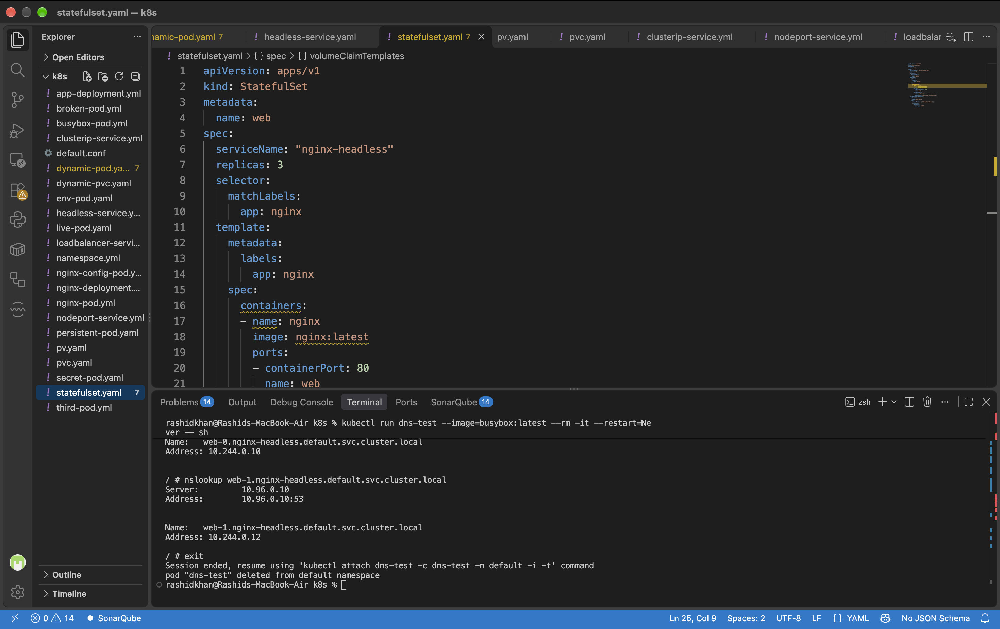
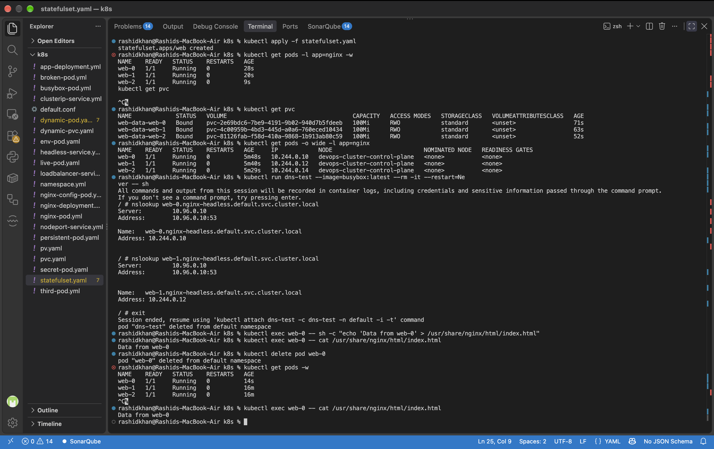
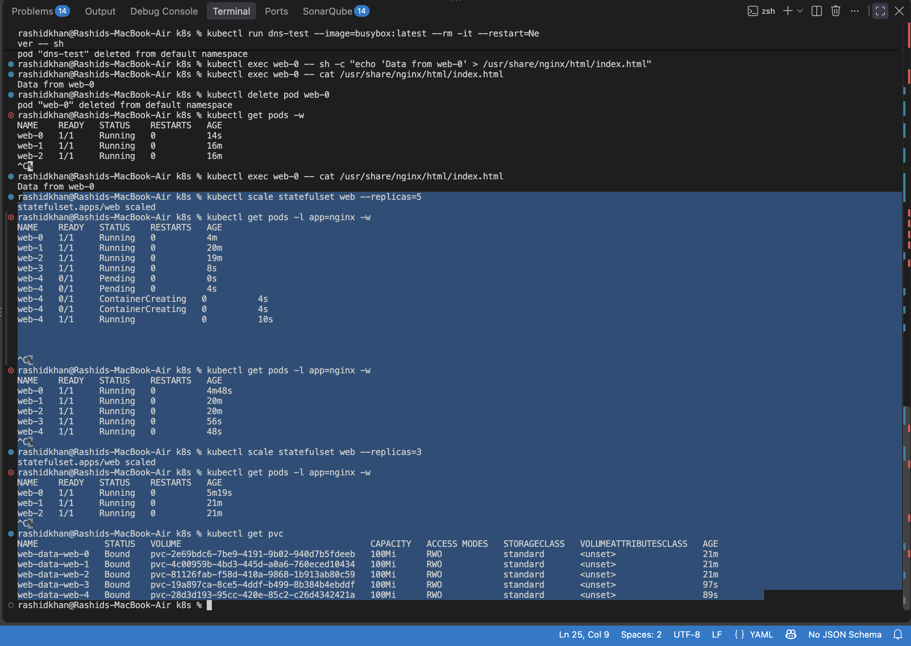

# Day 56: Kubernetes StatefulSets

## Challenge Tasks & Verification

### Task 1: Understand the Problem
*   **Verification Question:** Why would random pod names be a problem for a database cluster?
*   **Official Answer:** According to Kubernetes documentation, databases (stateful applications) require stable network identities to maintain cluster topology (e.g., knowing exactly who the master and replica nodes are). If a pod is deleted and comes back with a completely new random name and IP, the cluster peers lose connection, breaking the database replication. Deployments are designed for stateless apps where pods are interchangeable; databases need StatefulSets.
*   **Real Output Observation:** When the deployment pod `jwbnr` was deleted, it was replaced by a completely new random identity `6sgq9`:
    ```text
    test-deploy-7bfdbfb9b-jwbnr   1/1     Running   0          24s
    # After deletion:
    test-deploy-7bfdbfb9b-6sgq9   1/1     Running   0          21s
    ```

### Task 2: Create a Headless Service
*   **Verification Question:** What does the CLUSTER-IP column show?
*   **Official Answer & Output:** It shows `None`. As per official documentation, a Headless Service does not allocate a single IP for load balancing. Instead, it allows DNS queries to directly return the IPs of the individual pods backing the service.
    ```text
    NAME             TYPE        CLUSTER-IP   EXTERNAL-IP   PORT(S)   AGE
    nginx-headless   ClusterIP   None         <none>        80/TCP    22s
    ```

### Task 3: Create a StatefulSet
*   **Verification Question:** What are the exact pod names and PVC names?
*   **Official Answer & Output:** 
    *   **Pod Names:** They are created sequentially with stable ordinals: `web-0`, `web-1`, `web-2`.
    *   **PVC Names:** They are generated using the `volumeClaimTemplates` in the format `<template-name>-<pod-name>`.
    ```text
    NAME             STATUS   VOLUME                                     CAPACITY   ACCESS MODES   STORAGECLASS
    web-data-web-0   Bound    pvc-2e69bdc6-7be9-4191-9b02-940d7b5fdeeb   100Mi      RWO            standard
    web-data-web-1   Bound    pvc-4c00959b-4bd3-445d-a0a6-760eced10434   100Mi      RWO            standard
    web-data-web-2   Bound    pvc-81126fab-f58d-410a-9868-1b913ab80c59   100Mi      RWO            standard
    ```
*   **Task Proof (Screenshot):**
    

### Task 4: Stable Network Identity
*   **Verification Question:** Does the nslookup IP match the pod IP?
*   **Official Answer & Output:** Yes. The Headless Service creates a stable DNS record for each pod in the format `<pod-name>.<service-name>.<namespace>.svc.cluster.local`. `nslookup` perfectly resolved `web-0` to its exact IP (`10.244.0.10`).
    ```text
    / # nslookup web-0.nginx-headless.default.svc.cluster.local
    Address: 10.244.0.10
    
    / # nslookup web-1.nginx-headless.default.svc.cluster.local
    Address: 10.244.0.12
    ```
*   **Task Proof (Screenshot):**
    

### Task 5: Stable Storage — Data Survives Pod Deletion
*   **Verification Question:** Is the data identical after pod recreation?
*   **Official Answer & Output:** Yes. Kubernetes documentation states that a StatefulSet maintains a sticky identity for its Pods. When a Pod is rescheduled, it is automatically re-attached to the same exact PersistentVolume. The written data successfully survived the pod deletion.
    ```text
    # Output from the recreated web-0 pod:
    Data from web-0
    ```
*   **Task Proof (Screenshot):**
    

### Task 6: Ordered Scaling
*   **Verification Question:** After scaling down, how many PVCs exist?
*   **Official Answer & Output:** 5 PVCs still existed. The official documentation confirms that when a StatefulSet is scaled down, its associated PersistentVolumeClaims are intentionally **not deleted**. This safety feature ensures that data is preserved in case of an accidental scale-down.
    ```text
    NAME             STATUS   VOLUME                                     CAPACITY
    web-data-web-0   Bound    pvc-2e69bdc6-7be9-4191-9b02-940d7b5fdeeb   100Mi
    web-data-web-1   Bound    pvc-4c00959b-4bd3-445d-a0a6-760eced10434   100Mi
    web-data-web-2   Bound    pvc-81126fab-f58d-410a-9868-1b913ab80c59   100Mi
    web-data-web-3   Bound    pvc-19a897ca-8ce5-4ddf-b499-8b384b4ebddf   100Mi
    web-data-web-4   Bound    pvc-28d3d193-95cc-420e-85c2-c26d4342421a   100Mi
    ```
*   **Task Proof (Screenshot):**
    

### Task 7: Clean Up
*   **Verification Question:** Were PVCs auto-deleted with the StatefulSet?
*   **Official Answer:** No. Deleting a StatefulSet (or a Pod within it) does not delete the volumes associated with the StatefulSet. PVCs must be deleted manually by the administrator.

---

## Documentation: Deep Dive into StatefulSets

### What StatefulSets are and when to use them vs Deployments
A **StatefulSet** is the Kubernetes workload API object used to manage stateful applications.
*   **Use Deployments for:** Stateless applications (like web servers or API endpoints) where pods are completely interchangeable and do not require stable local storage or stable network identities.
*   **Use StatefulSets for:** Stateful applications (like MySQL, PostgreSQL, Kafka, or Elasticsearch) where pods require strict ordering, stable network identifiers, and persistent, per-pod storage.

### Deployment vs StatefulSet Comparison Table
| Feature | Deployment | StatefulSet |
| :--- | :--- | :--- |
| **Pod names** | Random (e.g., `app-xyz-abc`) | Stable, ordered (`app-0`, `app-1`) |
| **Startup order** | All at once (Parallel) | Ordered sequentially (`pod-0`, then `pod-1`) |
| **Storage** | Shared PVC across all replicas | Each pod dynamically gets its own PVC |
| **Network identity** | No stable individual hostname | Stable DNS per pod |
| **Scaling Down** | Random termination | Terminated in reverse order (`web-2`, then `web-1`) |

### Core Mechanisms Explained
*   **Headless Services:** A Service configured with `clusterIP: None`. It disables standard Kubernetes load balancing and instead allows DNS to directly return the IP addresses of the individual StatefulSet pods.
*   **Stable DNS:** K8s automatically creates a stable DNS record for every pod in a StatefulSet. The format strictly follows `<pod-name>.<service-name>.<namespace>.svc.cluster.local`, allowing pods to reliably discover each other.
*   **volumeClaimTemplates:** A template embedded in the StatefulSet manifest. Instead of an admin manually creating a PVC for every single pod, Kubernetes uses this template to dynamically auto-generate a unique PVC and bind it to each newly created pod in the StatefulSet.